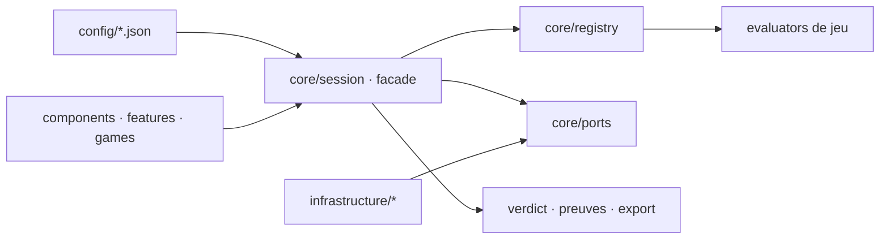

# Architecture

> **État du dépôt.** Le socle applicatif (moteur, grille, mode replay, façade de session) **n'est pas encore ici** : il est importé depuis un projet d'essai. Aujourd'hui le dépôt porte l'outillage, le design system et un `App.tsx` vide. L'architecture ci-dessous est le contrat que tout code ajouté doit respecter ; sa forme détaillée vit dans [`../TECHNICAL.md`](../TECHNICAL.md).

## Stack

- TypeScript strict, React et Vite. **Aucun backend** : application 100 % front, déployée en statique.
- Tailwind CSS et shadcn/ui (style Base UI) pour l'interface. Usage maximal des primitives, pas de composant custom quand shadcn suffit.
- Zod pour tous les contrats : configuration chargée, réponses, export. TanStack Form pour les formulaires, avec l'adapter Zod natif — jamais deux définitions de validation.
- Zustand pour l'état UI seulement. Pas de TanStack Query : il n'y a aucun fetching serveur.
- Biome pour le lint et le format, Vitest et Playwright pour les tests, Lefthook pour les gates.

## Comment ça s'emboîte

Le sens des dépendances va toujours vers le domaine : UI → facade → ports ← adapters.

## Décisions clés

- **Le niveau se calcule sans IA.** Contrainte de jury, non négociable : le jury n'aura pas de clé. L'assistant est une option désactivée par défaut, purement narrative ; sans clé, l'outil produit la même sortie rédigée par gabarits.
- **`core/` est du domaine pur** : zéro import de React, de `features/`, `games/`, `components/`, `infrastructure/` ou `store/`.
- **Data-driven, pas hardcodé.** La grille, la signature, le parcours et les profils sont quatre fichiers JSON découplés sous `config/`, chacun remplaçable sans toucher au code. Le schéma n'est pas la grille : c'est le format d'accueil de n'importe quelle grille.
- **Validation au chargement, pas au verdict.** Un mapping qui vise une dimension inconnue, une échelle qui ne monte pas, une dimension déclarée dans la grille *et* dans la signature : tout est refusé au chargement, avec le champ fautif nommé. Ces JSON s'éditent à la main sous pression.
- **Un axe qui décroît dans le référentiel est transposé en score croissant** — `intervention` mesure l'absence de reprise, `1` = « jamais » — pour que chaque condition reste un `min` et que la lecture aille dans le même sens que les niveaux.
- **La signature ne décide aucun niveau.** `getVerdict()` rend `level` et `signature` séparés jusque dans l'écran de résultat. Le fichier est optionnel : sans lui, le verdict officiel est identique au caractère près.
- **Bornes `min`/`max` inclusives** : un score posé exactement sur le seuil atteint le niveau.
- **Patterns imposés** : Strategy (un evaluator par jeu), Registry (ajouter un jeu = un dossier + un bloc dans `core/registry/register-games.ts` et un dans `games/register-components.ts`), Command (chaque réponse empilée = la trace d'audit qui sert à l'export *et* au payload de l'assistant), Facade (seul point d'entrée de l'UI), Adapter (persistence, assistant IA, horloge).
- **Pas de conteneur DI** : un unique composition root câble tout, injection par constructeur, instance de la façade exposée à React par un Context.
- **Pas de barrel export.** Aucun `index.ts` de ré-export ; chaque import pointe le fichier réel. Le seul câblage centralisé est `register-games.ts`, et sa verbosité est voulue.

## Pièges

- **Un hook n'est pas une boucle.** Un hook de vérification bloque ; une boucle relance tant qu'une commande échoue. Le cran `boucles` exige la preuve de la relance automatique — c'est lui qui sépare Copper de Silver, et l'accorder à tort fait un faux Silver.
- **Substance avant présence.** Un fichier de contexte de trois lignes jamais mis à jour n'est pas du context engineering. Compter des fichiers récompense le cargo cult, et c'est précisément le piège que cherche le jury.
- **Neutralité d'outil.** Le catalogue reconnaît des *familles* d'artefacts par motif de chemin (Claude Code, Cursor, Copilot, Windsurf, Aider, framework maison), déclarées en JSON. Reconnaître un seul outil, c'est rater tout profil qui en utilise un autre.
- **Le piège symétrique de `intervention`** : qui n'utilise pas l'IA n'a rien à reprendre. Un score élevé n'a de sens que si l'assistant est effectivement à l'œuvre.
- **L'absence est un cas nominal**, jamais une erreur. Elle se traduit en statut de mesure, pas en zéro.
- **Le déclaratif ne monte jamais un niveau.** Il alimente une ligne du rapport : « se décrit avancé, les faits disent Red ».
- **La clé API** est saisie par le participant, jamais commitée, jamais persistée hors LocalStorage.
