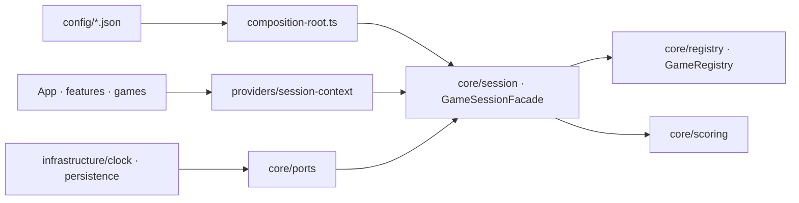

# Architecture

## Stack

- TypeScript strict, React et Vite. **Aucun backend** : application 100 % front, déployée en statique.
- Tailwind CSS et shadcn/ui (style Base UI) pour l'interface. Usage maximal des primitives, pas de composant custom quand shadcn suffit.
- Zod pour tous les contrats : configuration chargée, réponses, instantané de session. TanStack Form pour les formulaires, avec l'adapter Zod natif — jamais deux définitions de validation.
- Zustand pour l'état UI seulement. Pas de TanStack Query : il n'y a aucun fetching serveur.
- Biome pour le lint et le format, Vitest et Playwright pour les tests, Lefthook pour les gates.

## Comment ça s'emboîte

Le sens des dépendances va toujours vers le domaine : UI → contexte → façade → ports ← adapters.

## Décisions clés

- **Le niveau se calcule sans IA.** Contrainte de jury, non négociable : le jury n'aura pas de clé. L'assistant est prévu comme option désactivée par défaut, purement narrative ; sans clé, l'outil produit la même sortie rédigée par gabarits. Rien n'est encore câblé sous `infrastructure/`.
- **`core/` est du domaine pur** : zéro import de React, de `features/`, `games/`, `components/`, `infrastructure/` ou `store/`.
- **Data-driven, pas hardcodé.** La grille, la signature et le parcours sont des fichiers JSON découplés sous `config/`, chacun remplaçable sans toucher au code. Le schéma n'est pas la grille : c'est le format d'accueil de n'importe quelle grille.
- **Une configuration hors contrat n'ouvre pas de session.** `composeFrom()` rend un état `invalid-config` portant le champ fautif, que l'écran affiche tel quel — au lieu de lever et de casser le montage.
- **Le câblage prend ses données en paramètre.** `composeFrom(rawGrid, rawCourse, rawSignature)` existe à côté de `composeApp()` pour que la branche de refus soit exerçable sans dépendre des fichiers réels. C'est le chemin du jour J si la grille officielle arrive mal formée.
- **Un adapter ne prend pas de dépendance externe par défaut.** `LocalSessionStorageAdapter` reçoit son `Storage` au constructeur, sans valeur de repli : un défaut lisant un global rendrait l'absence inexprimable et ferait dépendre l'adapter du runtime.
- **Aucun composant n'importe la façade directement** : elle arrive par `providers/session-context.tsx`, ce qui garde un seul point d'injection et rend les écrans testables avec une façade de test.
- **Un axe qui décroît dans le référentiel est transposé en score croissant** — `intervention` mesure l'absence de reprise, `1` = « jamais » — pour que chaque condition reste un `min` et que la lecture aille dans le même sens que les niveaux.
- **La signature ne décide aucun niveau.** `getVerdict()` rend le niveau et la signature séparés jusque dans l'écran de résultat. Le fichier est optionnel : sans lui, le verdict officiel est identique au caractère près.
- **Bornes `min`/`max` inclusives** : un score posé exactement sur le seuil atteint le niveau.
- **Patterns en place** : Strategy (un evaluator par jeu derrière `game-evaluator.interface.ts`, une stratégie de scoring derrière `scoring-strategy.interface.ts`), Registry (ajouter un jeu = un dossier plus un bloc dans `games/register-games.ts` et un dans `games/register-components.ts`, résolus par le même `type`), Command (`submit-answer.command.ts` empilé en trace d'audit, rendue par `auditTrail()`), Facade (seul point d'entrée de l'UI), Adapter (`infrastructure/clock/`, `infrastructure/persistence/`).
- **Pas de conteneur DI** : `composition-root.ts` câble tout, injection par constructeur, façade exposée à React par un Context.
- **Pas de barrel export.** Aucun `index.ts` de ré-export ; chaque import pointe le fichier réel. Les seuls câblages centralisés sont les deux fichiers `register-*.ts` de `games/`, et leur verbosité est voulue.

## Pièges

- **Un hook n'est pas une boucle.** Un hook de vérification bloque ; une boucle relance tant qu'une commande échoue. Le cran `boucles` exige la preuve de la relance automatique — c'est lui qui sépare Copper de Silver, et l'accorder à tort fait un faux Silver.
- **Substance avant présence.** Un fichier de contexte de trois lignes jamais mis à jour n'est pas du context engineering. Compter des fichiers récompense le cargo cult, et c'est précisément le piège que cherche le jury.
- **Neutralité d'outil.** La reconnaissance des artefacts se fait par *familles* de motifs de chemin déclarées en JSON, jamais par une marque en dur. Reconnaître un seul outil, c'est rater tout profil qui en utilise un autre.
- **Le piège symétrique de `intervention`** : qui n'utilise pas l'IA n'a rien à reprendre. Un score élevé n'a de sens que si l'assistant est effectivement à l'œuvre.
- **L'absence est un cas nominal**, jamais une erreur. Elle se traduit en statut de mesure, pas en zéro.
- **Le déclaratif ne monte jamais un niveau.** Il alimente une ligne du rapport : « se décrit avancé, les faits disent Red ».
- **La clé API** est saisie par le participant, jamais commitée, jamais persistée hors LocalStorage.
- **En cas de contradiction entre `TECHNICAL.md` et le code, le code fait foi.** Le document a déjà dérivé une fois sur la position de `register-games.ts` et sur l'API de façade ; il a été recalé, il redérivera.
