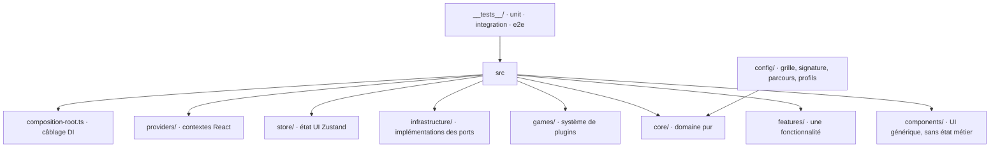

# Codebase Map

> Toutes les zones ci-dessous existent sur le disque. La carte reste contractualisée dans [`../TECHNICAL.md`](../TECHNICAL.md) §3 : **c'est là qu'un fichier nouveau doit atterrir**.



## Zones

- `src/components/` : UI générique sans état métier. `ui/` tient les primitifs shadcn installés par la CLI — Biome les exclut du lint.
- `src/features/` : un sous-dossier par fonctionnalité, gabarit interne `components/` · `hooks/` · `actions/` · `schema/`. Aujourd'hui `onboarding/`, `group-navigation/`, `scoring-summary/`.
- `src/games/` : un sous-dossier par jeu, même gabarit plus `helpers/` et l'evaluator à la racine du dossier. **Reste à la racine, pas sous `features/`** : c'est un système de plugins à contrat formel, un contributeur doit voir en cinq secondes où ajouter un jeu.
- `src/core/` : `entities/`, `contracts/` (schémas Zod, `helpers/` pour la validation), `ports/` (interfaces), `commands/`, `registry/`, `scoring/`, `session/`.
- `src/infrastructure/` : un sous-dossier par port implémenté — `clock/`, `persistence/`. Un adapter reçoit sa dépendance externe au constructeur, **sans valeur par défaut** : un défaut lisant `globalThis` rend l'absence inexprimable, puisque passer `undefined` déclenche le défaut, et le comportement se met alors à dépendre du runtime. C'est `composition-root.ts` qui désigne la dépendance réelle.
- `src/providers/` : les contextes React qui portent le résultat du câblage jusqu'aux écrans. Aucun composant n'importe la façade directement.
- `config/` : les quatre JSON data-driven. `grid.json`, `course.json` et `signature.json` sont posés ; `signals.json` arrive avec le catalogue de signaux.
- `__tests__/` : à la racine, en miroir de `src/`. `unit/` pour la forme et le comportement d'une unité, `integration/config-loading/` pour le refus au chargement croisé avec les JSON réels, `fixtures/` pour les doubles de port partagés. Vitest ne lit que `__tests__/{unit,integration}/**/*.test.{ts,tsx}` : un fichier rangé ailleurs ne tourne pas et ne dit rien.

## Règles de placement

- Générique sans état métier → `components/` · spécifique à une fonctionnalité → `features/<nom>/` · spécifique à un jeu → `games/<jeu>/` · contrats et orchestration → `core/` · implémentations → `infrastructure/<port>/`.
- Un élément de `features/` ou `games/` réutilisé ailleurs sans modification est le signal pour le remonter dans `components/`.

## Découpage atomique inversé

On cherche par **nom** ; le niveau atomique vient après, **à l'intérieur** du dossier nommé — `components/dialog/{elements,composites,sections}/`, jamais trois dossiers atomiques à la racine de `components/`. Un composant simple ne crée que les niveaux réellement utilisés.

`elements` (dumb atomiques) → `composites` (dumb composés) → `sections` (smart, connectés au store ou à la façade). La logique ne vit jamais dans un element ou un composite.

## Chaîne logique / composants

```
component (dumb) → hook (cycle de vie React) → action (métier, testable hors React) → helper (pur)
```

Un helper est partageable entre l'action jouée et l'evaluator au scoring — une seule source pour une formule. L'evaluator reste à la racine du dossier du jeu, pas dans `actions/` : c'est le point de contact public avec le port.

## Points d'entrée

- `src/main.tsx` monte `App` dans `#root`. `index.html` est le template Vite.
- `src/composition-root.ts` est le seul endroit où tout se câble. Il rend `ready` ou `invalid-config` : une configuration hors contrat n'ouvre pas de session, elle remonte le champ fautif à l'écran. `main.tsx` passe ce résultat à `SessionProvider`.
