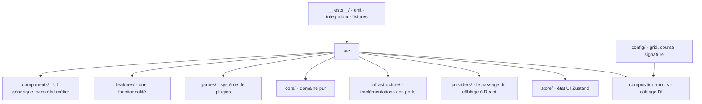

# Codebase Map



## Zones

- `src/components/` : UI générique sans état métier. `ui/` tient les primitifs shadcn installés par la CLI — Biome les exclut du lint.
- `src/features/` : `onboarding/`, `group-navigation/`, `scoring-summary/`. Gabarit interne `components/` · `hooks/` · `actions/` · `schema/`, seuls les niveaux utilisés sont créés.
- `src/games/` : un sous-dossier par jeu, plus les deux fichiers de câblage `register-games.ts` (evaluator, schémas) et `register-components.ts` (le composant), et `types/game-component.ts`. **Reste à la racine, pas sous `features/`** : c'est un système de plugins à contrat formel, un contributeur doit voir en cinq secondes où ajouter un jeu.
- `src/core/` : `entities/`, `contracts/` (schémas Zod et `helpers/parse-config.helper.ts`), `ports/` (interfaces), `commands/`, `registry/` (`game-registry.ts` seul), `scoring/` (stratégie de pondération et helpers de bande et de résolution de niveau), `session/` (façade et `run-replay.helper.ts`).
- `src/infrastructure/` : un sous-dossier par port implémenté — `clock/` (`system`, `fixed`), `persistence/`.
- `src/providers/` : `session-context.tsx`, le seul chemin par lequel un composant atteint la façade.
- `config/` : `grid.json`, `course.json`, `signature.json`. Aucun profil de rejeu sur le disque.
- `__tests__/` : à la racine, en miroir de `src/`, plus `fixtures/` pour les doubles partagés.

## Règles de placement

- Générique sans état métier → `components/` · spécifique à une fonctionnalité → `features/<nom>/` · spécifique à un jeu → `games/<jeu>/` · contrats et orchestration → `core/` · implémentations → `infrastructure/<port>/`.
- Un élément de `features/` ou `games/` réutilisé ailleurs sans modification est le signal pour le remonter dans `components/`.

## Découpage atomique inversé

On cherche par **nom** ; le niveau atomique vient après, **à l'intérieur** du dossier nommé — `components/group-rail/composites/`, jamais un dossier atomique à la racine de `components/`. Un composant simple ne crée que les niveaux réellement utilisés.

`elements` (dumb atomiques) → `composites` (dumb composés) → `sections` (smart, connectés au store ou à la façade). La logique ne vit jamais dans un element ou un composite.

Une exception en place : `components/layout/app-layout/app-layout.tsx` est posé sans niveau atomique. Le composant n'a ni état ni frère, et la coquille de page ne se décline pas.

## Chaîne logique / composants

```
component (dumb) → hook (cycle de vie React) → action (métier, testable hors React) → helper (pur)
```

Un helper est partageable entre l'action jouée et l'evaluator au scoring — une seule source pour une formule. L'evaluator reste à la racine du dossier du jeu, pas dans `actions/` : c'est le point de contact public avec le port.

## Points d'entrée

- `src/main.tsx` monte `App` sous `SessionProvider`, dans `#root`.
- `src/composition-root.ts` est le seul endroit où tout se câble. `composeApp()` prend les JSON réels, `composeFrom()` prend les données en paramètre.
- `src/App.tsx` aiguille les écrans depuis `session.store`, et rend l'écran de refus quand la configuration est hors contrat.
