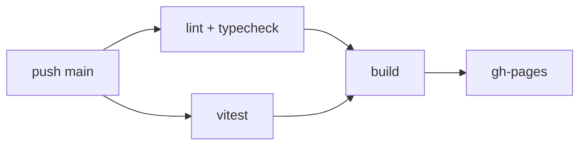

# Deployment

## Pipeline

GitHub Actions, deux workflows, tous deux sur runners Node 24.

- `deploy.yml` — sur push `main`.
- `pr-preview.yml` — à l'ouverture, la synchronisation, la réouverture et la fermeture d'une PR.

`quality` et `test` tournent en parallèle ; `build` attend les deux. `deploy` publie l'artefact `dist` avec `peaceiris/actions-gh-pages`.

## Environnements

- Production : GitHub Pages, servi sous `/laivel-up-eval/`.
- Preview : un sous-dossier Pages par PR, nettoyé à la fermeture.

## Base relative

`vite.config.ts` fixe `base: './'`. C'est ce qui fait marcher **le même build** en production et sous le sous-dossier d'une preview. **Contrepartie : un routeur client servant des routes imbriquées casserait.** Voir `navigation.md`.

## Release

Pas de release versionnée : le livrable est le dépôt public, le site déployé et une vidéo, rendus via le formulaire du hackathon. Rollback = `revert` sur `main`, le déploiement se rejoue.

## Monitoring

Aucun. Application statique sans backend.
