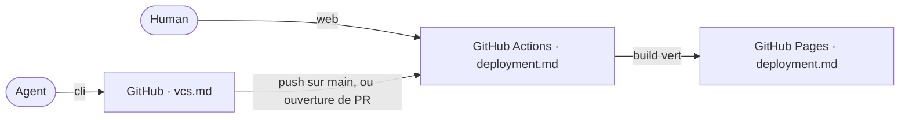

# Ecosystem

```mermaid
flowchart LR
  Human([Human])
  Agent([Agent])
  Vcs["GitHub · vcs.md"]
  Ci["GitHub Actions · deployment.md"]
  Pages["GitHub Pages · deployment.md"]

  Agent -- cli --> Vcs
  Human -- web --> Ci

  Vcs -- "push sur main, ou ouverture de PR" --> Ci
  Ci -- "build vert" --> Pages
```
