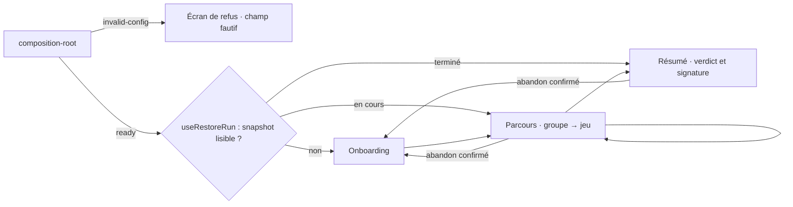

# Navigation

## Routage

**Aucun routeur client, et c'est délibéré** — voir la contrainte `base: './'` dans `deployment.md`, qui est ce qui l'interdit.

L'aiguillage vit dans `App.tsx`, sur `useSessionStore((state) => state.screen)`. La progression est portée par l'état de session, pas par l'URL : l'entité de session tient l'invariant — on ne passe pas au groupe suivant sans avoir soumis les jeux du groupe courant.

Conséquence assumée : **aucun écran n'est adressable par lien**, et un rechargement repart du LocalStorage, pas de l'URL. La position se lit toujours sur le snapshot persisté via la façade, jamais sur un fragment ou un paramètre d'URL.

## Reprise au montage

Un rechargement ne ramène plus à l'accueil : `useRestoreRun` (`features/session-restore/`) s'exécute une seule fois au montage d'`App`, après le cas `invalid-config` — une configuration refusée n'ouvre aucune session, donc aucune reprise. Une seule exécution même sous `StrictMode`, qui monte deux fois : un `ref` garde l'attente.

- Un snapshot lisible et en cours ouvre directement le parcours, au jeu qui suit la dernière soumission.
- Un snapshot dont toutes les situations sont soumises ouvre directement le verdict.
- Un stockage vide, ou un snapshot hors contrat, laisse l'accueil en place — `resume()` rend `false`, aucune exception ne remonte.

L'accueil ne porte plus de reprise manuelle : la carte `ResumeRun` et le choix « Reprendre / Repartir de zéro » ont disparu avec l'automatisation. L'unique sortie d'une partie en cours est l'action « Abandonner cette partie », dans l'en-tête (`AbandonRun`, confirmée par un dialogue qui chiffre ce qu'elle détruit), rendue sur le parcours et le verdict, jamais sur l'accueil.

## Structure

L'écran de refus n'est pas une erreur technique affichée par défaut : c'est un état de premier rang, rendu par `InvalidConfig` avant tout autre écran, qui nomme le champ de configuration en cause.

`AppLayout` enveloppe les trois écrans et porte la ligne de statut, plus un emplacement d'action optionnel à droite ; `group-rail` donne la position dans le parcours.
