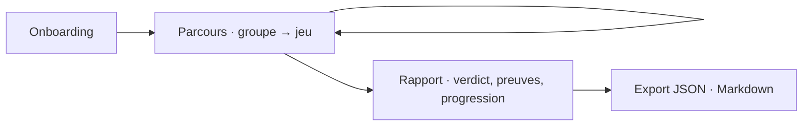

# Navigation

## Routage

**Aucun routeur client, et c'est délibéré.** `vite.config.ts` fixe `base: './'` pour qu'un même build serve la production Pages *et* le sous-dossier d'une preview de PR ; une base relative ne convient plus dès qu'un routeur sert des routes imbriquées. Ajouter un routeur oblige à revoir la stratégie de déploiement (voir `deployment.md`).

La progression est donc portée par l'état de session, pas par l'URL : l'entité de session tient l'invariant — on ne passe pas au groupe suivant sans avoir soumis les jeux du groupe courant.

Conséquence assumée : **aucun écran n'est adressable par lien**, et un rechargement repart du LocalStorage, pas de l'URL.

## Structure

`App.tsx` ne rend rien aujourd'hui : ce plan est la cible.
