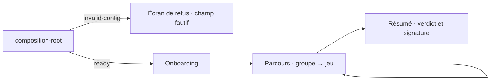

# Navigation

## Routage

**Aucun routeur client, et c'est délibéré** — voir la contrainte `base: './'` dans `deployment.md`, qui est ce qui l'interdit.

L'aiguillage vit dans `App.tsx`, sur `useSessionStore((state) => state.screen)`. La progression est portée par l'état de session, pas par l'URL : l'entité de session tient l'invariant — on ne passe pas au groupe suivant sans avoir soumis les jeux du groupe courant.

Conséquence assumée : **aucun écran n'est adressable par lien**, et un rechargement repart du LocalStorage, pas de l'URL.

## Structure

L'écran de refus n'est pas une erreur technique affichée par défaut : c'est un état de premier rang, rendu par `InvalidConfig` avant tout autre écran, qui nomme le champ de configuration en cause.

`AppLayout` enveloppe les trois écrans et porte la ligne de statut ; `group-rail` donne la position dans le parcours.
