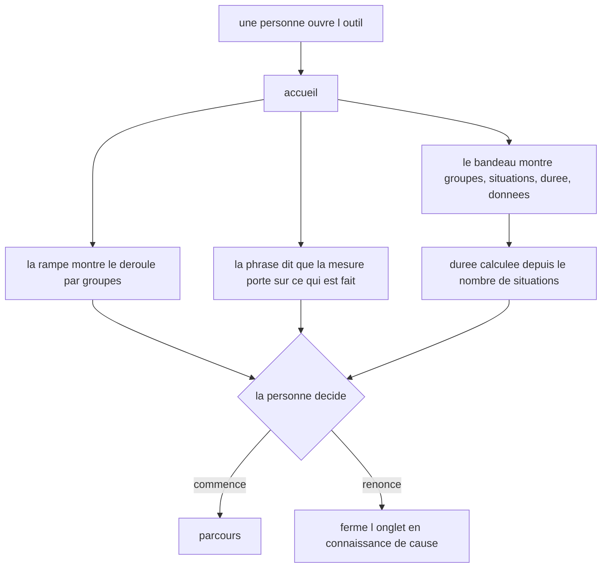
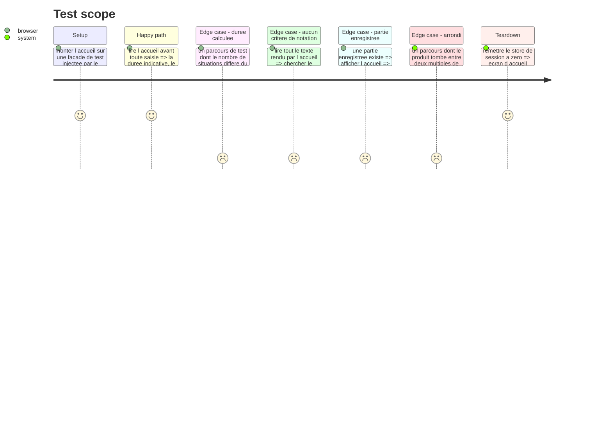

# Instruction: La durée, calculée et énoncée

## Architecture projection

> Tree of the final files. ✅ create · ✏️ modify · ❌ delete

```txt
.
├── src/features/onboarding/
│   ├── helpers/estimate-course-minutes.helper.ts       ✅ situations → minutes, le seul endroit qui porte le budget et l'arrondi
│   ├── hooks/use-onboarding.hook.ts                    ✏️ expose `totalGames` et `estimatedMinutes`, le calcul quitte la vue
│   └── components/sections/onboarding-view.tsx         ✏️ la tuile Durée rejoint le bandeau, le total vient du hook
└── __tests__/unit/features/onboarding/
    ├── estimate-course-minutes.test.ts                 ✅ le calcul et son arrondi, hors rendu
    ├── use-onboarding.test.ts                          ✏️ le hook rend les deux grandeurs du parcours de test
    └── onboarding-view.test.tsx                        ✏️ le cadre énoncé, le vocabulaire de notation absent, le ton
```

## User Journey



## Test Scope



## Wireframe

```txt
┌──────────────────────────────────────────────────────────┐
│ (1) En-tete applicatif                                   │
├────────────┬─────────────────────────────────────────────┤
│ (2) Rampe  │ (3) Titre + phrase de cadre                 │
│  des       ├─────────────────────────────────────────────┤
│  groupes   │ (4) Bandeau de chiffres                     │
│            │  ┌──────┬──────┬──────┬──────┐              │
│            │  │Grpes │Situa.│Duree │Donn. │              │
│            │  └──────┴──────┴──────┴──────┘              │
│            ├─────────────────────────────────────────────┤
│            │ (5) Carte de partie en cours (si stockee)   │
│            ├─────────────────────────────────────────────┤
│            │ (6) Formulaire nom + depot                  │
│            │ (7) Bouton d entree                         │
└────────────┴─────────────────────────────────────────────┘
```

1. En-tête existant, inchangé sur l'accueil.
2. Rampe des groupes, inchangée : elle porte le déroulé que l'acceptation demande.
3. Titre et phrase de cadre, inchangés : ils disent déjà que la mesure porte sur ce qui est fait.
4. Bandeau de chiffres, qui passe de trois à quatre tuiles. La tuile Durée est le seul ajout.
5. Carte de partie enregistrée, inchangée, toujours sous le bandeau : le cadre se lit avant elle.
6. Formulaire, inchangé.
7. Bouton de départ, inchangé.

## Tasks to do

### `1)` Le calcul de la durée

> Une estimation qui suit le parcours, et qui se lit comme une estimation.

1. Créer `estimate-course-minutes.helper.ts` : une fonction pure qui prend le nombre de situations et rend un nombre de minutes.
2. Poser le budget dans une constante nommée en tête de fichier, avec une ligne disant d'où il vient — arbitrage du 29/08, moyenne entre les jeux courts et les jeux à état.
3. Arrondir au multiple de cinq le plus proche, avec un plancher à cinq : un parcours non vide ne s'annonce jamais à zéro minute.
4. Documenter en tête de fichier pourquoi le calcul n'est pas dans le domaine : c'est une estimation d'expérience, aucun verdict n'en dépend.

### `2)` Le hook porte les grandeurs du parcours

> La vue ne calcule plus rien ; elle affiche ce que la couche smart lui donne.

1. Dans `use-onboarding.hook.ts`, sommer les `gameCount` de la rampe pour obtenir le total des situations.
2. Passer ce total au helper et exposer `totalGames` et `estimatedMinutes` dans le retour du hook.
3. Retirer de `onboarding-view.tsx` le calcul inline de `totalGames` et lire les deux valeurs du hook.

### `3)` La tuile Durée au bandeau

> Le cadre se complète sans s'allonger.

1. Ajouter une quatrième tuile Durée au bandeau, entre Situations et Données.
2. Formuler la valeur pour qu'elle se lise comme indicative et non comme un chronomètre, en phrase courte et sans encouragement.
3. Faire passer la grille à deux colonnes sur petit écran et quatre au-delà, pour que quatre libellés ne se cassent pas sur mobile.
4. Reprendre le traitement des tuiles existantes — jetons `plane-*`, filets, chiffres en chasse tabulaire — sans introduire de couleur nouvelle.

### `4)` Les trois acceptations, prouvées

> Deux des trois acceptations sont négatives : sans test, elles n'existent pas.

1. Dans `estimate-course-minutes.test.ts`, couvrir le calcul, l'arrondi vers le haut, l'arrondi vers le bas, le plancher et le parcours vide.
2. Dans `use-onboarding.test.ts`, vérifier que le hook rend le total de situations et la durée du parcours de test, et non ceux du parcours réel.
3. Dans `onboarding-view.test.tsx`, vérifier qu'avant toute saisie l'accueil rend la durée, le nombre de groupes, le nombre de situations et la phrase sur ce qui est mesuré.
4. Ajouter un cas qui balaie tout le texte rendu par l'accueil et échoue si un terme de notation y apparaît. Nommer la liste terme par terme dans une constante commentée : note, notation, score, point, barème, coefficient, critère, seuil. La comparaison se fait sur des mots entiers : « Jugement critique » est un libellé de groupe légitime, et le titre parle de niveau sans énoncer de niveau requis.
5. Ajouter un cas qui rend l'accueil avec une partie enregistrée et vérifie que le cadre reste énoncé au-dessus de la carte de reprise.

## Test acceptance criteria

| Task | Acceptance criteria                                                                                                      |
| ---- | -------------------------------------------------------------------------------------------------------------------------- |
| 1    | Vingt situations rendent trente minutes                                                                                    |
| 1    | Un nombre de situations dont le produit tombe entre deux multiples de cinq rend le multiple le plus proche                  |
| 1    | Un parcours non vide ne rend jamais zéro minute                                                                            |
| 1    | Un parcours sans situation rend zéro                                                                                       |
| 2    | Le hook rend un total de situations et une durée qui suivent le parcours de la façade injectée                              |
| 2    | La vue ne contient plus aucun calcul : elle lit `totalGames` et `estimatedMinutes` du hook                                  |
| 3    | Avant toute saisie, l'accueil affiche la durée indicative, le nombre de groupes et le nombre de situations                  |
| 3    | Le bandeau tient sur quatre tuiles sans casser ses libellés sur petit écran                                                 |
| 4    | L'accueil affiche la phrase disant que la mesure porte sur ce qui est fait et non sur ce qui est déclaré                     |
| 4    | Aucun terme de la liste de notation n'apparaît dans le texte rendu par l'accueil                                           |
| 4    | Le cadre reste énoncé quand une partie enregistrée est présente                                                            |
