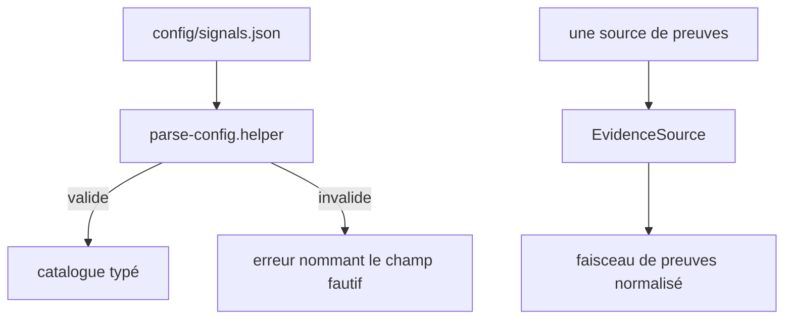
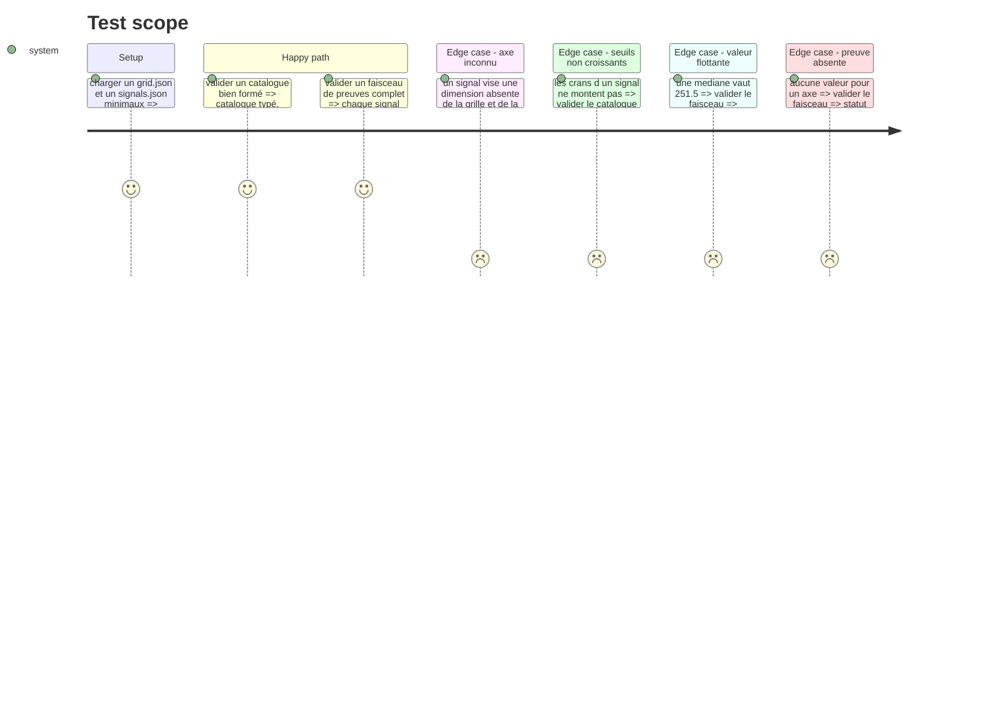

# Instruction: Les contrats — faisceau de preuves et catalogue

## Socle en place

> Le core est importé et vert (`typecheck`, `lint`, `test`). Cette phase s'y greffe, elle ne le refait pas.

| Acquis | Fichier | Ce que la phase en réutilise |
| --- | --- | --- |
| Frontière de validation | `src/core/contracts/helpers/parse-config.helper.ts` | `ConfigValidationError(source, field, message)`, le chemin de champ, et `parseConfiguration(rawGrid, rawCourse, rawSignature)` qui refuse déjà une dimension de parcours absente de la grille et de la signature |
| Contrat de grille | `src/core/contracts/grid.schema.ts` | `dimensionScaleSchema` porte déjà la règle « part de 0, monte strictement » : les `steps` du catalogue la rejouent, ils ne l'inventent pas |
| Statut de mesure | `src/core/ports/scoring-strategy.interface.ts` | `DimensionScore.measured` distingue déjà « non visée » de « visée et ratée ». Le faisceau de preuves doit produire la même distinction, sous le même mot |
| Modèle de registre | `src/core/registry/game-registry.ts` + `src/games/register-games.ts` | Le registre de règles de la phase 2 en est la copie : `resolve` lève en se nommant, un seul point de câblage |
| Convention de port | `src/core/ports/*.interface.ts` | Interface nue, commentaire d'intention, aucun détail d'implémentation |

Écarts relevés à l'import, corrigés avant de démarrer la phase :

- `parse-config.helper.ts` vit sous `contracts/helpers/`, pas directement sous `contracts/` : l'arbre ci-dessous est aligné sur le disque.
- `src/core/store/session.store.ts` doublonnait `src/store/session.store.ts`. Supprimé : `core/` est le domaine pur, l'état UI Zustand vit sous `src/store/`.
- Les phases 2 à 4 projettent des helpers à plat (`src/core/scoring/axis-score.ts`) alors que le socle range ses helpers sous `helpers/`. À trancher au moment de leur révision.

## Architecture projection

> Tree of the final files. ✅ create · ✏️ modify · ❌ delete

```txt
.
├── config/
│   └── signals.json                                    ✅ squelette versionné, catalogue vide
├── src/core/
│   ├── contracts/
│   │   ├── evidence-bundle.schema.ts                   ✅ le format interne normalisé
│   │   ├── signals-catalog.schema.ts                   ✅ le contrat du catalogue
│   │   └── helpers/
│   │       └── parse-config.helper.ts                  ✏️ en place avec le socle, étendu au catalogue
│   └── ports/
│       └── evidence-source.interface.ts                ✅ le port d'entrée des adapters
└── __tests__/unit/core/contracts/
    ├── signals-catalog.schema.test.ts                  ✅
    ├── evidence-bundle.schema.test.ts                  ✅
    └── parse-config.helper.test.ts                     ✅ la validation croisée catalogue × grille
```

## User Journey



## Test Scope



## Tasks to do

### `1)` Le schéma du faisceau de preuves

> Le format interne que tout adapter produit, et la seule chose que le moteur sait lire.

1. Créer `evidence-bundle.schema.ts` : un faisceau porte une période, une liste d'observations, et rien d'autre.
2. Une observation porte : `signalId`, `value` (nombre, booléen, ou liste de chemins), `source` (le fichier ou l'artefact d'où elle sort), `family` (`repo` ou `course`).
3. Accepter les valeurs flottantes pour toute médiane.
4. Exporter les types par `z.infer`, aucune classe — comme `grid.schema.ts` et `course.schema.ts`.
5. L'absence d'observation se dit par l'absence d'entrée, jamais par une valeur sentinelle : c'est ce que la phase 3 relit pour poser `measured`, au sens de `DimensionScore.measured`.

### `2)` Le schéma du catalogue

> Un signal est une règle de lecture déclarée, jamais du code.

1. Créer `signals-catalog.schema.ts` : un signal porte `id`, `axis`, `rule` (type discriminant + paramètres), `steps` (la valeur seuil par cran, avec le libellé du cran), `family`, et `confidence`.
2. Les `steps` montent strictement, comme les échelles de la grille.
3. Discriminer les paramètres de `rule` par le type, pour qu'un paramètre étranger soit refusé.

### `3)` Le port d'entrée

> Le moteur ignore d'où viennent les preuves.

1. Créer `evidence-source.interface.ts` : une méthode qui rend un faisceau de preuves, et le nom de la source.
2. Interface petite et ciblée, aucun détail de dossier ni de réseau.

### `4)` La validation au chargement

> Ces JSON s'éditent à la main sous pression : l'erreur doit nommer le champ.

1. Ajouter `parseSignalsCatalog` à `contracts/helpers/parse-config.helper.ts`, sur le `validate` + `fail` déjà en place : l'erreur reste une `ConfigValidationError` portant `source` et `field`.
2. Ouvrir `parseConfiguration` à un quatrième argument optionnel `rawSignals`, et croiser les axes du catalogue contre le `knownDimensions` déjà calculé — la même passe qui contrôle les mappings de parcours, pas une seconde.
3. Refuser au chargement un signal dont l'axe n'est déclaré ni par la grille ni par la signature, en nommant les deux.
4. Refuser au chargement des `steps` qui ne montent pas.
5. Poser `config/signals.json` avec sa version et un catalogue vide, valide contre le schéma. Le dossier `config/` existe et est vide : c'est son premier fichier.

## Test acceptance criteria

| Task | Acceptance criteria |
| --- | --- |
| 1 | Un faisceau sans observation pour un axe se charge et laisse cet axe sans valeur, il ne le pose pas à zéro |
| 1 | Une médiane à `251.5` traverse le schéma sans perte |
| 2 | Un signal dont les crans décroissent est refusé, le message nomme le signal |
| 2 | Un paramètre qui n'appartient pas au type de règle déclaré est refusé |
| 3 | Le moteur compile sans importer aucun adapter concret |
| 4 | Un signal visant `qualite` alors que ni la grille ni la signature ne la déclarent est refusé au chargement, le message nomme le signal et la dimension |
| 4 | `config/signals.json` vide se charge sans erreur |
| 4 | `parseConfiguration` appelé sans catalogue se comporte exactement comme avant : les appels du socle ne changent pas |
