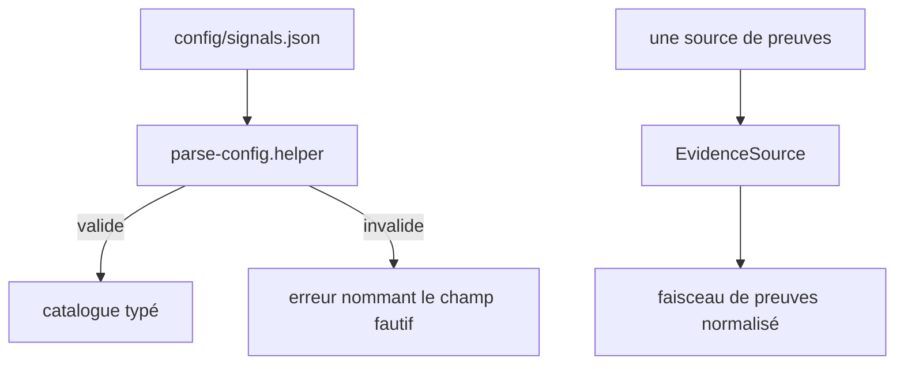
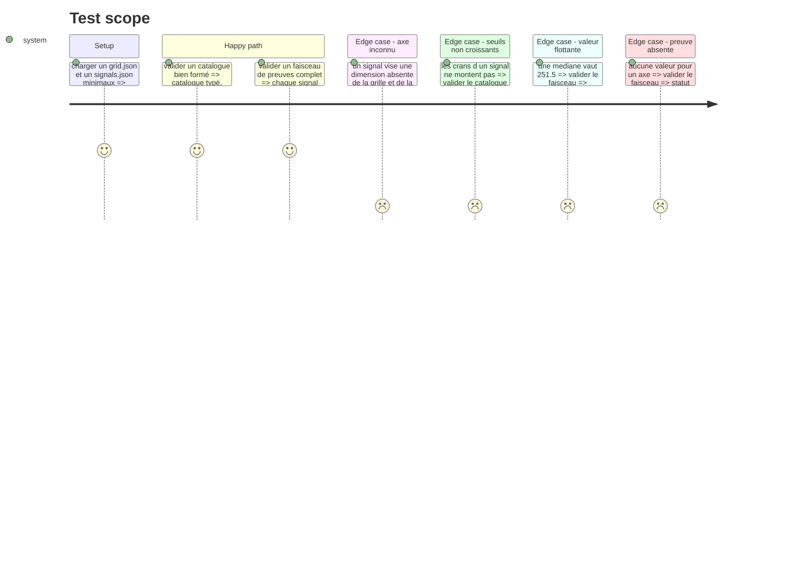

# Instruction: Les contrats — faisceau de preuves et catalogue

## Architecture projection

> Tree of the final files. ✅ create · ✏️ modify · ❌ delete

```txt
.
├── config/
│   └── signals.json                                    ✅ squelette versionné, catalogue vide
├── src/core/
│   ├── contracts/
│   │   ├── evidence-bundle.schema.ts                   ✅ le format interne normalisé
│   │   ├── signals-catalog.schema.ts                   ✅ le contrat du catalogue
│   │   └── parse-config.helper.ts                      ✏️ arrive avec le socle, étendu au catalogue
│   └── ports/
│       └── evidence-source.interface.ts                ✅ le port d'entrée des adapters
└── __tests__/unit/core/contracts/
    ├── signals-catalog.schema.test.ts                  ✅
    └── evidence-bundle.schema.test.ts                  ✅
```

## User Journey



## Test Scope



## Tasks to do

### `1)` Le schéma du faisceau de preuves

> Le format interne que tout adapter produit, et la seule chose que le moteur sait lire.

1. Créer `evidence-bundle.schema.ts` : un faisceau porte une période, une liste d'observations, et rien d'autre.
2. Une observation porte : `signalId`, `value` (nombre, booléen, ou liste de chemins), `source` (le fichier ou l'artefact d'où elle sort), `family` (`repo` ou `course`).
3. Accepter les valeurs flottantes pour toute médiane.
4. Exporter les types par `z.infer`, aucune classe.

### `2)` Le schéma du catalogue

> Un signal est une règle de lecture déclarée, jamais du code.

1. Créer `signals-catalog.schema.ts` : un signal porte `id`, `axis`, `rule` (type discriminant + paramètres), `steps` (la valeur seuil par cran, avec le libellé du cran), `family`, et `confidence`.
2. Les `steps` montent strictement, comme les échelles de la grille.
3. Discriminer les paramètres de `rule` par le type, pour qu'un paramètre étranger soit refusé.

### `3)` Le port d'entrée

> Le moteur ignore d'où viennent les preuves.

1. Créer `evidence-source.interface.ts` : une méthode qui rend un faisceau de preuves, et le nom de la source.
2. Interface petite et ciblée, aucun détail de dossier ni de réseau.

### `4)` La validation au chargement

> Ces JSON s'éditent à la main sous pression : l'erreur doit nommer le champ.

1. Étendre `parse-config.helper.ts` au catalogue.
2. Refuser au chargement un signal dont l'axe n'est déclaré ni par la grille ni par la signature, en nommant les deux.
3. Refuser au chargement des `steps` qui ne montent pas.
4. Poser `config/signals.json` avec sa version et un catalogue vide, valide contre le schéma.

## Test acceptance criteria

| Task | Acceptance criteria |
| --- | --- |
| 1 | Un faisceau sans observation pour un axe se charge et laisse cet axe sans valeur, il ne le pose pas à zéro |
| 1 | Une médiane à `251.5` traverse le schéma sans perte |
| 2 | Un signal dont les crans décroissent est refusé, le message nomme le signal |
| 2 | Un paramètre qui n'appartient pas au type de règle déclaré est refusé |
| 3 | Le moteur compile sans importer aucun adapter concret |
| 4 | Un signal visant `qualite` alors que ni la grille ni la signature ne la déclarent est refusé au chargement, le message nomme le signal et la dimension |
| 4 | `config/signals.json` vide se charge sans erreur |
