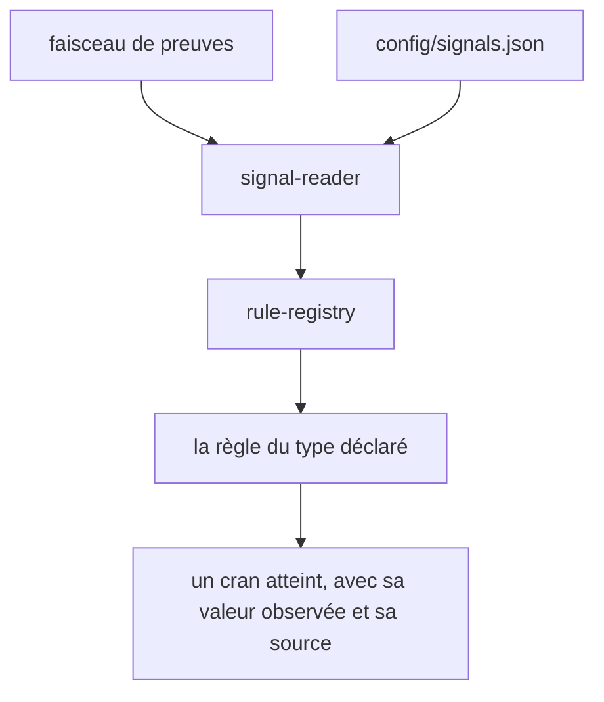
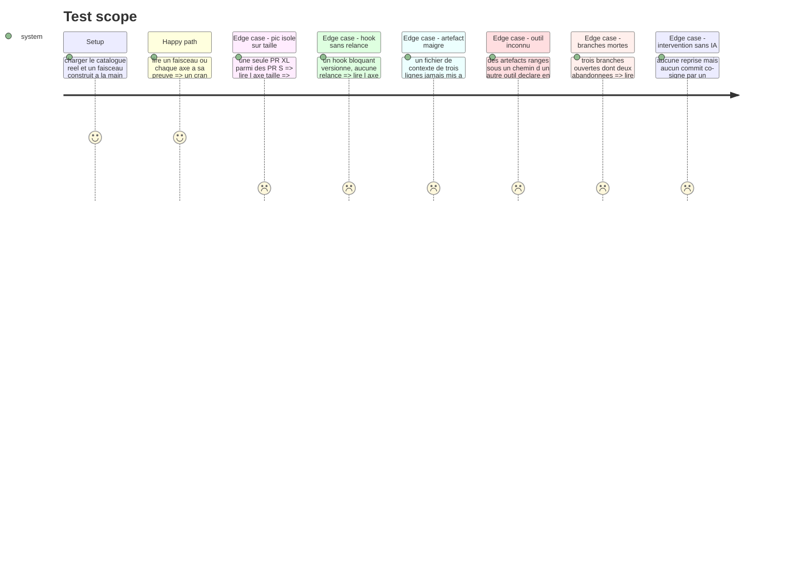

# Instruction: Les règles de lecture et le catalogue JSON

## Appuis du socle

- Le registre de règles se calque sur `src/core/registry/game-registry.ts` : une `Map`, un `resolve` qui lève en se nommant avec la liste des types connus, et un `register-rules.ts` sur le modèle de `src/games/register-games.ts`.
- Le suffixe `*.rule.ts` n'existe pas encore dans la table de nommage de `TECHNICAL.md` §4 ni dans `coding-assertions.md`. L'ajouter dans le même geste, sinon la convention se contredit dès le premier fichier de cette phase.
- `config/` porte déjà `grid.json`, `course.json` et `signature.json` : les axes que les signaux visent sont lisibles à l'écriture du catalogue, ils ne s'inventent pas.

## Architecture projection

> Tree of the final files. ✅ create · ✏️ modify · ❌ delete

```txt
.
├── config/
│   ├── signals.json                                    ✏️ le catalogue réel, cinq axes
│   └── artifact-families.json                          ✅ motifs de chemin par famille d outil
├── src/core/signals/
│   ├── rules/
│   │   ├── dominant-class.rule.ts                      ✅ taille : le plus haut cran pesant un quart
│   │   ├── median-threshold.rule.ts                    ✅ intervention, parallele
│   │   ├── ratio-threshold.rule.ts                     ✅ part de PR sans édition humaine
│   │   ├── artifact-family.rule.ts                     ✅ harness : présence ET substance
│   │   └── iteration-proof.rule.ts                     ✅ boucles : preuve de relance
│   ├── rule-registry.ts                                ✅ résolution type → règle
│   ├── register-rules.ts                               ✅ le seul point de câblage
│   └── signal-reader.ts                                ✅ faisceau + catalogue → crans par signal
└── __tests__/unit/core/signals/
    ├── dominant-class.rule.test.ts                     ✅
    ├── median-threshold.rule.test.ts                   ✅
    ├── ratio-threshold.rule.test.ts                    ✅
    ├── artifact-family.rule.test.ts                    ✅
    ├── iteration-proof.rule.test.ts                    ✅
    └── signal-reader.test.ts                           ✅
```

## User Journey



## Test Scope



## Tasks to do

### `1)` Les familles d'artefacts

> Reconnaître un seul outil, c'est perdre le critère de justesse sur tout profil qui en utilise un autre.

1. Créer `config/artifact-families.json` : par famille (`memory`, `rules`, `agents`, `hooks`, `skills`, `loops`), la liste des motifs de chemin.
2. Couvrir au minimum Claude Code, Cursor, Copilot, Windsurf, Aider et un dossier de contexte générique.
3. Aucun nom d'outil dans le code : le fichier est la seule source.

### `2)` La règle de classe dominante

> Le mot du référentiel est « habituelle ».

1. Créer `dominant-class.rule.ts` : sur une distribution, rendre le plus haut cran qui pèse au moins la part déclarée.
2. La part est un paramètre du catalogue, pas une constante.
3. Exposer la valeur observée qui a décidé, pour le rapport.

### `3)` Les règles de seuil

> Deux formes, une médiane et une part.

1. Créer `median-threshold.rule.ts` et `ratio-threshold.rule.ts`.
2. Les bornes sont inclusives, comme celles de la grille.
3. Gérer l'inversion : un axe qui décroît dans le référentiel est lu comme absence, `1` valant « jamais ».

### `4)` La règle d'artefact, présence et substance

> Compter des fichiers récompense le cargo cult.

1. Créer `artifact-family.rule.ts` : apparier les chemins observés aux familles, puis pondérer par taille utile et par fraîcheur.
2. Un artefact sous le plancher de substance ne compte pas, il n'abaisse rien.
3. La fraîcheur se lit sur la date de dernière modification déclarée par la preuve, jamais sur la date du jour en dur.

### `5)` La règle de preuve d'itération

> Un hook bloque, une boucle relance. C'est ce qui sépare Copper de Silver.

1. Créer `iteration-proof.rule.ts` : n'accorder le cran que sur la preuve d'une relance conditionnée à l'échec d'une commande du projet.
2. Un hook de vérification, même sortant en code non nul, ne suffit pas.
3. Un document qui décrit une relance sans mécanisme versionné ne suffit pas.
4. Sans preuve, le cran n'est pas accordé : mieux vaut un Copper justifié qu'un Silver optimiste.

### `6)` Le registre et le lecteur

> Ajouter une lecture ne modifie aucun fichier existant hors le câblage.

1. Créer `rule-registry.ts` et `register-rules.ts`, sur le modèle du registre de jeux : un type absent lève en se nommant et en listant les connus, comme `UnknownGameTypeError`.
2. Créer `signal-reader.ts` : pour chaque signal du catalogue, résoudre sa règle, l'appliquer au faisceau, rendre le cran avec sa valeur observée et sa source.
3. Un signal sans observation ne rend pas un cran zéro : il ne rend rien.
4. Inscrire le suffixe `*.rule.ts` dans la table de nommage de `TECHNICAL.md` §4 et dans `aidd_docs/memory/coding-assertions.md`.

### `7)` Écrire le catalogue

> Le cœur du produit, et la matière du critère « on comprend pourquoi ».

1. Remplir `config/signals.json` pour les cinq axes, en partant des signaux de `BRIEF.md` §5.
2. Chaque signal nomme sa famille (`repo` ou `course`) et sa confiance.
3. Aucun seuil ne vit ailleurs que dans ce fichier.

## Test acceptance criteria

| Task | Acceptance criteria |
| --- | --- |
| 1 | Le même jeu d'artefacts rangé sous deux conventions d'outil différentes rend le même cran |
| 2 | Une distribution à une seule PR XL parmi des S rend le cran S |
| 2 | Le cran rendu s'accompagne de la valeur qui l'a décidé |
| 3 | Un score posé exactement sur un seuil atteint le cran |
| 4 | Un fichier de contexte de trois lignes jamais mis à jour n'ouvre pas le cran `context engineering` |
| 4 | Un artefact frais et substantiel ouvre le cran, le même artefact figé depuis un an ne l'ouvre pas |
| 5 | Le hook `PostToolUse` bloquant de `leodagan` laisse l'axe `harness` au cran `behavior` |
| 5 | Un document de brainstorm sur la relance automatique n'ouvre pas le cran `boucles` |
| 6 | Ajouter un type de règle ne modifie que `register-rules.ts` |
| 6 | Un signal sans observation laisse l'axe sans valeur |
| 6 | Un type de règle inconnu lève en nommant le type et les types enregistrés |
| 7 | Déplacer un seuil dans `config/signals.json` change le cran rendu, sans qu'une ligne de code bouge |
