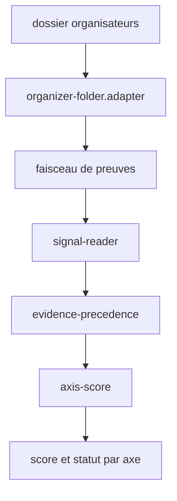
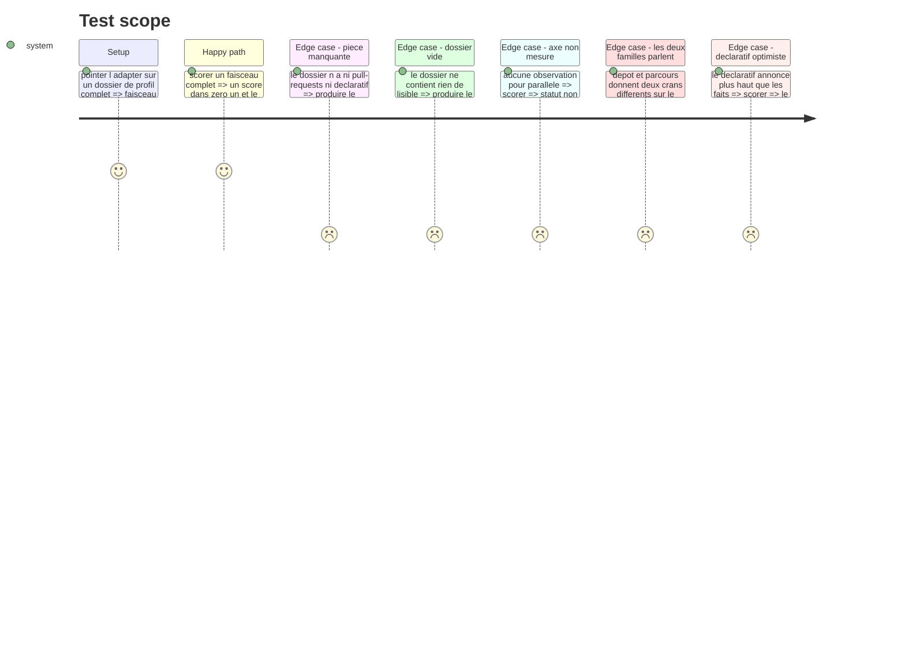

# Instruction: L'adapter dossier et le scoring par axe

## Appuis du socle

- `src/infrastructure/` porte déjà `clock/` et `persistence/` : `evidence/` suit la même règle, un sous-dossier par port, un fichier `<techno>.adapter.ts` sans préfixe de port.
- `LocalSessionStorageAdapter` reçoit sa dépendance externe au constructeur, **sans valeur par défaut** : c'est `composition-root.ts` qui lui passe `globalThis.localStorage`. Un défaut lisant un global rendrait l'absence inexprimable — passer `undefined` déclencherait le défaut — et ferait dépendre l'adapter du runtime. L'adapter dossier prend son lecteur de fichiers de la même façon : c'est ce qui rend ses cas de pièce absente exerçables sans monter une arborescence de test.
- Ce même adapter avale ses erreurs plutôt que de lever, parce qu'un stockage abîmé ne doit pas bloquer un joueur. L'adapter dossier applique la règle inverse pour ce qu'il ne comprend pas : une pièce absente est nominale, mais elle est **tracée** dans le rapport, jamais silencieuse.
- L'adapter dossier est un usage interne. Il ne passe pas par `composition-root.ts`, qui ne câble que la partie jouée ; le banc de la phase 4 l'instancie directement.
- **Collision à trancher avant d'écrire `axis-score.ts`.** `DimensionRow` (`src/features/scoring-summary/components/composites/dimension-row.tsx`) lit `measured` en booléen : à `false` il affiche `—`, un filet pointillé et « aucun critère ne mesure cette dimension ». Le statut à trois valeurs de la tâche 3 n'a pas de place dans ce rendu. Ou bien le statut s'ajoute à côté de `measured`, qui garde son sens actuel, ou bien `DimensionRow` apprend le cran `inféré` et sa marque propre. Ne pas laisser un axe `inféré` retomber sur `measured: true` : il s'afficherait comme une mesure, ce que le composant se donne justement pour mission de distinguer.

## Architecture projection

> Tree of the final files. ✅ create · ✏️ modify · ❌ delete

```txt
.
├── src/core/scoring/
│   ├── axis-score.ts                                   ✅ crans → score [0,1] + statut de mesure
│   └── evidence-precedence.ts                          ✅ le dépôt tranche sur le parcours
├── src/infrastructure/evidence/
│   └── organizer-folder.adapter.ts                     ✅ dossier organisateurs → faisceau
└── __tests__/unit/
    ├── core/scoring/
    │   ├── axis-score.test.ts                          ✅
    │   └── evidence-precedence.test.ts                 ✅
    └── infrastructure/evidence/
        └── organizer-folder.adapter.test.ts            ✅
```

## User Journey



## Test Scope



## Tasks to do

### `1)` L'adapter dossier organisateurs

> Un usage interne, pas une voie d'entrée produit.

1. Créer `organizer-folder.adapter.ts` derrière le port `EvidenceSource`.
2. Injecter le lecteur de fichiers au constructeur, avec le lecteur réel en défaut, comme `LocalSessionStorageAdapter` le fait de son `Storage`. Les cas de pièce absente se jouent alors sans arborescence sur le disque.
3. Lire `profile.json`, `git-activity.json`, `pull-requests.json`, `sonar-measures.json`, `repo-context/`, `code/`, `declaratif.md`, `session.md`.
4. Chaque pièce absente est un cas nominal : elle ne produit pas d'observation, elle ne lève pas d'erreur.
5. Rendre, à côté du faisceau, le rapport de ce qui a été trouvé et de ce qui ne l'a pas été.
6. Parcourir `repo-context/` en arborescence, pas seulement les compteurs de `git-activity.json` : ces compteurs ratent des artefacts réellement présents.

### `2)` La préséance des preuves

> Quand les deux parlent, le dépôt tranche.

1. Créer `evidence-precedence.ts` : à cran divergent sur un même axe, retenir la famille `repo`.
2. Conserver le cran écarté dans la trace, il sert le rapport.
3. Quand seul le parcours parle, retenir son cran avec une confiance moindre et affichée.

### `3)` Le score et le statut par axe

> Un axe non mesuré plafonne le niveau, il ne vaut pas zéro.

1. Créer `axis-score.ts` : contributions obtenues sur contributions possibles, normalisé dans `[0,1]`.
2. Poser le statut : `mesuré` quand une observation de famille `repo` porte l'axe, `inféré` quand seul le parcours ou un artefact en prose le porte, `non mesuré` sinon. Trancher la collision avec `DimensionScore.measured` relevée plus haut, et faire suivre `DimensionRow` : un axe `inféré` porte sa marque propre, jamais celle d'une mesure.
3. Un axe `non mesuré` sort un plafond de niveau annonçable, distinct du score.
4. Garder l'axe `intervention` sous garde : sans preuve qu'un assistant est à l'œuvre, il reste `non mesuré`.
5. Le déclaratif et l'analyse statique ne contribuent à aucun score ; ils produisent une ligne d'écart et une contre-preuve.

## Test acceptance criteria

| Task | Acceptance criteria |
| --- | --- |
| 1 | Le dossier de `perceval`, sans `pull-requests.json` ni `repo-context/`, produit un faisceau sans erreur |
| 1 | Le dossier de `arthur`, sans `declaratif.md`, produit un faisceau sans erreur |
| 1 | Les artefacts de `arthur/repo-context/.claude/` sont vus alors que `rules_count` vaut `0` |
| 1 | Un dossier vide rend un faisceau vide et un rapport listant chaque pièce absente |
| 1 | Les cas de pièce absente passent par un lecteur injecté, sans écrire un seul fichier sur le disque |
| 2 | Un axe où dépôt et parcours divergent retient le cran du dépôt et conserve l'autre dans la trace |
| 3 | Deux exécutions sur le même dossier rendent des scores identiques |
| 3 | Un axe sans aucune observation ressort `non mesuré` et pose un plafond, son score n'est pas `0` |
| 3 | Un profil sans commit co-signé par un assistant laisse `intervention` `non mesuré` malgré zéro reprise |
| 3 | Un déclaratif annonçant un niveau haut ne déplace aucun score |
| 3 | Un axe `inféré` se distingue à l'écran d'un axe `mesuré`, il ne réutilise pas sa marque |
