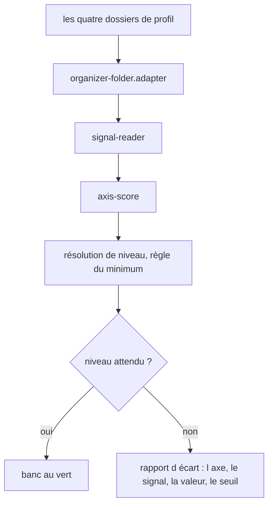
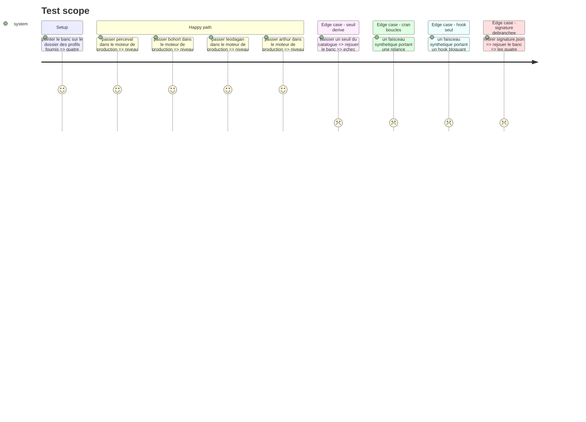

# Instruction: Le banc de calibration

## Architecture projection

> Tree of the final files. ✅ create · ✏️ modify · ❌ delete

```txt
.
├── config/
│   └── signals.json                                    ✏️ seuils recalés jusqu au vert
└── __tests__/integration/calibration/
    ├── expected-levels.ts                              ✅ les quatre attendus, source unique
    ├── calibration-bench.test.ts                       ✅ profil → moteur → niveau attendu
    ├── loop-threshold.test.ts                          ✅ le cran boucles, sans exemple au banc
    └── divergence-report.ts                            ✅ ce qui a plafonné, quand ça rate
```

## User Journey



## Test Scope



## Tasks to do

### `1)` Le banc

> Le banc est un outil de développement, pas une fonctionnalité livrée.

1. Créer `expected-levels.ts` : les quatre profils et leur niveau attribué, une seule fois.
2. Créer `calibration-bench.test.ts` : chaque profil traverse le **moteur de production**, jamais un chemin de test dédié.
3. Le banc lit les dossiers depuis un chemin configurable, il ne les copie pas dans le dépôt.

### `2)` Le rapport d'écart

> Un banc rouge doit dire quoi bouger, pas seulement qu'il est rouge.

1. Créer `divergence-report.ts` : à l'échec, nommer le profil, l'axe qui a plafonné, le signal, la valeur observée et le seuil manqué.
2. Le rapport sert aussi quand le banc est vert, pour montrer par quoi chaque profil a été plafonné.

### `3)` Le cran `boucles`, que le banc ne couvre pas

> Les quatre profils plafonnent à Copper : aucun ne valide ce seuil.

1. Créer `loop-threshold.test.ts` sur deux faisceaux synthétiques : un avec relance conditionnée à l'échec, un avec hook bloquant seul.
2. Marquer explicitement ces cas comme synthétiques, pour qu'ils ne passent pas pour des profils fournis.

### `4)` Recaler les seuils

> Le banc passe au vert avant qu'une mise en situation soit ajoutée.

1. Rejouer le banc, ajuster les seuils de `config/signals.json` jusqu'au vert.
2. Ne jamais ajouter de cas particulier par profil : un seuil qui ne tient que pour un dossier est un seuil faux.
3. Vérifier que le verdict officiel est identique une fois `signature.json` débranché.

### `5)` Brancher le banc sur la porte de push

1. Ajouter le banc au job de tests déjà câblé dans `lefthook.yml`.
2. Une régression de scoring bloque le push, comme un test qui casse.

## Test acceptance criteria

| Task | Acceptance criteria |
| --- | --- |
| 1 | Les quatre profils retombent sur Red, Blue, Green et Copper |
| 1 | Aucun profil ne passe par un chemin de code réservé aux tests |
| 2 | Un seuil déplacé fait échouer le banc avec le profil, l'axe, la valeur et le seuil nommés |
| 2 | Un banc vert affiche par profil l'axe qui a plafonné son niveau |
| 3 | Une relance conditionnée à l'échec d'une commande ouvre le cran `boucles` |
| 3 | Un hook bloquant sans relance laisse le cran à `behavior` |
| 4 | Aucune branche du code ne teste un identifiant de profil |
| 4 | Retirer `signature.json` laisse les quatre niveaux inchangés |
| 5 | Une régression de scoring bloque `git push` |
