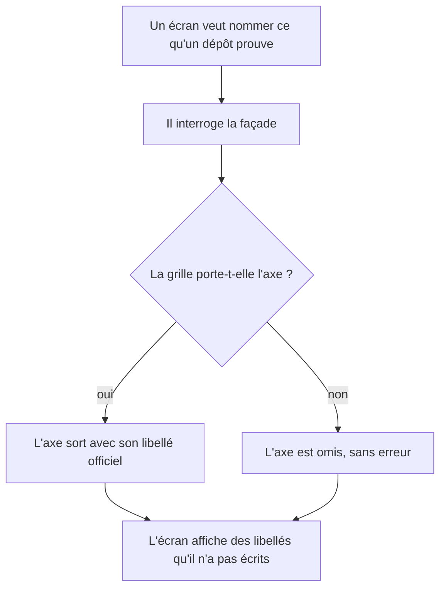
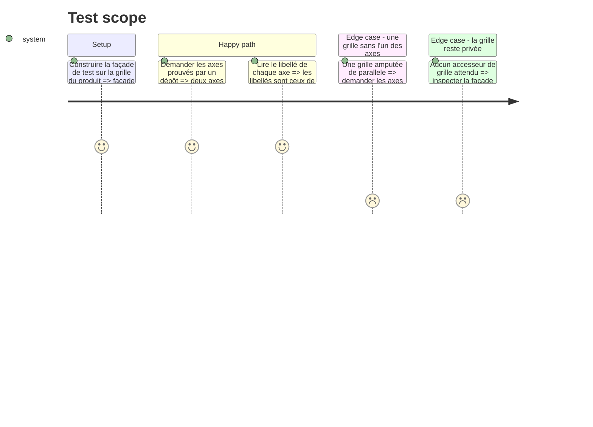

# Instruction: Nommer dans le domaine les axes que le dépôt prouve

## Cancellation

Annulée après revue, sur décision produit : l'accueil ne recopie pas les
libellés officiels de `config/grid.json`, il nomme les deux axes en mots
ordinaires. Plus aucun libellé n'est donc lu dans la grille, ce qui retire
tout appelant à ce que cette phase avait livré — l'aide de domaine
`repository-proven-axes.helper.ts`, la méthode `repositoryProvenAxes()` de
la façade, et son exposition par `use-onboarding.hook.ts`. Code non appelé
est du code mort : il a été retiré plutôt que gardé « pour l'Epic 4 »,
laquelle le réintroduira si elle en a besoin.

Le reste de ce fichier documente ce qui avait été construit puis retiré, pour
mémoire seulement — rien ci-dessous n'est présent dans le code.

## Architecture projection

> Tree of the final files. ✅ create · ✏️ modify · ❌ delete

```txt
.
├── src
│   └── core
│       ├── scoring
│       │   └── helpers
│       │       └── repository-proven-axes.helper.ts   ✅ la liste des axes qu'un dépôt sait prouver, et leurs libellés lus dans la grille
│       └── session
│           └── game-session.facade.ts                 ✏️ un accès à ces axes, la grille restant privée
└── __tests__
    └── unit
        └── core
            ├── scoring
            │   └── repository-proven-axes.test.ts     ✅ les deux axes, leurs libellés, et le silence sur une grille qui ne les porte pas
            └── session
                └── game-session.facade.test.ts        ✏️ la façade rend les axes sans exposer la grille
```

## User Journey



## Test Scope



## Tasks to do

### `1)` La liste des axes qu'un dépôt sait prouver

> Poser au même endroit le fait produit et sa lecture dans la grille.

1. Créer `src/core/scoring/helpers/repository-proven-axes.helper.ts`.
2. Exporter la constante des identifiants, `['intervention', 'parallele']`, dans cet ordre.
3. Exporter une fonction qui prend la grille et rend, pour chaque identifiant présent, `{ id, label }` en reprenant le libellé de la dimension.
4. Un identifiant absent de la grille est omis, pas remplacé par un libellé de repli.
5. Documenter en tête pourquoi ces deux-là et pas les cinq : les quatre preuves du spike ne portent que sur eux, et le parcours couvre le reste.

### `2)` L'accès depuis la façade

> Un écran ne lit pas la grille ; il demande.

1. Ajouter à `GameSessionFacade` une méthode qui rend les axes prouvés par un dépôt, en s'appuyant sur l'aide de la tâche 1 et sur sa grille privée.
2. Ne rien exposer d'autre de la grille.
3. La méthode ne demande aucune session ouverte : elle est lisible depuis l'accueil, avant tout démarrage.

### `3)` Les tests

> Prouver que le libellé vient de la donnée, pas du code.

1. Créer `__tests__/unit/core/scoring/repository-proven-axes.test.ts` : les deux axes dans l'ordre, leurs libellés lus dans la grille du produit, et le cas de la grille amputée.
2. Compléter `__tests__/unit/core/session/game-session.facade.test.ts` : la façade rend les mêmes axes, sans session ouverte.

## Test acceptance criteria

| Task | Acceptance criteria |
| ---- | ------------------- |
| 1 | Demander les axes prouvés par un dépôt sur la grille du produit rend `intervention` puis `parallele`, chacun avec le libellé exact que porte `config/grid.json`. |
| 1 | Une grille privée d'un de ces deux axes rend l'autre seul, sans erreur ni libellé inventé. |
| 2 | La façade rend ces axes alors qu'aucune session n'a été démarrée, et n'expose la grille par aucun autre membre. |
| 3 | `npm run lint`, `npm run typecheck` et `npm run test` passent. |
