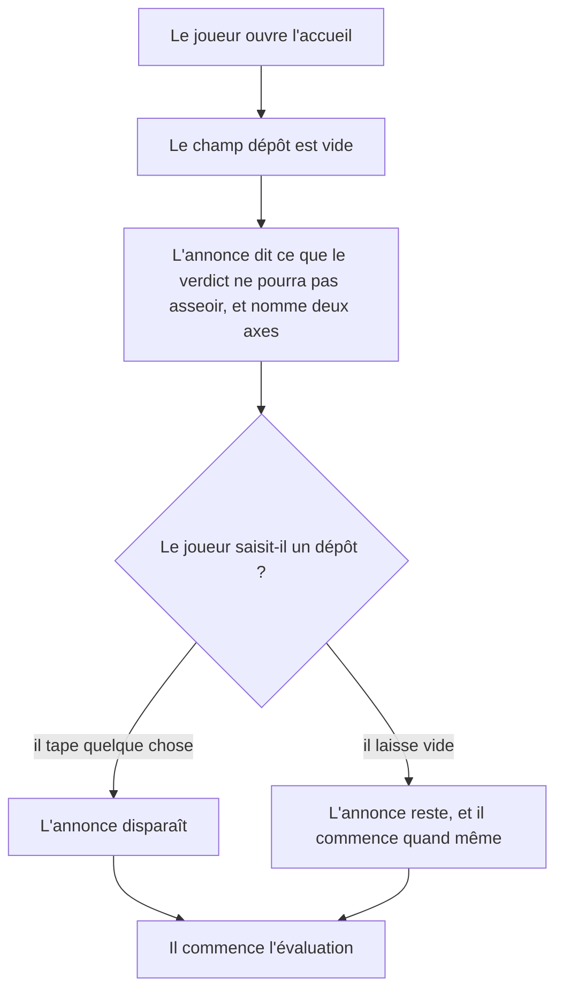
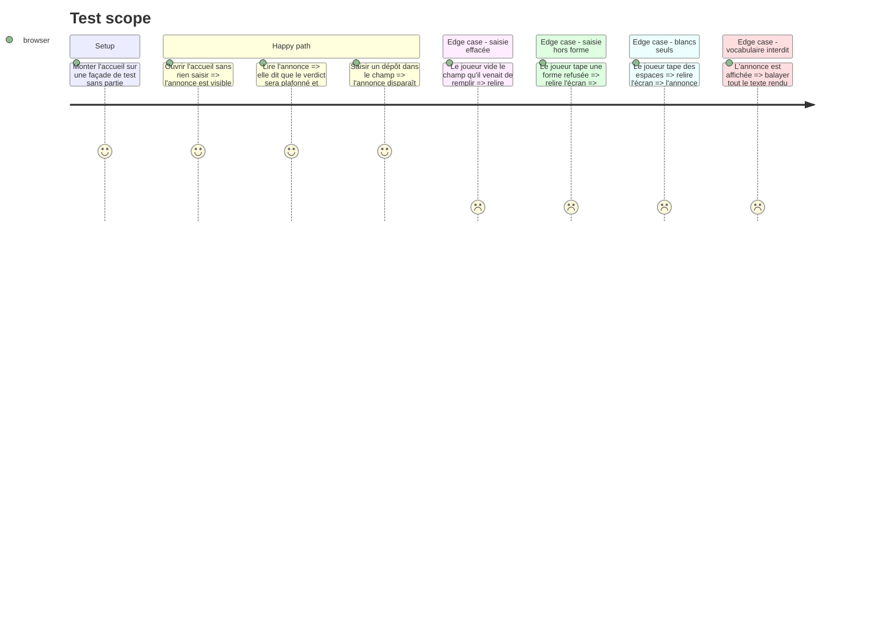

# Instruction: Énoncer le plafond tant que le dépôt manque

## Architecture projection

> Tree of the final files. ✅ create · ✏️ modify · ❌ delete

```txt
.
├── src
│   └── features
│       └── onboarding
│           ├── components
│           │   ├── composites
│           │   │   └── missing-repository-notice.tsx   ✅ l'annonce, purement présentationnelle
│           │   └── sections
│           │       └── onboarding-view.tsx             ✏️ l'annonce sous le champ dépôt, tant qu'il est vide
│           └── hooks
│               └── use-onboarding.hook.ts              ✏️ les axes remontés depuis la façade
└── __tests__
    └── unit
        └── features
            └── onboarding
                ├── onboarding-view.test.tsx            ✏️ présence, disparition, ton, et le balayage du vocabulaire
                └── use-onboarding.test.ts              ✏️ le hook rend les axes de la façade
```

## User Journey



## Test Scope



## Wireframe

```txt
┌──────────────┬───────────────────────────────────────────────┐
│ (1) Rampe    │ (2) Titre et phrase du cadre                  │
│     des      ├───────────────────────────────────────────────┤
│   groupes    │ (3) Bandeau de quatre relevés                 │
│              ├───────────────────────────────────────────────┤
│              │ (4) Ligne « une partie interrompue se reprend »│
│              ├───────────────────────────────────────────────┤
│              │ (5) Carte « Partie en cours », si stockée      │
│              ├───────────────────────────────────────────────┤
│              │ (6) Champ « Votre nom »                       │
│              │                                               │
│              │ (7) Champ « Votre dépôt » et son aide         │
│              │ ┃ (8) Annonce du plafond, champ dépôt vide    │
│              │                                               │
│              │ (9) Bouton « Commencer l'évaluation »         │
└──────────────┴───────────────────────────────────────────────┘
```

1. Rampe : les groupes du parcours, inchangée.
2. Cadre : le titre et la phrase du non-déclaratif, inchangés.
3. Relevés : groupes, situations, estimation, données. Inchangé.
4. Reprise : la phrase adressée au primo-arrivant. Inchangée.
5. Partie stockée : la carte de reprise, quand il y en a une.
6. Nom : le champ requis, inchangé.
7. Dépôt : le champ facultatif et l'aide qui donne les formes acceptées.
8. Annonce : marque structurelle à gauche, plan neutre, sous le champ qu'elle commente. Aucune couleur d'état : ce n'est pas une alerte.
9. Bouton : l'engagement, inchangé.

## Tasks to do

### `1)` Le composant d'annonce

> Un bloc muet qui reçoit ses axes et n'en décide aucun.

1. Créer `src/features/onboarding/components/composites/missing-repository-notice.tsx`.
2. Recevoir en propriété la liste `{ id, label }` des axes et ne rien lire d'autre.
3. Rendre `null` quand la liste est vide : un référentiel qui ne porte plus ces axes n'a rien à annoncer.
4. Composer le texte en trois temps : entrer sans dépôt est prévu et le parcours se joue entier ; deux axes reposeront alors sur ce seul parcours, faute d'historique à lire, nommés par leur libellé ; le verdict le dira et restera plafonné sur eux.
5. Interdits d'écriture : les vingt formes de `__tests__/fixtures/scoring-vocabulary.ts`, tout impératif adressé au joueur, toute formule qui présente l'absence comme un manquement.
6. Traitement visuel : marque structurelle à gauche sur le plan neutre (`border-l`, `border-plane-rule`, retrait), texte de taille secondaire. Ni `--caution`, ni `--missed`, ni opacité réduite.

### `2)` Les axes remontés jusqu'à l'écran

> Le hook interroge la façade, il ne connaît aucun libellé.

1. Dans `use-onboarding.hook.ts`, appeler la méthode de façade posée en phase 1.
2. Rendre le résultat sous un nom qui dit ce que c'est, et non d'où ça vient.

### `3)` Le branchement dans l'accueil

> L'annonce vit sous le champ qu'elle commente, et suit sa valeur.

1. Dans `onboarding-view.tsx`, placer le composant sous le champ dépôt, avant le bouton.
2. Le rendre tant que la valeur du champ, une fois les blancs retirés, est vide.
3. S'abonner à la valeur du champ par les moyens du formulaire déjà en place, sans second état parallèle.
4. Ne toucher ni au champ, ni au schéma, ni à la soumission.

### `4)` Les tests

> Les trois lignes d'acceptation de la Story, chacune la sienne.

1. Dans `onboarding-view.test.tsx` : l'annonce est visible à l'ouverture et nomme les deux axes ; elle disparaît dès qu'un dépôt est saisi ; elle revient si le champ est vidé ; des espaces seuls ne la font pas disparaître ; une forme refusée ne la ramène pas.
2. Vérifier que le balayage du vocabulaire de notation couvre bien l'écran annonce affichée.
3. Dans `use-onboarding.test.ts` : le hook rend les axes que la façade lui donne.

## Test acceptance criteria

| Task | Acceptance criteria |
| ---- | ------------------- |
| 1 | Le texte rendu nomme « Reprise humaine du travail de l'IA » et « Chantiers menés en parallèle », dit que le verdict sera plafonné, et dit qu'entrer sans dépôt est un usage prévu. |
| 1 | Une liste d'axes vide ne rend rien du tout. |
| 3 | À l'ouverture de l'accueil, sans partie enregistrée, l'annonce est visible. |
| 3 | Saisir `alice/atelier` dans le champ dépôt la fait disparaître ; vider le champ la fait revenir ; n'y taper que des espaces la laisse visible. |
| 3 | Saisir une forme refusée laisse l'annonce absente, et le message du champ reste le seul refus affiché. |
| 4 | Le balayage du vocabulaire de notation passe sur l'écran annonce affichée. |
| 4 | `npm run lint`, `npm run typecheck` et `npm run test` passent. |
