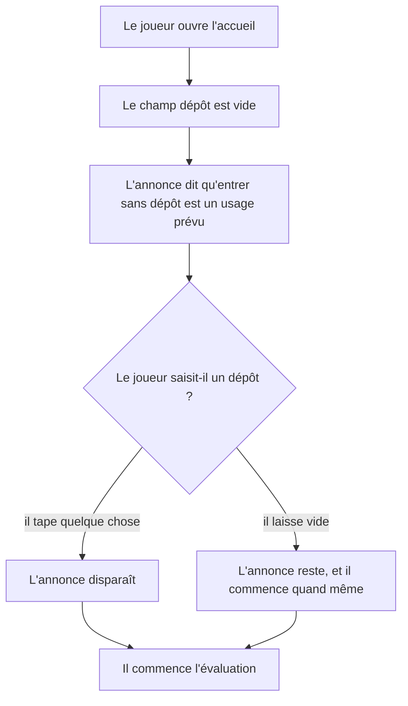
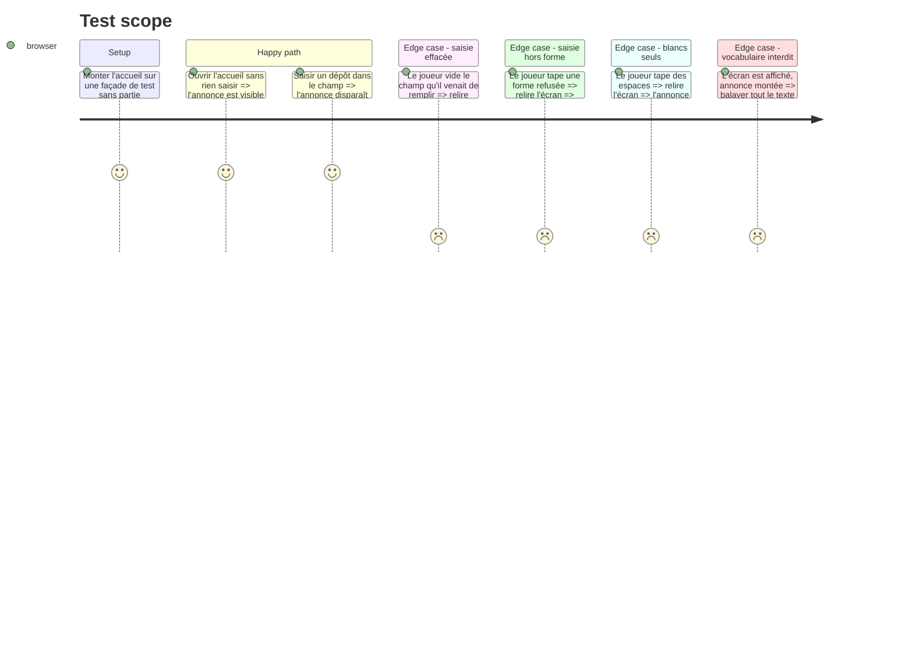

# Instruction: Énoncer que le parcours se joue en entier sans dépôt

Réparation décidée après revue : la Story initiale demandait de nommer les
deux axes avec leur libellé officiel et d'annoncer un plafond. Deux décisions
produit tranchent différemment — l'accueil ne recopie pas les libellés de
`config/grid.json`, et aucune promesse de plafond n'est faite, faute de
mécanisme dans le code. Le composant qui en résulte n'a donc plus d'axes à
recevoir : son texte est fixe.

## Architecture projection

> Tree of the final files. ✅ create · ✏️ modify · ❌ delete

```txt
.
├── src
│   └── features
│       └── onboarding
│           ├── components
│           │   ├── elements
│           │   │   └── missing-repository-notice.tsx   ✅ l'annonce, texte fixe, sans propriété
│           │   └── sections
│           │       └── onboarding-view.tsx             ✏️ l'annonce sous le champ dépôt, tant qu'il est vide
│           └── hooks
│               └── use-onboarding.hook.ts              — inchangé par cette phase
└── __tests__
    └── unit
        └── features
            └── onboarding
                └── onboarding-view.test.tsx            ✏️ présence, disparition, absence sur forme refusée
```

## User Journey



## Test Scope



## Wireframe

```txt
┌──────────────┬───────────────────────────────────────────────┐
│ (1) Rampe    │ (2) Titre et phrase du cadre                  │
│     des      ├───────────────────────────────────────────────┤
│   groupes    │ (3) Bandeau de quatre relevés                 │
│              ├───────────────────────────────────────────────┤
│              │ (4) Ligne « une partie interrompue se reprend »│
│              ├───────────────────────────────────────────────┤
│              │ (5) Carte « Partie en cours », si stockée      │
│              ├───────────────────────────────────────────────┤
│              │ (6) Champ « Votre nom »                       │
│              │                                               │
│              │ (7) Champ « Votre dépôt » et son aide         │
│              │     (8) Annonce, même largeur que le champ    │
│              │                                               │
│              │ (9) Bouton « Commencer l'évaluation »         │
└──────────────┴───────────────────────────────────────────────┘
```

1. Rampe : les groupes du parcours, inchangée.
2. Cadre : le titre et la phrase du non-déclaratif, inchangés.
3. Relevés : groupes, situations, estimation, données. Inchangé.
4. Reprise : la phrase adressée au primo-arrivant. Inchangée.
5. Partie stockée : la carte de reprise, quand il y en a une.
6. Nom : le champ requis, inchangé.
7. Dépôt : le champ facultatif et l'aide qui donne les formes acceptées.
8. Annonce : marque structurelle à gauche, plan neutre, dans le même conteneur
   que le champ dépôt (`max-w-sm`, `gap-2`) — plus proche de lui que du
   bouton. Aucune couleur d'état : ce n'est pas une alerte.
9. Bouton : l'engagement, inchangé.

## Tasks to do

### `1)` Le composant d'annonce

> Un élément muet, texte fixe, sans propriété.

1. `src/features/onboarding/components/elements/missing-repository-notice.tsx` : un `<p>` sans composition ni propriété — un élément, pas un composite.
2. Texte fixe : entrer sans dépôt est un usage prévu, le parcours se joue en entier ; sans dépôt à lire, ce que le joueur fait du travail de l'IA et le nombre de chantiers qu'il mène de front ne reposeront que sur ce seul parcours.
3. Ne pas recopier les libellés de `config/grid.json` : décision produit, un joueur prévenu de ce qui est noté joue un personnage.
4. Ne pas promettre de plafond ni de moment de lecture : aucun mécanisme de plafond n'existe dans le code, et aucune Story livrée ne tient la lecture du dépôt.
5. Interdits d'écriture : les vingt formes de `__tests__/fixtures/scoring-vocabulary.ts`, tout impératif adressé au joueur, toute formule qui présente l'absence comme un manquement.
6. Traitement visuel : marque structurelle à gauche sur le plan neutre (`border-l`, `border-plane-rule`, retrait), texte de taille secondaire, même largeur maximale que le champ qu'elle commente. Ni `--caution`, ni `--missed`.

### `2)` Le branchement dans l'accueil

> L'annonce vit dans le conteneur du champ qu'elle commente, et suit sa valeur.

1. Dans `onboarding-view.tsx`, envelopper le `TextField` du dépôt et l'annonce dans un même conteneur (`max-w-sm`, `gap-2`), pour que l'annonce hérite la largeur du champ et reste plus proche de lui que du bouton (`gap-5` du formulaire).
2. Rendre l'annonce tant que la valeur du champ, une fois les blancs retirés, est vide.
3. S'abonner à la valeur du champ par les moyens du formulaire déjà en place, sans second état parallèle.
4. Ne toucher ni au champ, ni au schéma, ni à la soumission.

### `3)` Les tests

> Les comportements qui portent, chacun le sien.

1. Dans `onboarding-view.test.tsx` : l'annonce est visible à l'ouverture ; elle disparaît dès qu'un dépôt est saisi ; elle revient si le champ est vidé ; des espaces seuls ne la font pas disparaître ; une forme refusée ne la ramène pas.
2. Le balayage du vocabulaire de notation déjà en place (`never states a scoring vocabulary word anywhere on the screen`) couvre l'écran annonce affichée ; aucun test dédié dupliqué n'est ajouté à côté.

## Test acceptance criteria

| Task | Acceptance criteria |
| ---- | -------------------- |
| 1 | Le texte rendu dit qu'entrer sans dépôt est un usage prévu, que le parcours se joue en entier, et ne recopie aucun libellé de `config/grid.json` ni aucune promesse de plafond. |
| 1 | Le texte ne contient aucune des vingt formes de `__tests__/fixtures/scoring-vocabulary.ts`. |
| 2 | À l'ouverture de l'accueil, sans partie enregistrée, l'annonce est visible. |
| 2 | Saisir `alice/atelier` dans le champ dépôt la fait disparaître ; vider le champ la fait revenir ; n'y taper que des espaces la laisse visible. |
| 2 | Saisir une forme refusée laisse l'annonce absente, et le message du champ reste le seul refus affiché. |
| 3 | `npm run lint`, `npm run typecheck` et `npm run test` passent. |
