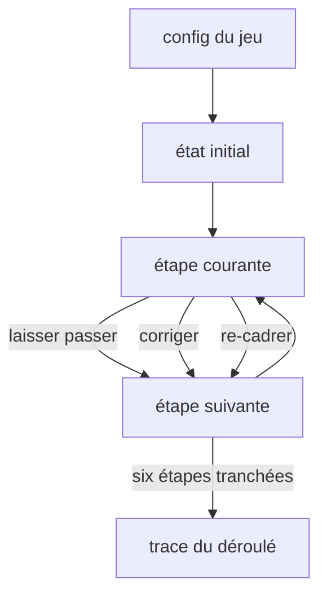
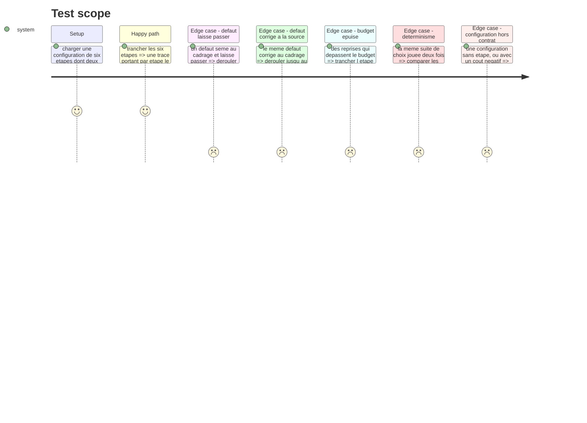

# Instruction: Les contrats et la simulation pure

## Architecture projection

> Tree of the final files. ✅ create · ✏️ modify · ❌ delete

```txt
.
├── src/games/checkpoints/
│   ├── schema/
│   │   ├── config.schema.ts                        ✅ les six étapes, leurs défauts, leurs coûts
│   │   └── answer.schema.ts                        ✅ la trace du déroulé
│   └── helpers/
│       └── run-simulation.helper.ts                ✅ état + choix → état suivant, sans effet de bord
└── __tests__/unit/games/checkpoints/
    ├── config.schema.test.ts                       ✅
    └── run-simulation.test.ts                      ✅
```

## User Journey



## Test Scope



## Tasks to do

### `1)` Le schéma de configuration

> Ce qu'un auteur de parcours écrit dans `course.json` pour ce jeu, et rien de plus.

1. Créer `config/schema/config.schema.ts` : une liste de six étapes ordonnées, chacune portant son identifiant, son libellé joueur en français, la sortie de l'IA à trancher, et le coût de chacun des trois choix.
2. Une étape peut porter un défaut : son identifiant, et le facteur par lequel son coût est multiplié s'il n'est pas traité à sa source.
3. Le budget de départ est déclaré dans la configuration, jamais en dur.
4. Un défaut déclare l'étape où il éclate s'il n'est pas traité à sa source.
5. Refuser au chargement une configuration sans étape, un coût négatif, ou un facteur inférieur à un.
6. Le schéma doit accueillir le barème arrêté en [`phase-4.md`](./phase-4.md) sans transformation.

### `2)` Le schéma de réponse

> La trace est la réponse. C'est elle que l'évaluateur lira.

1. Créer `schema/answer.schema.ts` : par étape tranchée, l'identifiant de l'étape, le choix fait, le coût payé.
2. Ajouter au niveau de la trace le budget restant à la fin et la liste des défauts encore présents au merge.
3. Une trace incomplète, à qui il manque une étape de la configuration, est refusée.

### `3)` La simulation

> Une seule source pour l'avancée à l'écran et le rejeu au scoring.

1. Créer `helpers/run-simulation.helper.ts` : une fonction pure qui prend un état et un choix, et rend l'état suivant.
2. Poser la propagation : un défaut laissé passer reste dans le livrable et son coût est prélevé à l'étape où il éclate, multiplié par son facteur.
3. `corriger` traite le défaut de l'étape courante, `re-cadrer` traite aussi ceux hérités des étapes précédentes, `laisser passer` ne traite rien.
4. Aucun appel à `Date`, `Math.random` ou à quoi que ce soit d'extérieur : la fonction ne dépend que de ses arguments.
5. Exposer une fonction qui rejoue une trace complète depuis la configuration, pour que l'évaluateur n'ait pas à réimplémenter l'avancée.

## Test acceptance criteria

| Task | Acceptance criteria |
| --- | --- |
| 1 | Une configuration sans étape est refusée, le message nomme le champ |
| 1 | Un coût négatif ou un facteur inférieur à un est refusé |
| 1 | Le budget vient de la configuration : le changer change la partie sans toucher au code |
| 2 | Une trace à qui il manque une étape est refusée |
| 2 | La trace porte, à la fin, le budget restant et les défauts encore présents |
| 3 | Un défaut laissé passer au cadrage coûte, au merge, son coût multiplié par son facteur |
| 3 | Le même défaut corrigé à sa source coûte son prix une fois, sans multiplication |
| 3 | Deux exécutions de la même suite de choix rendent des traces identiques |
| 3 | Un budget dépassé n'interrompt pas la partie : le dépassement est tracé et le joueur va au merge |
| 3 | Rejouer une trace complète rend le même état final que l'avoir jouée pas à pas |
