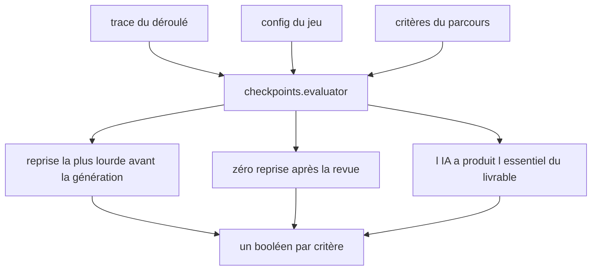
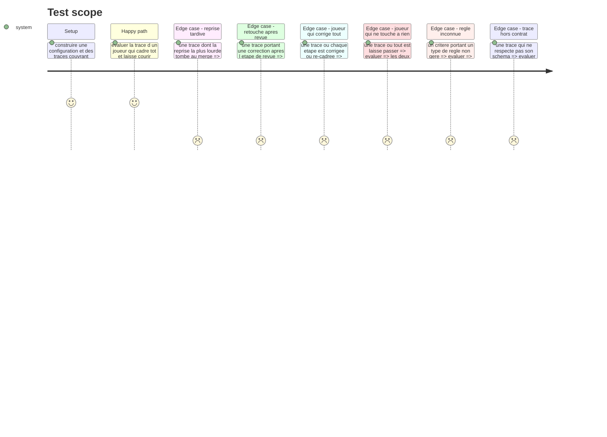

# Instruction: L'évaluateur et ses trois règles

## Architecture projection

> Tree of the final files. ✅ create · ✏️ modify · ❌ delete

```txt
.
├── src/games/checkpoints/
│   └── checkpoints.evaluator.ts                    ✅ le point de contact avec le port GameEvaluator
└── __tests__/unit/games/checkpoints/
    └── evaluator.test.ts                           ✅
```

## User Journey



## Test Scope



## Tasks to do

### `1)` L'évaluateur

> Il interprète des règles déclaratives ; modifier un critère se fait dans le JSON, pas ici.

1. Créer `checkpoints.evaluator.ts` à la racine du dossier du jeu, implémentant `GameEvaluator`.
2. Parser la configuration et la trace par leurs schémas avant toute lecture.
3. Rejouer la trace par le helper de la phase 1 plutôt que de recalculer l'avancée.
4. Aiguiller sur le type de règle porté par chaque critère, et lever en nommant la règle et le jeu quand le type est inconnu.
5. Aucun accès au store, aucun effet de bord, aucune connaissance d'un autre jeu.

### `2)` La règle « reprise la plus lourde avant la génération »

1. Identifier l'étape où le joueur a payé le plus cher.
2. Le critère est satisfait quand cette étape est le cadrage ou le plan.
3. À égalité de coût entre deux étapes, retenir la plus précoce : cadrer tôt ne doit pas être puni par une égalité.

### `3)` La règle « zéro reprise après la revue »

1. Le critère est satisfait quand aucune étape après la revue ne porte un choix `corriger` ou `re-cadrer`.
2. Un défaut qui éclate tout seul après la revue, sans que le joueur y touche, ne fait pas manquer le critère : on mesure sa reprise, pas la malchance.

### `4)` La règle « l'IA a produit l'essentiel du livrable »

> Le garde-fou. Sans lui, celui qui corrige tout obtient le score le plus haut.

1. Le critère est satisfait quand la part d'étapes laissées passer atteint le seuil déclaré dans la règle du critère.
2. Le seuil est un paramètre de la règle, lu dans le JSON, jamais une constante du code.
3. Une trace où chaque étape est reprise fait manquer ce critère, quelle que soit la qualité du reste.

## Test acceptance criteria

| Task | Acceptance criteria |
| --- | --- |
| 1 | Une trace hors contrat est refusée, aucun critère n'est rendu manqué par défaut |
| 1 | Un type de règle inconnu lève une erreur qui nomme la règle et le jeu |
| 1 | L'évaluateur ne recalcule pas l'avancée : il passe par le helper de simulation |
| 2 | Une trace dont la reprise la plus lourde tombe au merge fait manquer le critère |
| 2 | Deux étapes au même coût font retenir la plus précoce |
| 3 | Une correction posée après la revue fait manquer le critère |
| 3 | Un défaut qui éclate seul après la revue ne fait pas manquer le critère |
| 4 | Une trace intégralement reprise fait manquer le critère |
| 4 | Déplacer le seuil dans le JSON change le résultat sans qu'une ligne de code bouge |
| 4 | Un joueur qui corrige tout obtient un score d'intervention inférieur à celui qui cadre tôt et laisse courir |
