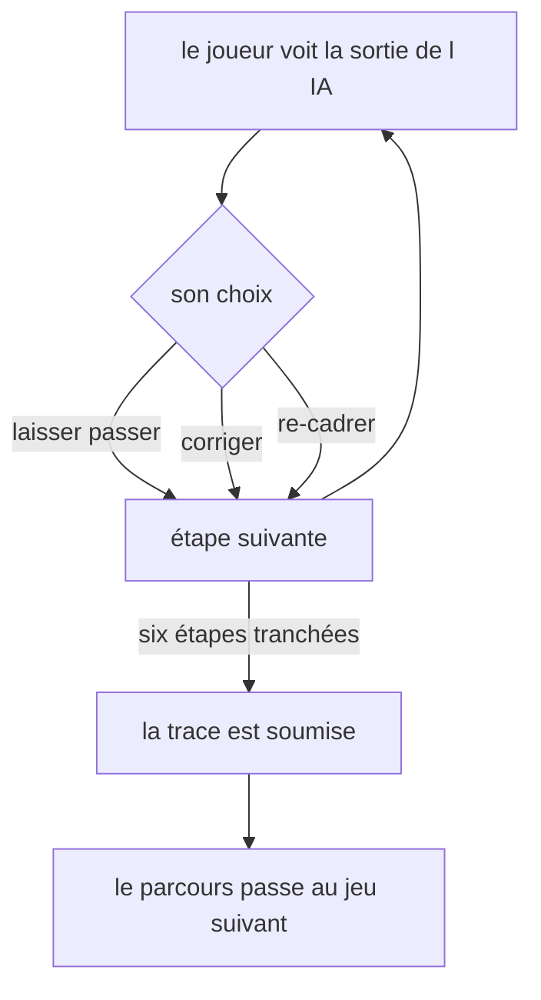
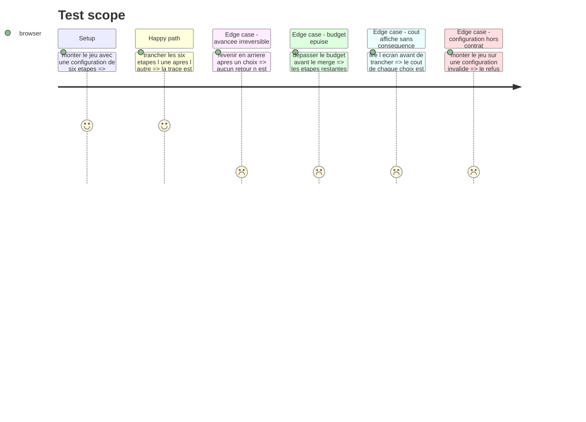

# Instruction: Le jeu à l'écran et son câblage

## Architecture projection

> Tree of the final files. ✅ create · ✏️ modify · ❌ delete

```txt
.
├── src/games/
│   ├── checkpoints/
│   │   ├── actions/
│   │   │   └── build-checkpoints-answer.action.ts   ✅ la trace, construite hors React
│   │   ├── hooks/
│   │   │   └── use-checkpoints.hook.ts              ✅ l état de la partie, cycle de vie seul
│   │   └── components/
│   │       ├── elements/
│   │       │   ├── stage-track.tsx                  ✅ la frise des six étapes
│   │       │   └── choice-card.tsx                  ✅ un choix et son coût
│   │       └── composites/
│   │           └── checkpoints-game.tsx             ✅ l écran du jeu, muet
│   ├── register-games.ts                            ✏️ un bloc de plus
│   └── register-components.ts                       ✏️ un bloc de plus
└── __tests__/unit/games/checkpoints/
    ├── build-answer.test.ts                         ✅
    └── use-checkpoints.test.ts                      ✅
```

## User Journey



## Wireframe

> La fiche de surface `.impeccable/surfaces/kpoints-components-composites-checkpoints-game-tsx.md` fait foi sur tout ce qui est visuel. Le croquis ci-dessous ne donne que la disposition ; les états, les plages, le mouvement et la liste de ce qu'il ne faut pas inventer vivent dans la fiche.

```txt
┌──────────────────────────────────────────────────────────┐
│ (1) Étape courante : 3 sur 6 · Budget restant : 7         │
├──────────────────────────────────────────────────────────┤
│ (2) Frise des six étapes                                  │
│   ●━━━●━━━◍───○───○───○                                   │
│   cadrage plan  génér. revue tests merge                  │
├──────────────────────────────────────────────────────────┤
│ (3) Sortie de l'IA pour l'étape courante                  │
│  ┌────────────────────────────────────────────────────┐  │
│  │                                                     │  │
│  └────────────────────────────────────────────────────┘  │
├──────────────────────────────────────────────────────────┤
│ (4) Les trois choix, chacun avec son coût                 │
│  ┌──────────────┐ ┌──────────────┐ ┌──────────────┐      │
│  │ laisser      │ │ corriger     │ │ re-cadrer    │      │
│  │ passer  0    │ │         2    │ │         3    │      │
│  └──────────────┘ └──────────────┘ └──────────────┘      │
├──────────────────────────────────────────────────────────┤
│ (5) Journal des étapes déjà tranchées                     │
│   cadrage  · laissé passer · 0                            │
│   plan     · corrigé       · 2                            │
└──────────────────────────────────────────────────────────┘
```

## Test Scope



## Tasks to do

### `1)` L'action

> Construire la trace hors de React, pour qu'elle se teste sans composant.

1. Créer `build-checkpoints-answer.action.ts` : depuis la configuration et la suite des choix, produire la trace validée par le schéma de réponse.
2. L'ordre des étapes dans la trace suit celui de la configuration, jamais celui des clics, pour qu'une même partie produise toujours la même trace.
3. Passer par le helper de simulation pour calculer les coûts payés et l'état final, sans les recalculer.

### `2)` Le hook

> Cycle de vie React uniquement. Aucune règle de jeu ici.

1. Créer `use-checkpoints.hook.ts` : parser la configuration une seule fois par `useMemo`, comme le fait le banc d'essai.
2. Tenir l'index de l'étape courante, la suite des choix déjà faits, et l'état courant rendu par la simulation.
3. Exposer l'étape courante, le budget restant, le journal, et une fonction qui enregistre un choix.
4. Soumettre au sixième choix, une seule fois, par l'action.
5. Aucun retour en arrière : le journal est en ajout seul.

### `3)` Les éléments muets

1. Créer `stage-track.tsx` : les six étapes, l'état de chacune porté par le poids et le remplissage du jeton, jamais par la couleur seule.
2. Créer `choice-card.tsx` : un choix et son coût, sans jamais afficher la conséquence de le refuser.
3. Aucune logique dans ces deux fichiers : ils reçoivent et affichent.

### `4)` L'écran du jeu

1. Créer `checkpoints-game.tsx` : la composition des cinq régions de la fiche de surface, en consommant le hook.
2. Les chiffres en `tabular-nums`, pour qu'ils ne déplacent rien en changeant.
3. **Les trois choix sont pairs**, aucun n'est primaire : même poids, même filet, même surface. Seul le focus clavier prend l'anneau.
4. Le cadre de la sortie de l'IA reste neutre : aucun signal ne doit trahir la présence d'un défaut.
5. Le journal ne montre que les coûts des choix ; l'écart avec le budget affiché est voulu et n'est pas expliqué.

### `5)` Le câblage

1. Ajouter un bloc `checkpoints` dans `games/register-games.ts` avec l'évaluateur et les deux schémas.
2. Ajouter un bloc `checkpoints` dans `games/register-components.ts` avec le composant.
3. Ne toucher à aucun autre fichier existant.

## Test acceptance criteria

| Task | Acceptance criteria |
| --- | --- |
| 1 | La trace produite suit l'ordre de la configuration, pas celui des clics |
| 1 | Les coûts de la trace viennent de la simulation, ils ne sont pas recalculés dans l'action |
| 2 | La configuration n'est parsée qu'une fois, pas à chaque rendu |
| 2 | `onSubmit` est appelé une seule fois, au sixième choix |
| 2 | Aucun retour en arrière n'est possible sur une étape tranchée |
| 3 | L'état d'une étape se lit sans la couleur : le remplissage du jeton, sa taille et le filet entrant suffisent |
| 3 | Le coût d'un choix est visible avant de trancher ; la conséquence de le refuser ne l'est jamais |
| 4 | Un défaut ne se repère pas au cadre de la sortie de l'IA |
| 4 | Aucun des trois choix ne se lit comme l'action recommandée |
| 4 | Le budget sous zéro porte le signe, le poids et `--missed`, jamais la couleur seule |
| 5 | Ajouter le jeu n'a modifié que les deux fichiers de câblage |
| 5 | Un type de jeu non résolu laisse le reste du parcours debout |
