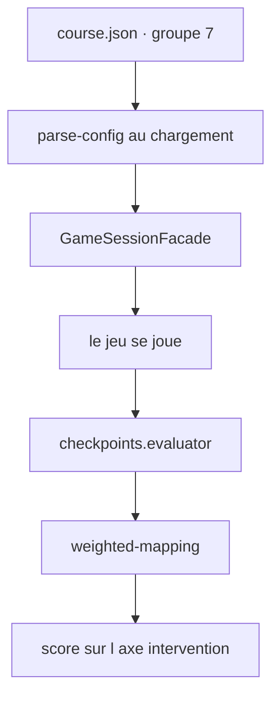
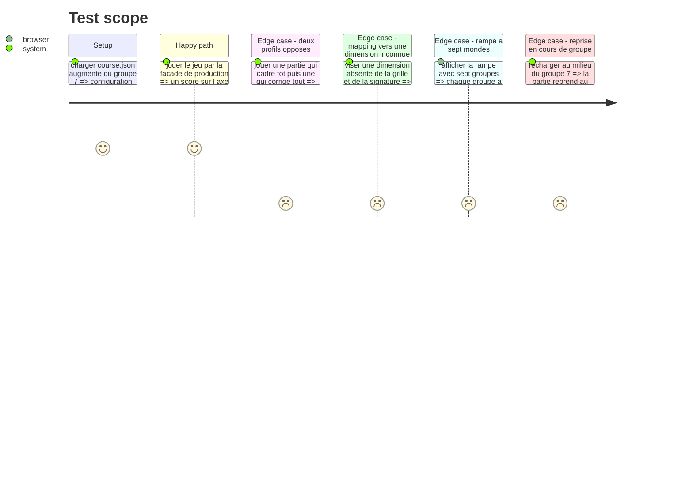

# Instruction: Le groupe 7 dans le parcours

## Architecture projection

> Tree of the final files. ✅ create · ✏️ modify · ❌ delete

```txt
.
├── config/
│   └── course.json                                  ✏️ le groupe 7, son jeu, ses critères et leurs mappings
└── __tests__/integration/
    └── course-run/
        └── checkpoints-run.test.ts                  ✅ config → partie jouée → score sur intervention
```

## User Journey



## Test Scope



## Tasks to do

### `1)` Le groupe dans les données

> Le parcours dit quel jeu instancier ; le registre fournit le reste.

1. Ajouter dans `config/course.json` un septième groupe portant les axes du référentiel, avec son `order`.
2. Y déclarer le jeu de type `checkpoints`, son libellé joueur en français, et sa configuration : six étapes, leurs sorties, leurs coûts, leurs défauts.
3. Déclarer les trois critères, chacun avec sa question en français, son type de règle et ses paramètres.
4. Mapper les trois critères sur la dimension `intervention`, avec des poids qui font peser le garde-fou moins que les deux critères de mesure.

### `2)` Le test d'intégration

> Le jeu doit traverser le moteur de production, jamais un chemin réservé aux tests.

1. Créer `__tests__/integration/course-run/checkpoints-run.test.ts`.
2. Faire jouer deux parties opposées par la façade : une qui cadre tôt et laisse courir, une qui reprend tout.
3. Comparer les scores d'`intervention` obtenus et vérifier qu'ils vont dans le bon sens.
4. Vérifier que la trace d'audit rendue par la façade porte la soumission du jeu.

### `3)` La vérification à l'écran

1. Jouer le parcours dans le navigateur, du premier au dernier choix, et vérifier que la partie se soumet et passe au jeu suivant.
2. Vérifier que la rampe affiche sept groupes, chacun avec sa teinte propre, y compris en largeur mobile.
3. Vérifier qu'un rechargement au milieu du groupe reprend au même jeu.

## Test acceptance criteria

| Task | Acceptance criteria |
| --- | --- |
| 1 | `course.json` augmenté se charge sans erreur |
| 1 | Un mapping visant une dimension que ni la grille ni la signature ne déclarent est refusé au chargement |
| 1 | Changer un coût ou un seuil dans le JSON change le résultat sans qu'une ligne de code bouge |
| 2 | Une partie qui cadre tôt obtient un score d'`intervention` supérieur à une partie qui reprend tout |
| 2 | La partie passe par la façade de production, sans branche réservée aux tests |
| 2 | La trace d'audit porte la soumission du jeu |
| 3 | Le jeu se joue de bout en bout dans le navigateur et rend la main au parcours |
| 3 | Les sept groupes ont sept teintes distinctes, sur écran large et en largeur mobile |
| 3 | Un rechargement au milieu du groupe reprend au même jeu |
