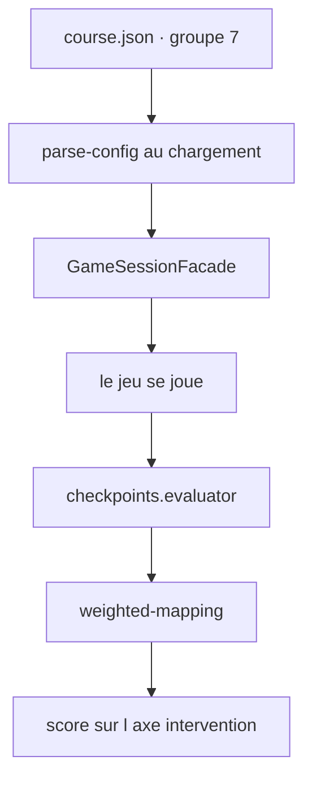
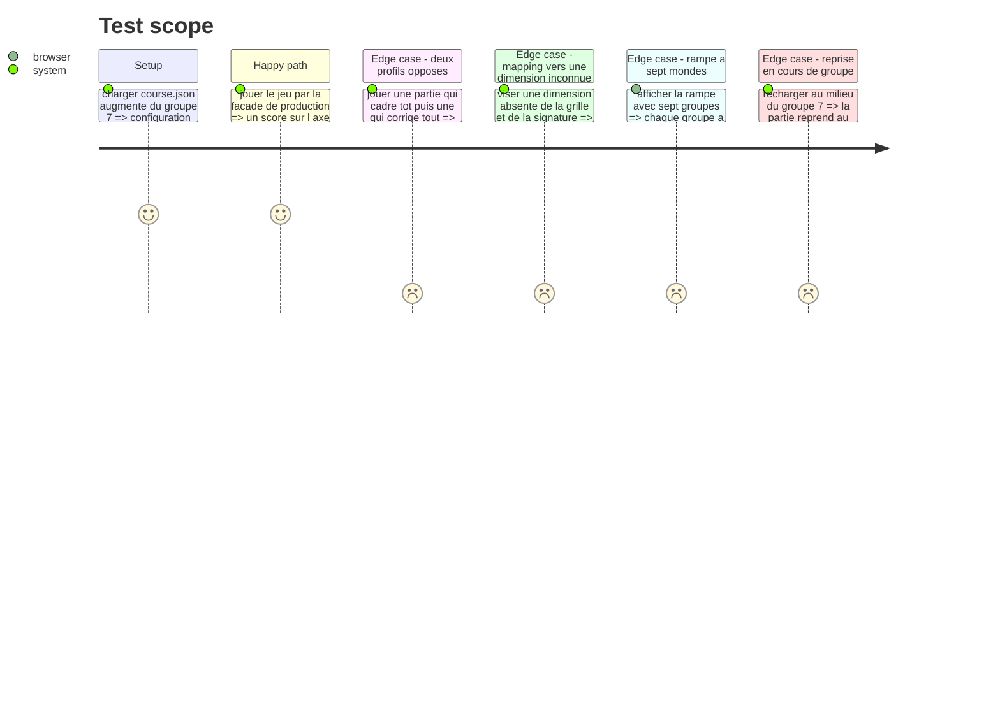

# Instruction: Le groupe 7 dans le parcours

## Architecture projection

> Tree of the final files. ✅ create · ✏️ modify · ❌ delete

```txt
.
├── config/
│   └── course.json                                  ✏️ le groupe 7, son jeu, ses critères et leurs mappings
└── __tests__/integration/
    └── course-run/
        └── checkpoints-run.test.ts                  ✅ config → partie jouée → score sur intervention
```

## User Journey



## Test Scope



## Tasks to do

### `1)` Le groupe dans les données

> Le parcours dit quel jeu instancier ; le registre fournit le reste.

1. Ajouter dans `config/course.json` un septième groupe portant les axes du référentiel, avec son `order`.
2. Y déclarer le jeu de type `checkpoints`, son libellé joueur en français, et sa configuration selon le barème ci-dessous.
3. Déclarer les trois critères, chacun avec sa question en français, son type de règle et ses paramètres. Le seuil du garde-fou est la moitié des étapes laissées passer.
4. Mapper les trois critères sur la dimension `intervention`, avec des poids qui font peser le garde-fou moins que les deux critères de mesure.

#### Le barème

La tâche jouée : ajouter la facturation récurrente à un produit existant. Assez banale pour que personne ne bute sur le domaine. **Budget de départ : 10.**

| # | Étape | Sortie | Laisser | Corriger | Re-cadrer | Défaut | Éclate à | Facteur |
| --- | --- | --- | --- | --- | --- | --- | --- | --- |
| 1 | cadrage | prose | 0 | 2 | 3 | oui | revue | ×3 |
| 2 | plan | prose | 0 | 2 | 3 | oui | tests | ×3 |
| 3 | génération | prose + code | 0 | 3 | 4 | non | — | — |
| 4 | revue | prose + code | 0 | 4 | 5 | non | — | — |
| 5 | tests | prose + code | 0 | 5 | 6 | non | — | — |
| 6 | merge | prose + code | 0 | 6 | 7 | non | — | — |

Le coût d'une reprise monte avec l'étape : c'est la vérité du métier, et le jeu doit la faire ressentir plutôt que l'énoncer. Les deux seuls défauts sont en amont, dans la prose ; le code des étapes 3 à 6 est propre et sert de leurre.

Ce que le barème produit, et qui doit rester vrai après tout réglage :

| Façon de jouer | Dépense | Budget final | Critères |
| --- | --- | --- | --- |
| Corrige au cadrage et au plan, puis laisse courir | 2 + 2 | 6 | 3 sur 3 |
| Ne touche à rien | 6 + 6 qui éclatent | −2 | 2 sur 3 |
| Corrige à chaque étape | 2+2+3+4+5+6 | −12 | 0 sur 3 |

Le bon jeu est le seul qui finit positif. Les deux mauvais partent en dette, ce qui donne son emploi au chiffre vermillon.

#### Le contenu éditorial

Six sorties d'IA à écrire, en français, sur la facturation récurrente.

1. **cadrage** — l'IA reformule la tâche. Le défaut est une ambiguïté laissée dans la reformulation : ce qu'elle ne dit pas sur la proration, la devise, ou le renouvellement un 31.
2. **plan** — l'IA propose son découpage. Le défaut est un pan non couvert, annoncé comme couvert.
3. à 6. — prose plus extrait. Aucun défaut. Le code doit être **plausible et correct** : un joueur qui le scrute ne doit rien y trouver, et c'est le sujet du jeu.

### `2)` Le test d'intégration

> Le jeu doit traverser le moteur de production, jamais un chemin réservé aux tests.

1. Créer `__tests__/integration/course-run/checkpoints-run.test.ts`.
2. Faire jouer deux parties opposées par la façade : une qui cadre tôt et laisse courir, une qui reprend tout.
3. Comparer les scores d'`intervention` obtenus et vérifier qu'ils vont dans le bon sens.
4. Vérifier que la trace d'audit rendue par la façade porte la soumission du jeu.

### `3)` La vérification à l'écran

1. Jouer le parcours dans le navigateur, du premier au dernier choix, et vérifier que la partie se soumet et passe au jeu suivant.
2. Vérifier que la rampe affiche sept groupes, chacun avec sa teinte propre, y compris en largeur mobile.
3. Vérifier qu'un rechargement au milieu du groupe reprend au même jeu.

## Test acceptance criteria

| Task | Acceptance criteria |
| --- | --- |
| 1 | `course.json` augmenté se charge sans erreur |
| 1 | Un mapping visant une dimension que ni la grille ni la signature ne déclarent est refusé au chargement |
| 1 | Changer un coût ou un seuil dans le JSON change le résultat sans qu'une ligne de code bouge |
| 2 | Une partie qui cadre tôt obtient un score d'`intervention` supérieur à une partie qui reprend tout |
| 2 | La partie passe par la façade de production, sans branche réservée aux tests |
| 2 | La trace d'audit porte la soumission du jeu |
| 3 | Le jeu se joue de bout en bout dans le navigateur et rend la main au parcours |
| 3 | Les sept groupes ont sept teintes distinctes, sur écran large et en largeur mobile |
| 3 | Un rechargement au milieu du groupe reprend au même jeu |
