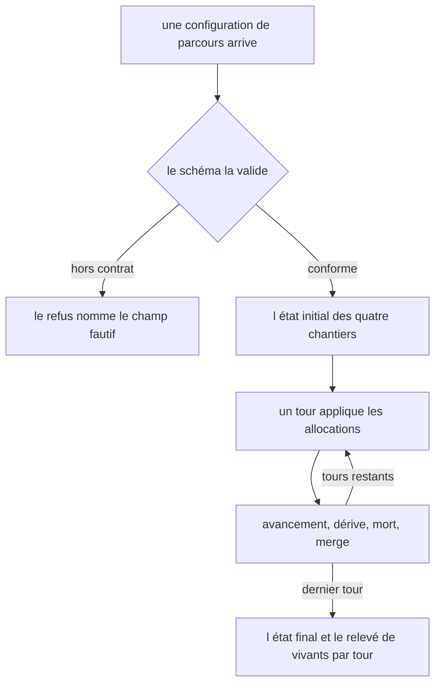
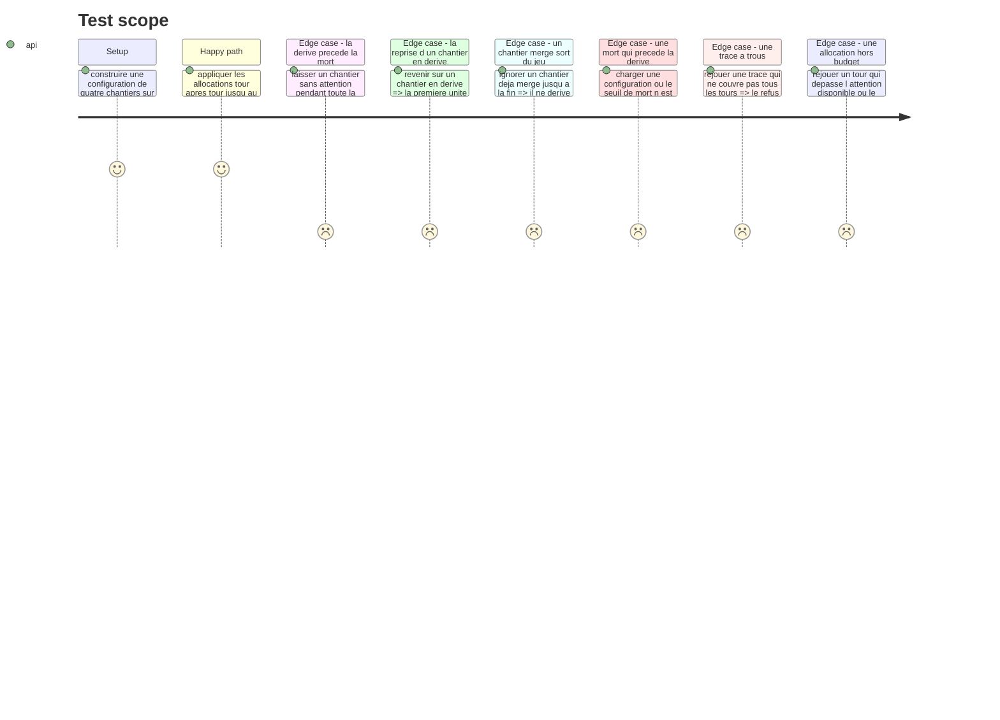

# Instruction: Les contrats et la simulation pure

## Architecture projection

> Tree of the final files. ✅ create · ✏️ modify · ❌ delete

```txt
.
├── src/games/three-tracks/
│   ├── schema/
│   │   ├── config.schema.ts                  ✅ ce qu un auteur de parcours écrit pour ce jeu
│   │   └── answer.schema.ts                  ✅ la trace du déroulé, et sa complétude
│   └── helpers/
│       └── run-simulation.helper.ts          ✅ l avancée d un tour, seule implémentation
└── __tests__/unit/games/three-tracks/
    ├── config.schema.test.ts                 ✅
    ├── answer.schema.test.ts                 ✅
    └── run-simulation.test.ts                ✅
```

## User Journey



## Test Scope



## Tasks to do

### `1)` Le schéma de configuration

> Ce qu'un auteur de parcours écrit, et rien de plus. Les seuils vivent ici, pas dans le code.

1. Créer `schema/config.schema.ts` : `turns`, `attentionPerTurn`, `maxPerTrack`, `driftAfter`, `diesAfter`, et `tracks` (au moins deux).
2. Un chantier porte `id`, `label`, `brief` et `work`, le travail à abattre pour merger.
3. Refuser au chargement, en nommant le champ fautif : deux chantiers de même `id`, un `maxPerTrack` supérieur à `attentionPerTurn`, un `diesAfter` qui n'est pas strictement supérieur à `driftAfter`.
4. Le troisième refus est le plus important : sans lui, la dérive ne serait jamais visible avant la mort, et la story tombe sans qu'aucun test ne le voie.
5. Documenter en tête du fichier pourquoi ces réglages ne sont pas dans le code : aucun test ne peut dire si un barème rend le jeu trivial.

### `2)` Le schéma de réponse

> La trace du déroulé est la réponse, comme pour `checkpoints`.

1. Créer `schema/answer.schema.ts` : une suite de tours, chacun portant son numéro et ses allocations `{ trackId, attention }`.
2. Ajouter au niveau de la trace le relevé du journal : chantiers mergés, chantiers perdus, et nombre de vivants par tour.
3. Écrire `parseThreeTracksTrace(answer, config)` : le schéma seul ignore combien de tours la partie comptait. Vérifier la couverture tour par tour, dans l'ordre.
4. Refuser une allocation qui vise un chantier inconnu, qui dépasse `maxPerTrack`, ou dont la somme dépasse `attentionPerTurn`. Une erreur nommée par cas, sur le modèle de `IncompleteTraceError`.
5. Une trace à trous rendrait des critères manqués par défaut : ce serait noter un bug comme une pratique.

### `3)` La simulation

> Une seule implémentation de l'avancée, partagée par l'écran et par le scoring.

1. Créer `helpers/run-simulation.helper.ts` : état d'un chantier (`progress`, `neglect`, statut parmi ouvert, dérive, mergé, perdu) et état de la partie (tour courant, chantiers, vivants par tour).
2. `initialState(config)` ouvre tous les chantiers à zéro.
3. `applyAllocations(config, state, allocations)` résout un tour dans cet ordre exact, et le documenter : la reprise d'un chantier en dérive consomme une unité avant tout avancement ; l'attention reçue remet le compteur de négligence à zéro, l'absence l'incrémente ; le travail atteint merge ; sinon la négligence décide de la mort puis de la dérive.
4. Un chantier mergé ou perdu est définitif : il ne reçoit plus d'attention, ne dérive plus, ne meurt plus.
5. Relever à chaque tour le nombre de chantiers **non morts**, mergés compris — c'est la matière de la médiane, et compter le mergé comme éteint punirait la réussite.
6. `replayTrace(config, turns)` rejoue la partie depuis les seules allocations, comme `checkpoints` rejoue depuis les seuls choix.
7. Aucune horloge, aucun aléa, aucun accès extérieur : la fonction ne dépend que de ses arguments.

### `4)` Les tests

1. Couvrir les trois refus de configuration, chacun sur le champ qu'il nomme.
2. Couvrir la complétude et les trois refus d'allocation de la trace.
3. Couvrir la traversée dérive puis mort d'un chantier abandonné, la reprise qui coûte une unité, et l'immunité d'un chantier mergé.
4. Vérifier que deux rejeux des mêmes allocations rendent le même état final.

## Test acceptance criteria

| Task | Acceptance criteria |
| --- | --- |
| 1 | Une configuration où la mort n'arrive pas après la dérive n'ouvre pas de session et nomme le champ |
| 1 | Un plafond par chantier supérieur à l'attention disponible est refusé au chargement |
| 1 | Deux chantiers de même identifiant sont refusés au chargement |
| 2 | Une trace qui ne couvre pas tous les tours est refusée, et l'erreur nomme le tour manquant |
| 2 | Une allocation qui dépasse l'attention du tour, ou le plafond d'un chantier, est refusée |
| 3 | Un chantier laissé sans attention est en dérive avant d'être perdu, jamais l'inverse |
| 3 | La première unité posée sur un chantier en dérive ne fait avancer aucun travail |
| 3 | Un chantier mergé ignoré jusqu'à la fin reste mergé |
| 3 | Le relevé de vivants compte les chantiers mergés |
| 3 | Deux rejeux des mêmes allocations rendent le même état final |
