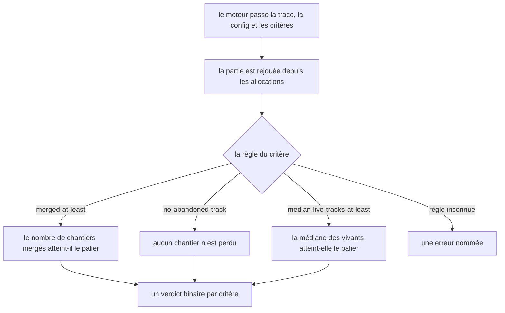
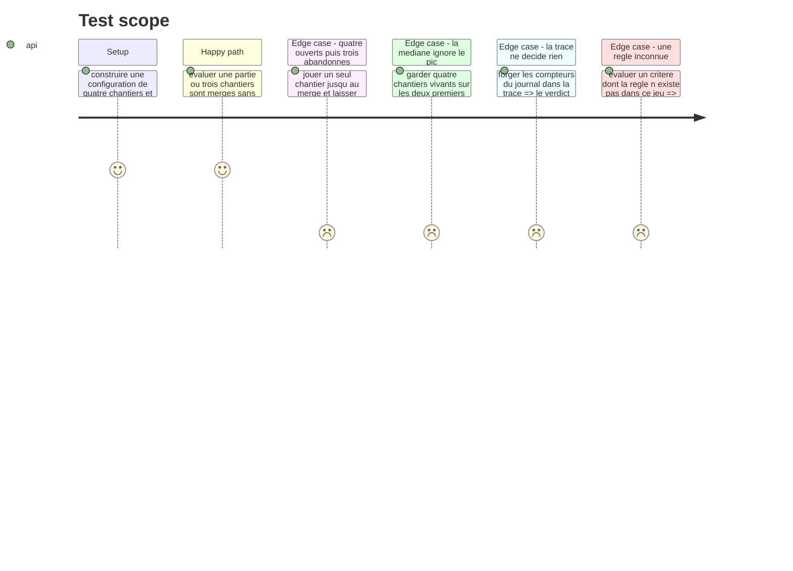

# Instruction: L'évaluateur et ses quatre règles

## Architecture projection

> Tree of the final files. ✅ create · ✏️ modify · ❌ delete

```txt
.
├── src/games/three-tracks/
│   ├── helpers/
│   │   └── median.helper.ts                  ✅ la médiane, isolée parce qu elle est la mesure
│   └── three-tracks.evaluator.ts             ✅ le point de contact avec le port GameEvaluator
└── __tests__/unit/games/three-tracks/
    ├── median.test.ts                        ✅
    └── evaluator.test.ts                     ✅
```

## User Journey



## Test Scope



## Tasks to do

### `1)` La médiane

> Elle porte la mesure du jeu. Elle vit dans son propre helper, pour se tester seule.

1. Créer `helpers/median.helper.ts` : la médiane d'une suite de nombres.
2. Trier une copie, ne jamais muter l'entrée.
3. Nombre pair de valeurs : la moyenne des deux du milieu. Le nombre de tours vient du parcours, il n'est pas forcément impair.
4. Documenter pourquoi la médiane et pas le maximum : le référentiel dit « habituellement », et un pic isolé ne compte pas.

### `2)` L'évaluateur

> Le point de contact public avec le port. Il interprète des règles déclaratives, il ne les code pas en dur.

1. Créer `three-tracks.evaluator.ts` à la racine du dossier du jeu, jamais sous `actions/`.
2. Parser la configuration, parser la trace contre elle, puis **rejouer** la partie depuis les seules allocations.
3. Ne jamais lire les compteurs du journal de la trace : une trace forgée ne doit changer aucun verdict.
4. Implémenter `merged-at-least`, paramétrée par un palier : le nombre de chantiers mergés l'atteint-il.
5. Implémenter `no-abandoned-track` : aucun chantier n'est perdu. C'est le garde-fou, celui qui coupe la voie du joueur qui ouvre large et lâche.
6. Implémenter `median-live-tracks-at-least`, paramétrée par un palier : la médiane du relevé de vivants par tour l'atteint-elle.
7. Une règle inconnue lève une erreur nommée, sur le modèle de `UnknownRuleError` de `checkpoints`.
8. Valider les paramètres de chaque règle par un schéma Zod local, comme le fait `checkpoints` pour `stage` et `threshold`.
9. Aucun accès au store, aucun effet de bord, aucune connaissance des autres jeux.

### `3)` Les tests

1. Une partie à trois merges sans perte satisfait les quatre critères.
2. Le piège : un merge et trois morts ne satisfait que le palier d'un chantier.
3. Le pic : quatre vivants sur les premiers tours puis un seul jusqu'à la fin ne satisfait pas la médiane.
4. Une trace dont les compteurs de journal sont faux rend le même verdict qu'une trace honnête aux mêmes allocations.
5. Une règle inconnue lève, elle ne rend pas un critère manqué.

## Test acceptance criteria

| Task | Acceptance criteria |
| --- | --- |
| 1 | La médiane d'un nombre pair de valeurs est la moyenne des deux du milieu |
| 1 | La suite passée n'est pas mutée |
| 2 | Un joueur qui ouvre quatre chantiers et n'en mène qu'un au merge ne satisfait que le palier d'un chantier |
| 2 | Un pic de quatre chantiers vivants sur deux tours ne satisfait pas le critère de médiane |
| 2 | Le verdict ne change pas quand les compteurs du journal de la trace sont forgés |
| 2 | Un chantier perdu fait manquer le critère de garde-fou, même si trois autres sont mergés |
| 2 | Une règle absente du jeu lève une erreur qui la nomme |
