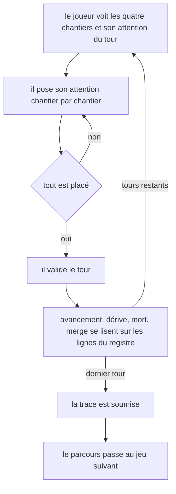
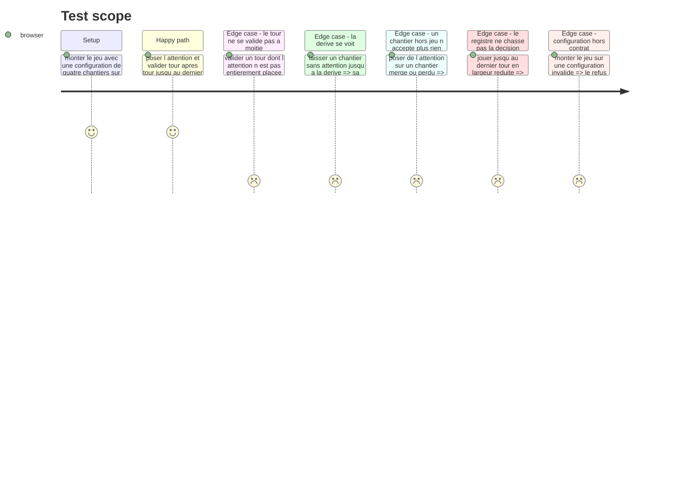

# Instruction: Le jeu à l'écran et son câblage

## Architecture projection

> Tree of the final files. ✅ create · ✏️ modify · ❌ delete

```txt
.
├── src/games/
│   ├── three-tracks/
│   │   ├── actions/
│   │   │   └── build-three-tracks-answer.action.ts   ✅ la trace, construite hors React
│   │   ├── hooks/
│   │   │   └── use-three-tracks.hook.ts              ✅ le cycle de vie de la partie
│   │   └── components/
│   │       ├── elements/
│   │       │   ├── work-notches.tsx                  ✅ la jauge à crans d un chantier
│   │       │   └── attention-cell.tsx                ✅ la cellule ouverte et ses pastilles
│   │       └── composites/
│   │           ├── track-register.tsx                ✅ le registre, un vrai tableau
│   │           └── three-tracks-game.tsx             ✅ l écran du jeu, muet
│   ├── register-games.ts                             ✏️ un bloc de plus
│   └── register-components.ts                        ✏️ un bloc de plus
└── __tests__/unit/games/three-tracks/
    ├── build-answer.test.ts                          ✅
    └── use-three-tracks.test.ts                      ✅
```

## User Journey



## Test Scope



## Wireframe

> La fiche de surface [`.impeccable/surfaces/tracks-components-composites-three-tracks-game-tsx.md`](../../../../.impeccable/surfaces/tracks-components-composites-three-tracks-game-tsx.md) fait foi sur tout ce qui est visuel. Le croquis ci-dessous ne donne que la disposition ; les états, les plages, l'adaptation et la liste de ce qu'il ne faut pas inventer vivent dans la fiche.
>
> Direction retenue : **le registre de bord**. Le relevé est le plateau — il n'y a pas de journal à côté du jeu.

```txt
┌────────────────────────────────────────────────────────────────┐
│ (1) TOUR 3 SUR 7 · 2 UNITÉS À PLACER                            │
├──────────────────────┬──┬──┬──┬──┬──┬──┬──┬────────────────────┤
│ (2) chantier         │ 1│ 2│ 3│ 4│ 5│ 6│ 7│ (3) avancement     │
├──────────────────────┼──┼──┼──┼──┼──┼──┼──┼────────────────────┤
│ La migration         │ 1│ 2│▓▓│  │  │  │  │ ███░  3 / 4        │
│ Le panier            │ 2│ 1│▓▓│  │  │  │  │ ███░  3 / 5        │
│ L'API publique       │ ·│ ·│▓▓│  │  │  │  │ ░░░░  0 / 5        │
│ La page d'accueil ╌╌╌╎ ·╎ ·╎▓▓╎  ╎  ╎  ╎  ╎ ░░░░  0 / 6  DÉRIVE│
└──────────────────────┴──┴──┴──┴──┴──┴──┴──┴────────────────────┘
   (4) ▓▓ = la colonne ouverte, une pastille d'attention par cellule
   ╌╌ = filet pointillé : ce chantier dérive
┌────────────────────────────────────────────────────────────────┐
│ (5)                                          [ Clore le tour ]  │
└────────────────────────────────────────────────────────────────┘
```

1. Ligne de position : le tour courant, le total, et l'attention qui reste à placer. Elle informe, elle ne conditionne rien : la clôture reste disponible quelle que soit cette valeur.
2. Le registre : un vrai tableau, une ligne par chantier dans l'ordre du parcours, une colonne par tour. Les cellules écoulées portent le chiffre posé, ou un point médian pour zéro.
3. La colonne d'avancement : une jauge à crans, un cran par unité de travail, suivie du chiffre.
4. La colonne ouverte : le seul endroit qui s'écrit, un groupe radio de pastilles par cellule.
5. La clôture du tour : la seule action primaire de l'écran.

## Tasks to do

### `0)` La fiche de surface — faite

> Écrite le 29/08 par une passe `impeccable`, direction verrouillée par le chef de projet. Elle fait foi sur tout ce qui est visuel, et elle prime sur ce fichier en cas d'écart.

1. Lire `.impeccable/surfaces/tracks-components-composites-three-tracks-game-tsx.md` **en entier** avant d'écrire une ligne de composant.
2. Sa section « Ce qu'un implémenteur ne doit pas inventer » est une liste d'interdits, pas de suggestions.
3. Ne rien reprendre de la fiche de `checkpoints` : une table qui s'écrit colonne après colonne ne se compose pas comme une frise de six étapes.

### `1)` L'action

> Construire la trace hors de React, pour qu'elle se teste sans composant.

1. Créer `build-three-tracks-answer.action.ts` : depuis la configuration et la suite des tours joués, produire la trace validée par le schéma de réponse.
2. Passer par le helper de simulation pour l'état final, sans le recalculer.
3. L'ordre des tours et des chantiers suit celui de la configuration, jamais celui des clics.

### `2)` Le hook

> Cycle de vie React uniquement. Aucune règle de jeu ici.

1. Créer `use-three-tracks.hook.ts` : parser la configuration une seule fois par `useMemo`.
2. Tenir les tours déjà joués, l'allocation en cours de composition, et l'état courant rendu par la simulation.
3. Exposer les chantiers avec leur état, le numéro de tour, l'attention restante à placer, les tours écoulés, une fonction qui pose ou retire une unité, et une fonction qui valide le tour.
4. Refuser de poser une unité sur un chantier hors jeu, au-delà du plafond, ou au-delà de l'attention du tour.
5. La clôture du tour est **toujours disponible**, dès le premier tour, quelle que soit l'attention déjà posée, y compris zéro. L'attention non placée à la clôture est perdue : rien ne la reporte, rien n'avertit qu'elle va se perdre. Avec un plafond par chantier inférieur à l'attention du tour, ce prix force un parallélisme minimal — c'est exactement ce que le jeu mesure.
6. Soumettre au dernier tour, une seule fois, par l'action.
7. Aucun retour en arrière sur un tour validé : le registre est en ajout seul.

### `3)` Les éléments muets

1. Créer `work-notches.tsx` : la jauge à crans d'un chantier, un cran par unité de travail, les acquis pleins et les restants évidés. Jamais une barre continue — ce monde avance par crans.
2. Créer `attention-cell.tsx` : la cellule ouverte d'un chantier, un groupe radio de `maxPerTrack + 1` pastilles, zéro compris. Le zéro est une pastille, pas une absence.
3. Une valeur que l'attention restante ne permet plus est désactivée par une marque structurelle — pastille évidée, sans anneau — jamais par un grisé.
4. Chaque pastille porte un nom accessible complet, qui nomme la valeur, le chantier et le tour.
5. Aucune logique dans ces deux fichiers : ils reçoivent et affichent.

### `4)` Le registre et l'écran

1. Créer `track-register.tsx` : un vrai `<table>`, `caption` en `sr-only`, `th scope="col"` par tour, `th scope="row"` par chantier. Une grille en `div` est refusée.
2. Les cellules des tours écoulés portent le chiffre posé, ou un point médian pour zéro. Le point est ce qui rend la négligence lisible d'un regard.
3. L'état d'une ligne passe par son filet et une mention en petites capitales dans sa tête, selon le tableau des quatre états de la fiche. Jamais par la couleur seule, jamais par une opacité réduite — la ligne d'un chantier perdu reste à pleine opacité, et le vermillon ne porte que le mot.
4. Sous `md`, replier les colonnes sur les trois derniers tours écoulés plus la colonne ouverte, précédés d'une cellule « n tours plus anciens ». Une colonne ne se comprime jamais sous la largeur d'un chiffre.
5. Créer `three-tracks-game.tsx` : la ligne de position, le registre, la clôture. Les chiffres en `tabular-nums`.
6. Aucun chantier n'est mis en avant : même poids, même filet, même surface, et l'ordre du parcours ne bouge jamais.
7. La dérive s'annonce quand elle arrive, jamais avant : rien n'indique combien de tours d'abandon la déclenchent.
8. L'écran ne dit jamais ce qu'il note : ni le nombre de merges visé, ni la médiane.
9. La ligne de position est la seule région annoncée à chaque changement. Le registre ne réannonce rien.

### `5)` Le câblage

1. Ajouter un bloc `three-tracks` dans `games/register-games.ts` avec l'évaluateur et les deux schémas.
2. Ajouter un bloc `three-tracks` dans `games/register-components.ts` avec le composant.
3. Ne toucher à aucun autre fichier existant.

## Test acceptance criteria

| Task | Acceptance criteria |
| --- | --- |
| 0 | Rien de l'implémentation ne contredit la section « Ce qu'un implémenteur ne doit pas inventer » de la fiche |
| 1 | La trace produite suit l'ordre de la configuration, pas celui des clics |
| 1 | L'état final de la trace vient de la simulation, il n'est pas recalculé dans l'action |
| 2 | La configuration n'est parsée qu'une fois, pas à chaque rendu |
| 2 | La clôture du tour est toujours disponible, y compris à zéro unité posée ; l'attention non placée est perdue sans avertissement |
| 2 | Aucune unité ne se dépose sur un chantier mergé ou perdu |
| 2 | `onSubmit` est appelé une seule fois, au dernier tour |
| 2 | Aucun retour en arrière n'est possible sur un tour validé |
| 3 | La jauge d'avancement est à crans, jamais une barre continue |
| 3 | Le zéro est une pastille explicite, et le plafond par chantier est visible avant de poser |
| 4 | Le registre est un tableau sémantique : un lecteur d'écran lit « chantier, tour, valeur » |
| 4 | Une suite de tours sans attention se lit comme une suite de points alignés |
| 4 | L'état d'une ligne se lit sans la couleur, le chantier perdu compris, et sans opacité réduite |
| 4 | Aucun chantier ne se lit comme celui qu'il faudrait servir en premier |
| 4 | Rien à l'écran n'annonce combien de tours d'abandon déclenchent la dérive |
| 4 | Sous `md`, le registre reste jouable sans défilement horizontal |
| 5 | Ajouter le jeu n'a modifié que les deux fichiers de câblage |
