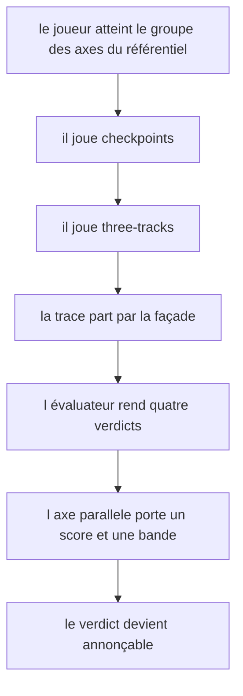
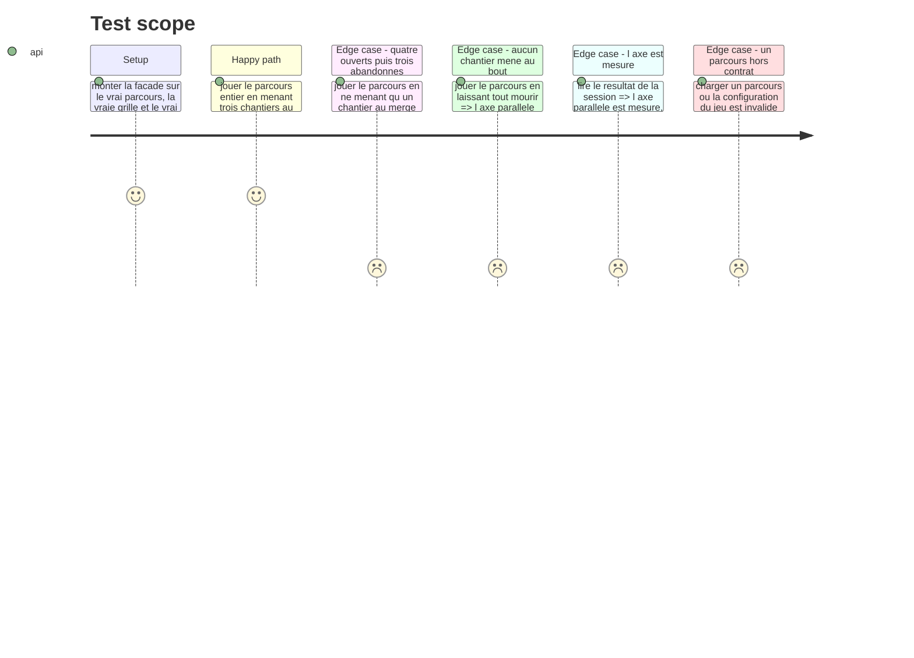

# Instruction: Le jeu dans le parcours

## Architecture projection

> Tree of the final files. ✅ create · ✏️ modify · ❌ delete

```txt
.
├── config/
│   └── course.json                                   ✏️ g7-2 devient le vrai three-tracks
└── __tests__/integration/course-run/
    ├── checkpoints-run.test.ts                       ✏️ son answerFor doit savoir répondre à three-tracks
    └── three-tracks-run.test.ts                      ✅ le jeu traverse le moteur de production
```

## User Journey



## Test Scope



## Tasks to do

### `1)` La configuration du jeu dans le parcours

> Le bloc `g7-2` est un banc d'essai déguisé. Il devient le vrai jeu. Le bloc ci-dessous est **arrêté et vérifié** : l'appliquer tel quel, sans réécrire les libellés ni les briefs.

Dans `config/course.json`, remplacer le corps du jeu `g7-2` — de `"type"` jusqu'à la fin de ses `criteria` — par exactement ceci :

```json
          "type": "three-tracks",
          "label": "Où passez-vous votre attention ?",
          "config": {
            "turns": 7,
            "attentionPerTurn": 3,
            "maxPerTrack": 2,
            "driftAfter": 2,
            "diesAfter": 4,
            "tracks": [
              {
                "id": "migration",
                "label": "La migration de la base",
                "brief": "Le schéma passe en deux temps, sans coupure de service.",
                "work": 4
              },
              {
                "id": "panier",
                "label": "La refonte du panier",
                "brief": "Le tunnel d'achat change de modèle de données en cours de route.",
                "work": 5
              },
              {
                "id": "api-v2",
                "label": "L'API publique v2",
                "brief": "Trois clients externes consomment la v1 et n'en bougeront pas.",
                "work": 5
              },
              {
                "id": "affichage",
                "label": "Le temps de premier affichage",
                "brief": "Quatre secondes à l'ouverture, la cause n'est pas identifiée.",
                "work": 6
              }
            ]
          },
          "criteria": [
            {
              "id": "g7-2-c1",
              "question": "Au moins un chantier a-t-il été mené jusqu'au merge ?",
              "rule": { "type": "merged-at-least", "threshold": 1 },
              "mapping": [{ "dimension": "parallele", "weight": 2 }]
            },
            {
              "id": "g7-2-c2",
              "question": "Trois chantiers ou plus ont-ils été menés jusqu'au merge ?",
              "rule": { "type": "merged-at-least", "threshold": 3 },
              "mapping": [{ "dimension": "parallele", "weight": 2 }]
            },
            {
              "id": "g7-2-c3",
              "question": "La médiane de chantiers vivants par tour atteint-elle trois ?",
              "rule": { "type": "median-live-tracks-at-least", "threshold": 3 },
              "mapping": [{ "dimension": "parallele", "weight": 1 }]
            },
            {
              "id": "g7-2-c4",
              "question": "Aucun chantier n'a-t-il été ouvert puis abandonné ?",
              "rule": { "type": "no-abandoned-track" },
              "mapping": [{ "dimension": "parallele", "weight": 1 }]
            }
          ]
```

Le fichier est indenté à deux espaces, une clé par ligne : reformater le bloc ci-dessus au style du fichier avant de l'insérer, `npx biome check --write config/course.json` s'en charge.

Aucun des quatre chantiers ne se lit comme le plus urgent. C'est délibéré, et ça ne se « corrige » pas en en rendant un plus criant.

### `1 bis)` Le test d'intégration existant, qui va casser

> Effet de bord obligatoire, découvert en vérifiant le barème. À traiter dans le même lot, sinon la suite est rouge.

`__tests__/integration/course-run/checkpoints-run.test.ts` joue **tout** le parcours, et sa fonction `answerFor` renvoie `{ selected: [] }` pour tout jeu qui n'est pas `checkpoints`. Dès que `g7-2` devient un `three-tracks`, cette réponse ne passe plus son schéma et la suite tombe.

1. Étendre `answerFor` pour qu'elle produise une trace `three-tracks` valide quand `game.type === 'three-tracks'`.
2. N'importe quelle partie conforme convient : ce test mesure `intervention`, pas `parallele`. Prendre la plus simple qui satisfasse `parseThreeTracksTrace`.
3. Ne pas toucher aux assertions de ce fichier : elles portent sur `checkpoints` et doivent rester vraies au chiffre près.

### `2)` Le barème, déjà vérifié contre le moteur

> Six parties ont été rejouées dans la simulation de la phase 1 et notées à la main contre les bandes de `config/grid.json`. Le tableau ci-dessous est le contrat que le test d'intégration doit reproduire.

| Partie | Mergés | Perdus | Médiane | Score | Bande attendue |
| --- | --- | --- | --- | --- | --- |
| Rotation soignée | 3 | 0 | 4 | 1.000 | 3 chantiers et plus |
| Une unité partout, à tour de rôle | 3 | 0 | 4 | 1.000 | 3 chantiers et plus |
| Deux chantiers à la fois, en série | 3 | 0 | 4 | 1.000 | 3 chantiers et plus |
| Étale, mais en perd un | 3 | 1 | 3 | 0.833 | 2 chantiers |
| Ouvre quatre, en lâche trois | 2 | 2 | 2 | 0.333 | 1 chantier |
| Ne place rien de la partie | 0 | 4 | 0 | 0.000 | aucun |

Ce que ce tableau prouve, et qu'il faut préserver en ajustant quoi que ce soit :

1. Le cran le plus haut s'atteint par trois routes différentes. Le jeu mesure une pratique, pas la découverte d'une solution unique.
2. Trois merges avec un chantier perdu **ne donne pas** le cran haut. C'est le garde-fou qui mord.
3. Ouvrir quatre chantiers puis en lâcher trois retombe à un tiers, malgré deux merges affichés.
4. La bande basse n'est atteignable que parce que la clôture d'un tour n'exige pas que l'attention soit placée. Si cette règle change, elle redevient inatteignable et l'axe cesse de discriminer par le bas.

### `3)` Le test d'intégration

> Le jeu traverse le moteur de production : le vrai parcours, la vraie grille, le vrai registre, la vraie façade.

1. Créer `three-tracks-run.test.ts` sur le modèle de `checkpoints-run.test.ts`. Seules l'horloge et la persistance sont doublées, aucune branche réservée aux tests.
2. Reprendre les six parties du tableau ci-dessus comme fixtures nommées, et vérifier la bande de `parallele` pour chacune.
3. Vérifier que la partie qui perd un chantier n'atteint pas la bande de celle qui n'en perd aucun, à nombre de merges égal.
4. Vérifier que `parallele` est mesuré à l'issue du parcours, et ne plafonne donc plus le niveau annonçable.
5. Vérifier qu'un parcours dont la configuration du jeu est hors contrat n'ouvre pas de session et nomme le champ fautif.

## Test acceptance criteria

| Task | Acceptance criteria |
| --- | --- |
| 1 | Le groupe des axes du référentiel porte un vrai `three-tracks` à la place du banc d'essai |
| 1 | Aucun des quatre chantiers ne se lit comme le plus urgent |
| 1 | Le libellé du jeu n'annonce aucun critère |
| 1 bis | La suite entière est verte : le test d'intégration de `checkpoints` sait répondre au nouveau type de jeu |
| 1 bis | Les assertions chiffrées de `checkpoints-run.test.ts` sont inchangées |
| 2 | Les six parties du tableau rendent les six bandes qu'il annonce, au chiffre près |
| 2 | Trois routes de jeu différentes atteignent la bande la plus haute |
| 2 | Trois merges avec un chantier perdu n'atteignent pas la bande la plus haute |
| 2 | Une partie qui ne place jamais rien atteint la bande la plus basse |
| 3 | Le jeu traverse la façade de production sans branche réservée aux tests |
| 3 | `parallele` est mesuré à l'issue du parcours |
| 3 | Un parcours dont la configuration du jeu est invalide n'ouvre pas de session et nomme le champ |
