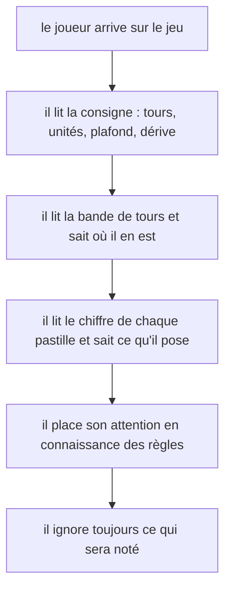
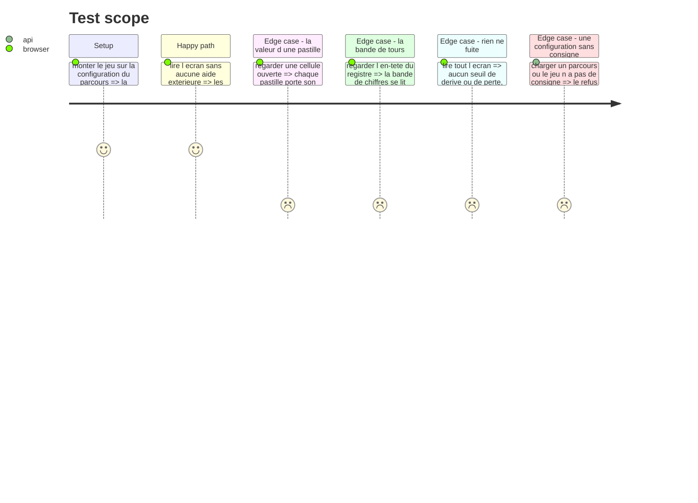

# Instruction: Le joueur doit comprendre à quoi il joue

## Architecture projection

> Tree of the final files. ✅ create · ✏️ modify · ❌ delete

```txt
.
├── config/
│   └── course.json                                   ✏️ la consigne du jeu, en données
├── src/games/three-tracks/
│   ├── schema/config.schema.ts                       ✏️ le champ de consigne, requis
│   ├── hooks/use-three-tracks.hook.ts                ✏️ il expose la consigne
│   └── components/
│       ├── elements/attention-cell.tsx               ✏️ la pastille porte son chiffre
│       └── composites/
│           ├── track-register.tsx                    ✏️ les colonnes se lisent comme des tours
│           └── three-tracks-game.tsx                 ✏️ la consigne au-dessus du registre
└── __tests__/unit/games/three-tracks/                ✏️ les tests qui verrouillent
```

## Le constat

Le chef de projet a regardé les captures et n'a pas compris le jeu. Ses mots : « à quoi correspond chaque radiobox et à quoi correspondent les chiffres de 1 à 6 ? en tant que joueur je ne comprends pas ce qu'il faut répondre ».

Il a raison, et c'est un écart au reste du produit. Le jeu `test-bench` affiche une consigne au-dessus de son contenu, portée par un champ `statement` de sa configuration. `three-tracks` n'a ni consigne, ni champ pour en porter une.

Trois choses sont illisibles à l'écran :

1. **Rien n'énonce les règles.** Le joueur ignore qu'il dispose de trois unités par tour, qu'il ne peut en poser que deux au plus sur un même chantier, et qu'un chantier délaissé finit par être perdu.
2. **Les pastilles sont anonymes.** Elles portent un nom accessible complet, mais aucun chiffre visible. Un joueur voyant a moins d'information qu'un lecteur d'écran, ce qui est un défaut à l'envers.
3. **La bande de chiffres ne se lit pas comme des tours.** Un `1 2 3 4 5 6 7` nu entre « CHANTIER » et « AVANCEMENT » peut être n'importe quoi.

## La ligne à ne pas franchir

`DESIGN.md` : « Un jeu ne dit jamais ce qu'il note. Le contrat annonce le cadre, jamais les critères. »

**Le cadre s'explique. Les critères et les seuils restent tus.**

| S'énonce | Se tait |
| --- | --- |
| Sept tours, puis la partie s'arrête | Combien de tours d'abandon déclenchent la dérive |
| Trois unités par tour, deux au plus par chantier | Combien en déclenchent la perte |
| Un chantier n'avance que les tours où il est servi | Que le nombre de merges décide du cran |
| Un chantier délaissé dérive, puis il est perdu | Que la médiane de chantiers vivants est mesurée |
| Le travail restant de chaque chantier, chiffré | Qu'abandonner un chantier est pénalisé |

Si un joueur peut déduire de l'écran ce qu'il doit faire **pour bien noter**, la consigne est allée trop loin et le jeu ne mesure plus rien.

## User Journey



## Test Scope



## Tasks to do

### `1)` La consigne, en données

> Le gabarit existe déjà dans le projet : `test-bench` porte un `statement` dans sa configuration et l'affiche en tête d'écran. Le suivre, ne pas en inventer un autre.

1. Ajouter un champ de consigne **requis** au schéma de configuration de `three-tracks`, nommé comme celui de `test-bench` pour que deux jeux ne nomment pas différemment la même chose.
2. Une configuration sans consigne est refusée au chargement, en nommant le champ. Le jeu ne doit pas pouvoir être publié muet une seconde fois.
3. L'exposer par le hook, l'afficher au-dessus du registre, dans le même traitement typographique que celui de `test-bench`.
4. Écrire la consigne dans `config/course.json`. Elle énonce le tableau « S'énonce » ci-dessus et rien du tableau « Se tait ». Vouvoiement, phrases courtes, aucun point d'exclamation, aucun encouragement — `DESIGN.md`, section « Adresse ».
5. Ne pas y écrire les seuils numériques de dérive et de perte. « Un chantier délaissé dérive, puis il est perdu » suffit : le joueur doit juger lui-même ce que « trop longtemps » veut dire, et c'est précisément ce que l'axe mesure.

### `2)` La pastille porte son chiffre

1. Rendre la valeur de chaque pastille visible, zéro compris.
2. Le nom accessible existant reste inchangé : il est correct et plus riche que l'affichage.
3. La pastille sélectionnée et la pastille indisponible gardent leurs marques structurelles actuelles. Le chiffre s'ajoute, il ne remplace rien.
4. Vérifier que trois pastilles chiffrées tiennent toujours sur une ligne dans la colonne ouverte, aux deux gabarits. C'est le défaut qui avait déjà été corrigé une fois — ne pas le rouvrir.

### `3)` La bande de tours se lit comme des tours

1. Faire qu'un joueur comprenne que ces chiffres sont des tours sans lire autre chose que l'en-tête.
2. Deux voies acceptables : un en-tête de groupe couvrant les colonnes de tours, ou un libellé porté par chaque colonne. Choisir, et dire pourquoi en commentaire.
3. Distinguer visuellement la colonne ouverte des colonnes à venir : c'est la seule qui s'écrit, et rien ne le dit aujourd'hui.
4. La sémantique du tableau ne se dégrade pas : les `th scope` restent corrects, et le nombre de cellules d'une ligne reste égal au nombre d'en-têtes. C'est un correctif de revue déjà payé, ne pas le rouvrir.

## Test acceptance criteria

| Task | Acceptance criteria |
| --- | --- |
| 1 | Une configuration de `three-tracks` sans consigne n'ouvre pas de session et nomme le champ |
| 1 | La consigne est visible au-dessus du registre dès le premier tour |
| 1 | La consigne énonce les tours, les unités par tour, le plafond par chantier, et le sort d'un chantier délaissé |
| 1 | La consigne ne contient ni seuil de dérive, ni seuil de perte, ni aucun critère de notation |
| 2 | Chaque pastille d'attention porte son chiffre à l'écran, zéro compris |
| 2 | Les pastilles tiennent sur une ligne dans la colonne ouverte, à 1440 et à 390 |
| 3 | La bande de chiffres se lit comme des tours sans lire le reste de l'écran |
| 3 | La colonne du tour courant se distingue des colonnes à venir |
| 3 | Le nombre de cellules d'une ligne reste égal au nombre d'en-têtes de colonne |
