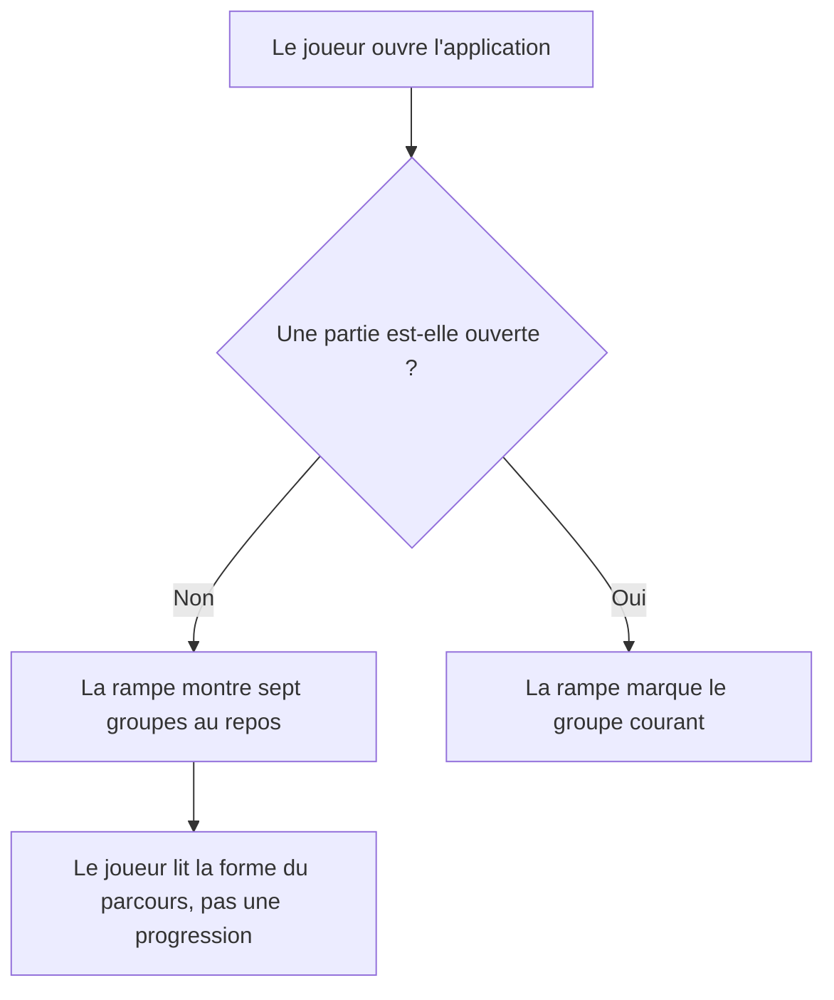
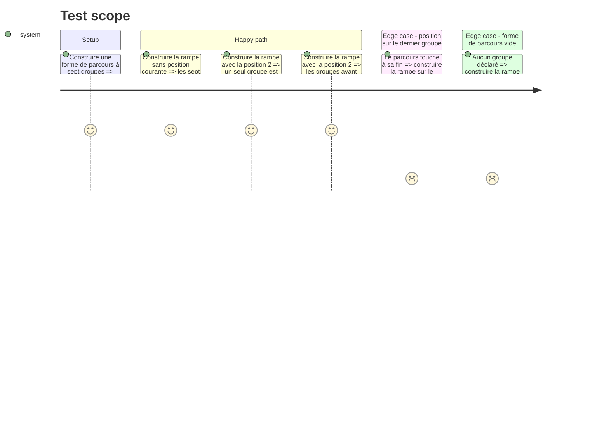

# Instruction: La rampe au repos

## Architecture projection

> Tree of the final files. ✅ create · ✏️ modify · ❌ delete

```txt
.
├── src
│   ├── components/group-rail/helpers
│   │   └── ✏️ build-rail.helper.ts        # accepte l'absence de position courante
│   └── features/onboarding/hooks
│       └── ✏️ use-onboarding.hook.ts      # cesse de passer 0 comme position
└── __tests__/unit/components
    └── ✅ build-rail.test.ts               # couvre les deux états de la rampe
```

## User Journey



## Test Scope



## Wireframe

```txt
┌──────────────────────────────────────────────────────┐
│ (1) En-tête : marque · statut                        │
├────────────┬─────────────────────────────────────────┤
│ (2) Rampe  │ (3) Titre et cadre                      │
│  7 groupes │ (4) Compteurs                           │
│  tous au   │ (5) Partie enregistrée, si elle existe  │
│  repos     │ (6) Formulaire d'entrée                 │
└────────────┴─────────────────────────────────────────┘
```

## Tasks to do

### `1)` Rendre la position courante facultative dans le helper

> Un parcours non commencé n'a pas de position, et cela doit pouvoir s'exprimer.

1. Ouvrir `src/components/group-rail/helpers/build-rail.helper.ts`.
2. Rendre le second paramètre facultatif, de type `number | undefined`.
3. Quand il est absent, rendre chaque groupe en `pending`, sans exception.
4. Quand il est présent, garder le comportement actuel au caractère près.
5. Mettre le commentaire du fichier à jour : dire que l'absence de position est le cas de l'accueil, et pourquoi `0` ne pouvait pas l'exprimer.

### `2)` Cesser de simuler une position sur l'accueil

> L'appelant fautif est l'accueil, pas le helper.

1. Ouvrir `src/features/onboarding/hooks/use-onboarding.hook.ts`.
2. Appeler `buildRail` sans second argument.
3. Vérifier qu'aucun autre appelant ne passe une position par défaut : `src/features/group-navigation/hooks/use-course.hook.ts` lit une position réelle et reste inchangé.

### `3)` Couvrir la rampe par un test

> La régression a déjà eu lieu une fois après une factorisation. Sans test, elle se reproduira.

1. Créer `__tests__/unit/components/build-rail.test.ts`.
2. Couvrir la rampe sans position : les sept groupes en `pending`.
3. Couvrir la rampe avec position : un seul `current`, les précédents `done`, les suivants `pending`.
4. Couvrir la position sur le dernier groupe et la forme vide.
5. Ne pas tester le rendu du composant ici : le helper porte la règle, le composant porte l'apparence.

## Test acceptance criteria

| Task | Acceptance criteria              |
| ---- | -------------------------------- |
| 1 | Une rampe construite sans position rend tous ses groupes en `pending` ; une rampe construite avec une position se comporte exactement comme avant. |
| 2 | Sur l'accueil, aucun onglet ne porte l'anneau ni le libellé gras, ni à la première visite ni au retour avec une partie enregistrée. Après « Commencer l'évaluation », le groupe 1 passe courant. |
| 3 | Les tests échouent si l'on repasse `0` depuis l'accueil. |
