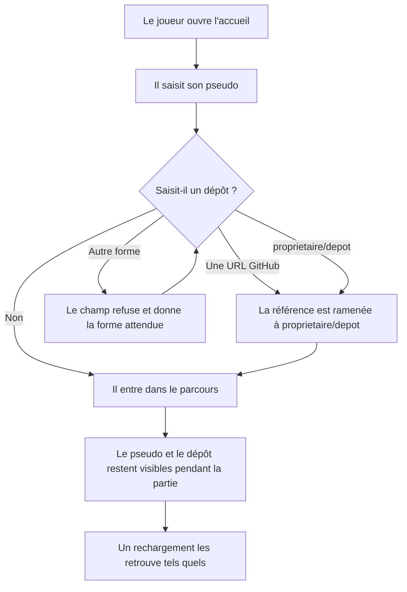
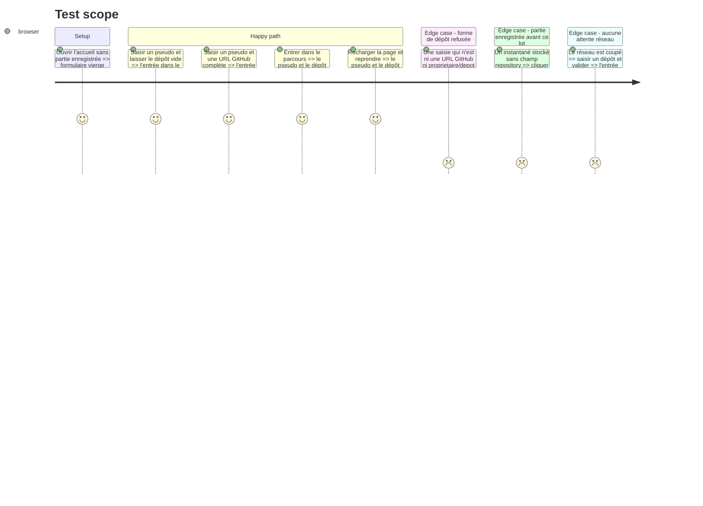

# Instruction: Le dépôt saisi et retenu

## Architecture projection

> Tree of the final files. ✅ create · ✏️ modify · ❌ delete

```txt
.
├── src
│   ├── core
│   │   ├── contracts
│   │   │   ├── ✅ repository-ref.schema.ts      # contrat unique de la référence de dépôt
│   │   │   └── ✏️ session-snapshot.schema.ts    # repository facultatif, rétrocompatible
│   │   ├── entities
│   │   │   └── ✏️ game-session.entity.ts        # la session porte la référence
│   │   └── session
│   │       └── ✏️ game-session.facade.ts        # start l'accepte, un accès la rend
│   ├── features/onboarding
│   │   ├── schema
│   │   │   └── ✏️ onboarding-form.schema.ts     # champ facultatif, réutilise le contrat
│   │   ├── hooks
│   │   │   └── ✏️ use-onboarding.hook.ts        # transmet la référence à la façade
│   │   └── components/sections
│   │       └── ✏️ onboarding-view.tsx           # le champ dépôt
│   └── components/layout/app-layout
│       └── ✏️ app-layout.tsx                    # l'identité reste visible pendant la partie
└── __tests__/unit
    ├── core
    │   └── ✅ repository-ref.schema.test.ts      # formes acceptées et refusées
    └── features/onboarding
        └── ✏️ use-onboarding.test.ts             # la référence traverse jusqu'à la façade
```

## User Journey



## Test Scope



## Wireframe

```txt
┌──────────────────────────────────────────────────────┐
│ (1) En-tête : marque · statut · identité et dépôt    │
├────────────┬─────────────────────────────────────────┤
│ (2) Rampe  │ (3) Titre et cadre                      │
│            │ (4) Compteurs                           │
│            │ (5) Partie enregistrée, si elle existe  │
│            │ ┌─────────────────────────────────────┐ │
│            │ │ (6) Champ pseudo         [requis]   │ │
│            │ │ (7) Champ dépôt       [facultatif]  │ │
│            │ │ (8) Bouton d'entrée                 │ │
│            │ └─────────────────────────────────────┘ │
└────────────┴─────────────────────────────────────────┘
```

## Tasks to do

### `1)` Poser le contrat de la référence de dépôt

> Une seule règle, lue par le formulaire comme par l'instantané stocké.

1. Créer `src/core/contracts/repository-ref.schema.ts`.
2. Accepter deux formes en entrée : une URL GitHub complète, avec ou sans `.git` final, et la forme `proprietaire/depot`.
3. Normaliser vers `proprietaire/depot` : c'est cette forme qui est retenue et stockée.
4. Refuser toute autre forme avec un message en français qui donne la forme attendue.
5. N'importer ni React, ni `features/`, ni `infrastructure/` : le fichier vit dans le domaine.
6. Commenter pourquoi la normalisation est ici et non dans le formulaire : l'API n'accepte que le couple propriétaire et dépôt, et deux définitions divergeraient.

### `2)` Ouvrir le champ dans le formulaire

> Facultatif veut dire que le vide passe, pas que n'importe quoi passe.

1. Ouvrir `src/features/onboarding/schema/onboarding-form.schema.ts`.
2. Ajouter un champ dépôt facultatif qui délègue au contrat de la tâche 1 ; ne pas réécrire la règle.
3. Une chaîne vide est valide et vaut « aucun dépôt ».
4. Mettre le commentaire d'en-tête à jour : il affirme aujourd'hui « Le pseudo, et rien d'autre ».

### `3)` Faire descendre la référence jusqu'au domaine

> Une donnée saisie qui ne traverse pas jusqu'à la session est une donnée perdue au rechargement.

1. Ajouter `repository` en facultatif dans `src/core/contracts/session-snapshot.schema.ts`, sans le rendre requis.
2. Faire porter la référence par `src/core/entities/game-session.entity.ts`, dans le constructeur, la restauration et l'instantané.
3. Élargir `start` dans `src/core/session/game-session.facade.ts` pour accepter une référence facultative, et exposer un accès en lecture à côté de `playerName()`.
4. Vérifier qu'un instantané stocké sans `repository` se restaure toujours.

### `4)` Montrer le champ, puis la saisie

> La Story exige que la saisie reste visible pendant toute la partie.

1. Ajouter le champ dépôt dans `src/features/onboarding/components/sections/onboarding-view.tsx`, sous le pseudo, avec sa mention de champ facultatif et son message d'erreur.
2. Transmettre la valeur à la façade depuis `src/features/onboarding/hooks/use-onboarding.hook.ts`.
3. Porter le pseudo et le dépôt dans l'en-tête de `src/components/layout/app-layout/app-layout.tsx`, à côté du statut, pour qu'ils restent lisibles sur tous les écrans du parcours.
4. Garder la logique dans le hook et le composant purement présentationnel.

### `5)` Couvrir le contrat et le passage

> Le contrat porte la règle, le hook porte le passage. Les deux se cassent séparément.

1. Créer `__tests__/unit/core/repository-ref.schema.test.ts` : formes acceptées, normalisation, formes refusées, chaîne vide.
2. Étendre `__tests__/unit/features/onboarding/use-onboarding.test.ts` : la référence saisie arrive à la façade, et l'absence de saisie n'en fabrique pas une.

## Test acceptance criteria

| Task | Acceptance criteria              |
| ---- | -------------------------------- |
| 1 | Une URL GitHub et la forme courte donnent la même référence normalisée ; toute autre forme est refusée avec un message qui donne la forme attendue. |
| 2 | Le formulaire s'envoie avec le dépôt vide ; une forme invalide bloque l'envoi. |
| 3 | Une partie enregistrée avant ce lot, sans `repository`, se reprend sans erreur. |
| 4 | Après l'entrée, le pseudo et le dépôt sont lisibles sur les écrans du parcours, et un rechargement suivi d'une reprise les retrouve tels quels. |
| 5 | Les tests échouent si la normalisation change de forme retenue, ou si la référence cesse d'atteindre la façade. |
