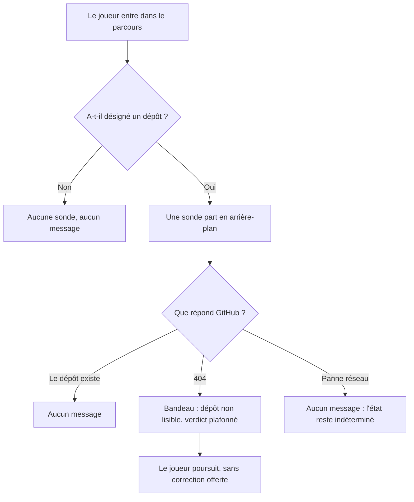
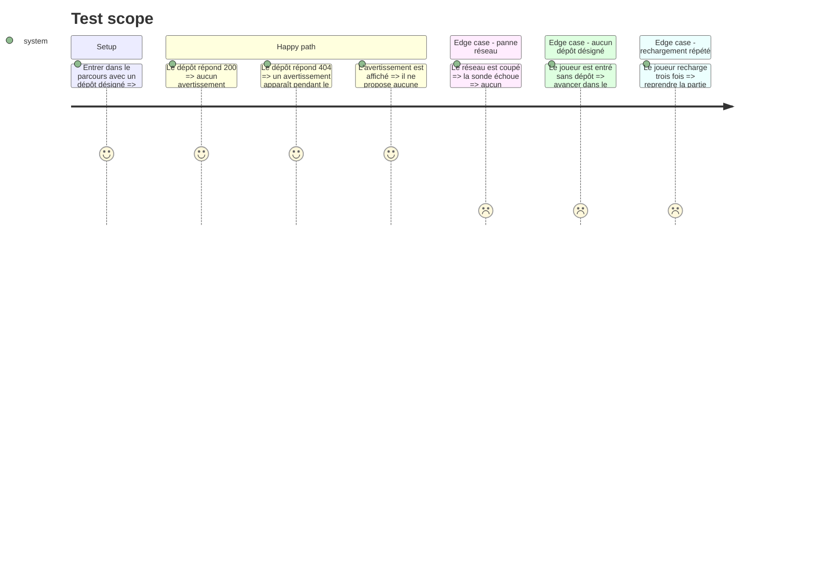

# Instruction: La sonde de lisibilité

## Architecture projection

> Tree of the final files. ✅ create · ✏️ modify · ❌ delete

```txt
.
├── src
│   ├── core/ports
│   │   └── ✅ repository-reader.interface.ts        # port étroit : le dépôt est-il lisible
│   ├── infrastructure/repository
│   │   └── ✅ github.adapter.ts                     # un seul appel, sans jeton
│   ├── ✏️ composition-root.ts                       # câble l'adapter au reste
│   ├── features/repository-probe
│   │   ├── hooks
│   │   │   └── ✅ use-repository-probe.hook.ts      # sonde une fois par session
│   │   └── components/composites
│   │       └── ✅ repository-warning.tsx            # bandeau informatif, sans action
│   └── features/group-navigation/components/sections
│       └── ✏️ course-view.tsx                       # accueille le bandeau
├── __tests__/unit
│   ├── infrastructure
│   │   └── ✅ github.adapter.test.ts                # 200, 404 et panne réseau
│   └── features/repository-probe
│       └── ✅ use-repository-probe.test.ts          # une sonde par session
└── aidd_docs/memory
    └── ✏️ architecture.md                           # « aucun fetching serveur » devient faux
```

## User Journey



## Test Scope



## Wireframe

```txt
┌──────────────────────────────────────────────────────┐
│ (1) En-tête : marque · statut · identité et dépôt    │
├────────────┬─────────────────────────────────────────┤
│ (2) Rampe  │ ┌─────────────────────────────────────┐ │
│  groupe    │ │ (3) Bandeau dépôt non lisible       │ │
│  courant   │ └─────────────────────────────────────┘ │
│  marqué    │ (4) Situation en cours                  │
└────────────┴─────────────────────────────────────────┘
```

1. En-tête : porte déjà l'identité depuis la phase 2.
2. Rampe : comportement du parcours, inchangé.
3. Bandeau : présent seulement quand la sonde a conclu à l'illisibilité. Aucune action, aucun bouton.
4. Le jeu courant, inchangé.

## Tasks to do

### `1)` Poser le port

> Le domaine dit ce dont il a besoin, jamais comment on l'obtient.

1. Créer `src/core/ports/repository-reader.interface.ts`, sur le modèle de `persistence-session-adapter.interface.ts`.
2. Une seule opération : sonder une référence de dépôt et rendre un état.
3. Trois états distincts, et pas deux : lisible, non lisible, indéterminé. L'indéterminé est le cas de la panne réseau.
4. Commenter pourquoi l'indéterminé existe : un `404` et une coupure réseau ne disent pas la même chose, et les confondre accuserait un dépôt sain.

### `2)` Écrire l'adapter GitHub

> Un seul appel, sans jeton, et qui ne ment jamais sur ce qu'il n'a pas su.

1. Créer `src/infrastructure/repository/github.adapter.ts`. L'adapter ne préfixe pas son port, c'est la convention du projet.
2. Appeler `GET https://api.github.com/repos/{proprietaire}/{depot}`, sans en-tête d'authentification.
3. Une réponse `200` rend lisible. Une réponse `404` rend non lisible.
4. Un rejet de `fetch`, une coupure, un délai dépassé rendent indéterminé. Ne jamais traduire un rejet en non lisible.
5. Recevoir `fetch` par le constructeur, sans valeur de repli, comme `LocalSessionStorageAdapter` reçoit son `Storage` : c'est ce qui rend la sonde testable sans réseau.
6. Commenter le fait que `404` couvre à la fois le dépôt privé et le dépôt inexistant, et que l'adapter ne peut pas les distinguer.

### `3)` Câbler

> Un seul endroit choisit les implémentations.

1. Ouvrir `src/composition-root.ts` et y instancier l'adapter, à côté de l'horloge et de la persistance.
2. Passer `globalThis.fetch` explicitement, jamais depuis l'adapter lui-même.

### `4)` Sonder une fois, pas à chaque rendu

> Le budget est de 60 requêtes par heure et par IP. Une sonde par rendu le brûlerait.

1. Créer `src/features/repository-probe/hooks/use-repository-probe.hook.ts`.
2. Ne rien émettre quand aucun dépôt n'a été désigné.
3. Émettre une seule sonde par session, et la mémoriser pour qu'un remontage ne la relance pas.
4. Annuler proprement la requête si le composant est démonté avant la réponse.
5. Rendre l'état de la sonde, sans décider de l'affichage.

### `5)` Afficher l'avertissement

> Informatif, et honnête sur ce qu'il ne sait pas.

1. Créer `src/features/repository-probe/components/composites/repository-warning.tsx`, composant pur, sans logique.
2. N'afficher le bandeau que sur l'état non lisible. Ni sur lisible, ni sur indéterminé.
3. Dire que le dépôt n'est pas lisible, sans prétendre dire pourquoi.
4. Rappeler que le verdict sera plafonné comme si aucun dépôt n'avait été désigné.
5. N'offrir aucune correction et ne rien suggérer que le joueur ne puisse faire.
6. Placer le bandeau en tête de `src/features/group-navigation/components/sections/course-view.tsx`.

### `6)` Recaler la mémoire projet

> Le document affirme une chose que ce lot rend fausse.

1. Ouvrir `aidd_docs/memory/architecture.md`.
2. Corriger « Pas de TanStack Query : il n'y a aucun fetching serveur » : il y a désormais un appel réseau, sorti par un port, et il reste sans client de requêtes.
3. Ajouter le port et l'adapter à la liste des adapters existants.

### `7)` Couvrir la sonde

> Les trois issues comptent autant l'une que l'autre.

1. Créer `__tests__/unit/infrastructure/github.adapter.test.ts` : `200`, `404`, rejet de `fetch`, avec un `fetch` de test.
2. Créer `__tests__/unit/features/repository-probe/use-repository-probe.test.ts` : aucune requête sans dépôt désigné, une seule requête pour plusieurs montages.

## Test acceptance criteria

| Task | Acceptance criteria              |
| ---- | -------------------------------- |
| 1 | Le port distingue trois états et le domaine n'importe rien de `infrastructure/`. |
| 2 | Un `404` rend non lisible ; un rejet de `fetch` rend indéterminé et jamais non lisible. |
| 3 | L'adapter ne lit aucun global par lui-même ; il est substituable en test. |
| 4 | Sans dépôt désigné, aucune requête ne part. Avec un dépôt, une seule requête part par session, quel que soit le nombre de remontages. |
| 5 | Le bandeau n'apparaît que sur l'état non lisible, ne nomme pas de cause, rappelle le plafond, et n'offre aucune action. |
| 6 | `architecture.md` ne contredit plus le code. |
| 7 | Les tests échouent si une panne réseau se met à produire un avertissement, ou si la sonde repart à chaque montage. |
