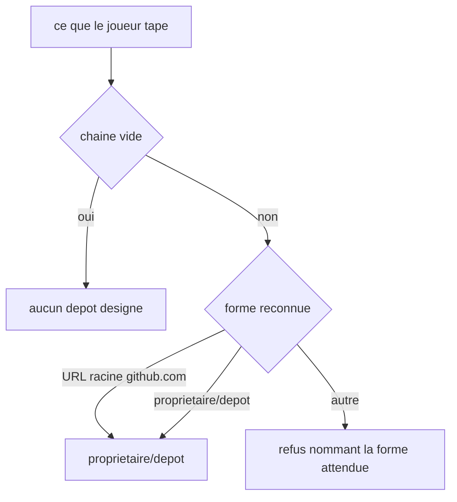
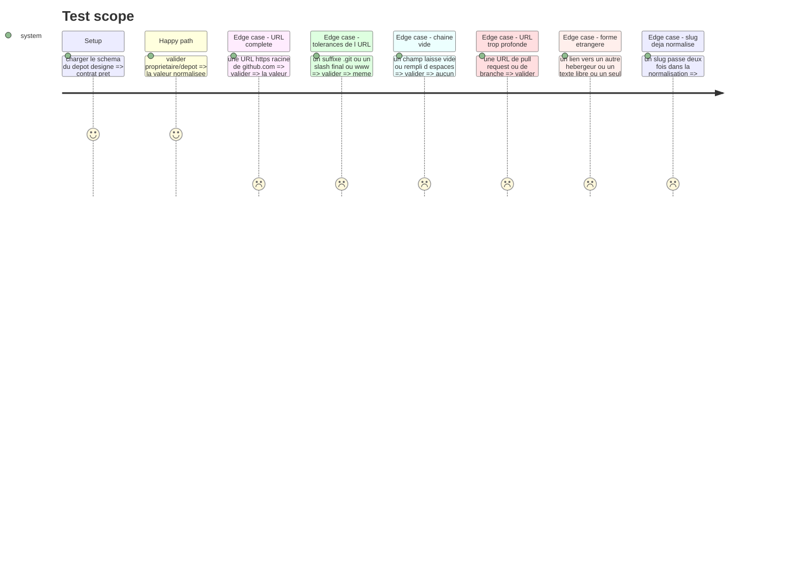

# Instruction: Le contrat du dépôt désigné

## Architecture projection

> Tree of the final files. ✅ create · ✏️ modify · ❌ delete

```txt
.
├── src/core/contracts/
│   └── repository-slug.schema.ts                   ✅ la forme acceptée, et sa normalisation vers `proprietaire/depot`
└── __tests__/unit/core/contracts/
    └── repository-slug.test.ts                     ✅
```

## User Journey



## Test Scope



## Tasks to do

### `1)` Le slug, forme de référence

> Ce que le domaine stocke et ce que l'API GitHub saura relire plus tard.

1. Créer `src/core/contracts/repository-slug.schema.ts`.
2. Exporter `repositorySlugSchema` : exactement deux segments non vides séparés par un `/`, chaque segment composé de lettres, chiffres, `.`, `-` ou `_`, sans espace.
3. Refuser un segment réduit à `.` ou `..`, et refuser un troisième segment.
4. Exporter le type `RepositorySlug` inféré du schéma.
5. Ne valider que la forme : aucune règle de nommage GitHub recopiée en dur, aucun appel réseau, aucun import hors `zod`.

### `2)` L'entrée du joueur, et sa normalisation

> Deux formes entrent, une seule sort.

1. Dans le même fichier, exporter `repositoryInputSchema` : il accepte une chaîne, la débarrasse de ses espaces de bord, et rend soit un `RepositorySlug`, soit `undefined`.
2. Une chaîne vide, ou faite d'espaces seuls, rend `undefined` sans erreur : le dépôt est facultatif.
3. Une URL `https://github.com/proprietaire/depot` est acceptée et rendue sous forme de slug. Tolérer le `http`, le `www.`, le suffixe `.git` et le slash final.
4. Une URL portant un segment de plus — `/pull/3`, `/tree/main`, `/issues` — est refusée : elle désigne autre chose que le dépôt.
5. Toute autre forme est refusée avec un message en français qui **donne la forme attendue**, en citant les deux formes acceptées.
6. La normalisation est idempotente : repasser un slug déjà normalisé rend le même slug.

## Test acceptance criteria

| Task | Acceptance criteria                                                                                     |
| ---- | --------------------------------------------------------------------------------------------------------- |
| 1    | `proprietaire/depot` est accepté ; un seul segment, trois segments, ou un segment vide sont refusés         |
| 1    | Un segment contenant un espace ou réduit à `.` est refusé                                                   |
| 2    | Une chaîne vide ou faite d'espaces rend l'absence de dépôt, sans message d'erreur                           |
| 2    | `https://github.com/o/d`, `https://www.github.com/o/d/`, `https://github.com/o/d.git` rendent tous `o/d`     |
| 2    | `https://github.com/o/d/pull/3` est refusé                                                                  |
| 2    | Un lien vers un autre hébergeur, ou un texte libre, est refusé                                              |
| 2    | Le message de refus est en français et cite les deux formes acceptées                                       |
| 2    | Normaliser deux fois de suite rend la même valeur                                                           |
