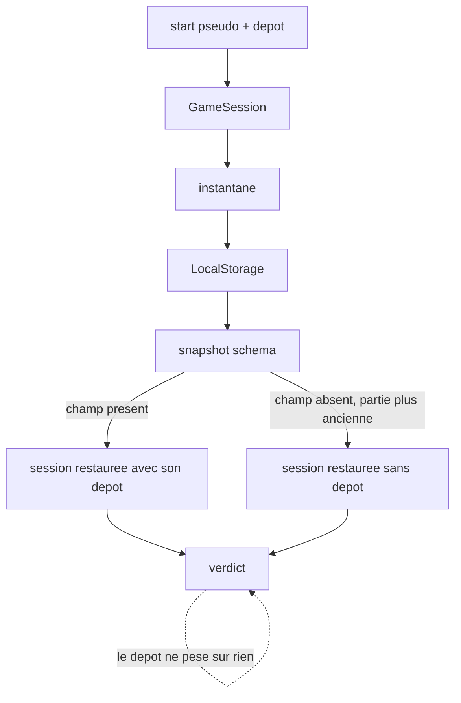
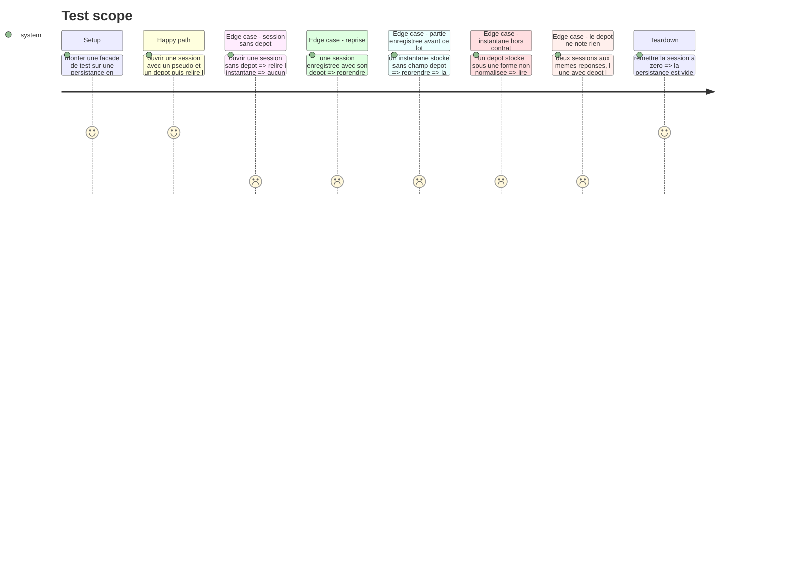

# Instruction: Le dépôt traverse la session

## Architecture projection

> Tree of the final files. ✅ create · ✏️ modify · ❌ delete

```txt
.
├── src/core/
│   ├── contracts/
│   │   └── session-snapshot.schema.ts              ✏️ `repository` optionnel, pour ne pas perdre les parties déjà enregistrées
│   ├── entities/
│   │   └── game-session.entity.ts                  ✏️ la session porte le dépôt, le rend dans son instantané, le retrouve à la restauration
│   └── session/
│       └── game-session.facade.ts                  ✏️ `start` prend le dépôt, `designatedRepository()` le rend, `storedRun()` l'expose
└── __tests__/unit/core/
    ├── entities/game-session.test.ts               ✏️
    └── session/game-session.facade.test.ts         ✏️
```

## User Journey



## Test Scope



## Tasks to do

### `1)` L'instantané accueille le dépôt

> Un champ nouveau ne doit pas condamner les parties déjà commencées.

1. Dans `session-snapshot.schema.ts`, ajouter un champ `repository` **optionnel**, typé par `repositorySlugSchema` de la phase 1.
2. Un instantané dépourvu du champ reste valide : c'est le cas de toute partie enregistrée avant ce lot.
3. Un instantané portant un dépôt sous une forme non normalisée est rejeté comme n'importe quel instantané hors contrat, sans lever — la façade l'ignore déjà.
4. Commenter le pourquoi de l'optionnalité au-dessus du champ : la compatibilité avec le stockage existant, pas une hésitation de modélisation.

### `2)` L'entité porte le dépôt

> La session sait sous quel dépôt elle a été ouverte, et le retrouve à l'identique.

1. Dans `game-session.entity.ts`, faire prendre au constructeur le dépôt désigné, facultatif, à côté du pseudo.
2. L'exposer en lecture seule, comme `playerName`.
3. `snapshot()` l'écrit ; il est absent de l'instantané quand aucun dépôt n'a été désigné.
4. `restore()` le relit tel quel, sans le recalculer ni le revalider une seconde fois.

### `3)` La façade prend et rend le dépôt

> Le seul point d'entrée de l'interface doit suffire à tout ce que l'écran a besoin de savoir.

1. `start()` prend le dépôt désigné en second argument, facultatif, et le passe à la session.
2. Ajouter `designatedRepository()` qui rend le slug de la session en cours, ou `undefined`.
3. `storedRun()` ajoute le dépôt à ce qu'il expose déjà, pour que l'accueil montre sous quel dépôt la partie enregistrée tourne.
4. Ne rien changer d'autre : ni `getVerdict()`, ni `getProgress()`, ni la stratégie de scoring ne connaissent le dépôt.

## Test acceptance criteria

| Task | Acceptance criteria                                                                                                  |
| ---- | ------------------------------------------------------------------------------------------------------------------------ |
| 1    | Un instantané sans champ `repository` est accepté par le schéma                                                          |
| 1    | Un instantané dont le `repository` n'est pas un slug est rejeté, et la façade repart sur un accueil vierge sans lever      |
| 2    | Une session ouverte avec un dépôt le rend dans son instantané, sous sa forme normalisée                                   |
| 2    | Une session ouverte sans dépôt produit un instantané sans dépôt                                                           |
| 2    | Une session restaurée retrouve son dépôt, son pseudo et sa position                                                       |
| 3    | `designatedRepository()` rend `undefined` tant qu'aucun dépôt n'a été désigné                                             |
| 3    | `storedRun()` expose le dépôt de la partie enregistrée                                                                    |
| 3    | Deux parties aux mêmes réponses, l'une avec dépôt l'autre sans, rendent le même niveau et les mêmes dimensions             |
