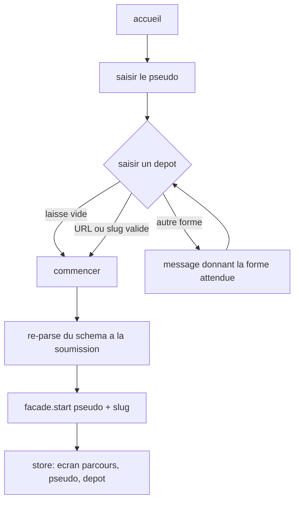
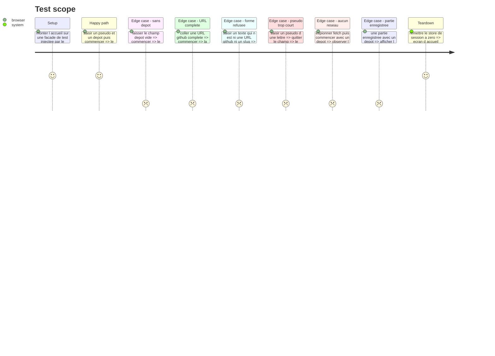

# Instruction: La saisie à l'accueil

## Architecture projection

> Tree of the final files. ✅ create · ✏️ modify · ❌ delete

```txt
.
├── src/
│   ├── features/onboarding/
│   │   ├── schema/onboarding-form.schema.ts        ✏️ le champ dépôt, facultatif, adossé au contrat de la phase 1
│   │   ├── hooks/use-onboarding.hook.ts            ✏️ `start` transmet le dépôt, la reprise le remonte
│   │   └── components/
│   │       ├── sections/onboarding-view.tsx        ✏️ le champ, son aide, son erreur, et le parse à la soumission
│   │       └── composites/resume-run.tsx           ✏️ la partie enregistrée montre son dépôt
│   └── store/session.store.ts                      ✏️ l'identité à l'écran devient pseudo + dépôt
└── __tests__/unit/features/onboarding/
    ├── use-onboarding.test.ts                      ✏️
    └── onboarding-view.test.tsx                    ✅ la saisie vue du joueur, et l'absence de réseau
```

## User Journey



## Wireframe

```txt
┌──────────────────────────────────────────────────────────────┐
│ (1) En-tete: laivel-up-eval                                   │
├─────────────┬────────────────────────────────────────────────┤
│ (2) Rampe   │ (3) Titre + promesse                           │
│  des        ├────────────────────────────────────────────────┤
│  groupes    │ (4) Groupes | Situations | Donnees             │
│             ├────────────────────────────────────────────────┤
│             │ (5) Partie en cours ┌────────────────────────┐ │
│             │                     │ pseudo · depot · x/y   │ │
│             │                     │ [Reprendre] [Zero]     │ │
│             │                     └────────────────────────┘ │
│             ├────────────────────────────────────────────────┤
│             │ (6) VOTRE NOM                                  │
│             │     [__________________________]               │
│             │                                                │
│             │ (7) VOTRE DEPOT (FACULTATIF)                   │
│             │     [__________________________]               │
│             │     (8) aide: formes acceptees                 │
│             │     (9) erreur: forme attendue                 │
│             │                                                │
│             │ (10) [ Commencer l'evaluation ]                │
└─────────────┴────────────────────────────────────────────────┘
```

1. En-tête existant, inchangé sur l'accueil : aucune identité à afficher tant que rien n'est saisi.
2. Rampe des groupes, inchangée : la forme de ce qui va être mesuré.
3. Titre et promesse, inchangés.
4. Bandeau de chiffres, inchangé.
5. Carte de partie enregistrée, affichée seulement s'il y en a une ; elle gagne le dépôt à côté du pseudo.
6. Champ du pseudo, inchangé.
7. Champ du dépôt, nouveau, sous le pseudo. Son intitulé porte le mot « facultatif ».
8. Ligne d'aide permanente sous le champ : les deux formes acceptées, et le fait qu'aucune vérification n'a lieu ici.
9. Ligne d'erreur, au même emplacement que celle du pseudo, affichée seulement en cas de refus.
10. Bouton de départ, inchangé.

## Test Scope



## Tasks to do

### `1)` Le schéma du formulaire

> Une seule définition de validation, celle de la phase 1 réutilisée telle quelle.

1. Dans `onboarding-form.schema.ts`, ajouter `repository` adossé à `repositoryInputSchema` : le formulaire ne redéclare aucune règle de forme.
2. Laisser `playerName` intact : ses bornes et ses messages sont déjà conformes à l'acceptation.
3. Documenter en tête de fichier que la sortie du schéma est le slug, et que l'entrée reste la chaîne tapée.

### `2)` Le champ à l'écran

> Le joueur voit ce qui est accepté avant de se tromper, pas après.

1. Ajouter le champ dépôt sous le pseudo, avec `defaultValues` complété d'une chaîne vide.
2. Intituler le champ de façon à ce que « facultatif » se lise sans survol.
3. Poser sous le champ une aide permanente qui cite les deux formes acceptées et dit qu'aucune vérification n'a lieu à cet instant.
4. Rendre l'erreur au même endroit et avec le même traitement que celle du pseudo, `aria-invalid` compris.
5. Dans `onSubmit`, **re-parser la valeur du formulaire avec le schéma** pour obtenir le slug, puis le transmettre : TanStack Form ne passe que l'entrée brute.

### `3)` Le hook et le store

> Ce qui a été saisi doit survivre au changement d'écran.

1. `start` prend le dépôt en second argument et le passe à `facade.start`.
2. `resume` remonte le dépôt de la session reprise via `designatedRepository()`.
3. Dans `session.store.ts`, faire porter à `openCourse` une identité nommée — pseudo et dépôt — plutôt qu'un troisième argument positionnel, et exposer `repository` dans l'état.
4. `reset()` efface le dépôt comme il efface le pseudo.
5. Passer `storedRun.repository` à la carte de reprise, qui l'affiche à côté du pseudo et n'affiche rien de plus quand il n'y en a pas.

### `4)` Aucun réseau à l'entrée

> L'acceptation est négative : elle a besoin d'un test pour exister.

1. Écrire dans `onboarding-view.test.tsx` un cas qui espionne `globalThis.fetch` et démarre une partie avec un dépôt renseigné.
2. Vérifier que l'espion n'a pas été appelé et que l'écran du parcours est ouvert.

## Test acceptance criteria

| Task | Acceptance criteria                                                                                        |
| ---- | -------------------------------------------------------------------------------------------------------------- |
| 1    | Le schéma du formulaire ne contient aucune expression de forme : il délègue à `repositoryInputSchema`           |
| 2    | Un champ dépôt vide n'empêche pas de commencer et n'affiche aucune erreur                                       |
| 2    | Une URL GitHub complète ouvre le parcours avec `proprietaire/depot` retenu                                      |
| 2    | Une forme refusée affiche un message qui donne la forme attendue, et le parcours ne s'ouvre pas                 |
| 2    | Le champ refusé porte `aria-invalid`, comme le pseudo                                                           |
| 2    | Le message d'erreur du pseudo reste inchangé, en français, entre 2 et 40 caractères                             |
| 3    | Après le démarrage, le store porte le pseudo et le dépôt                                                        |
| 3    | Une reprise remet le dépôt de la partie enregistrée dans le store                                               |
| 3    | La carte de reprise affiche le dépôt quand il y en a un, et rien de plus quand il n'y en a pas                  |
| 4    | Démarrer une partie avec un dépôt renseigné ne déclenche aucun appel réseau                                     |
