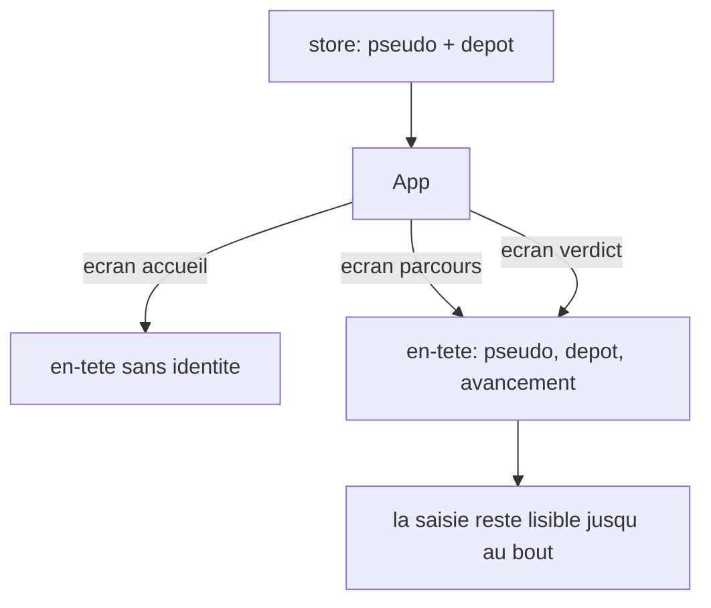
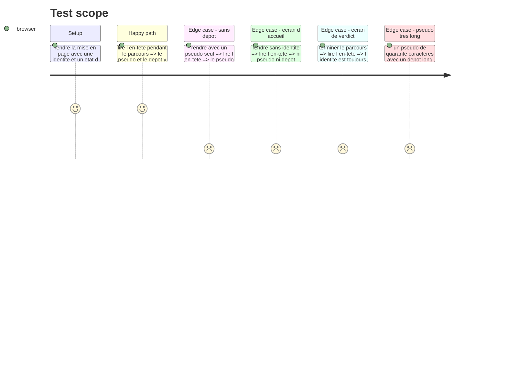

# Instruction: La saisie visible pendant la partie

## Architecture projection

> Tree of the final files. ✅ create · ✏️ modify · ❌ delete

```txt
.
├── src/
│   ├── components/layout/app-layout/app-layout.tsx ✏️ l'en-tête accueille une identité, à côté de l'état d'avancement
│   └── App.tsx                                     ✏️ le parcours et le verdict la passent, l'accueil non
└── __tests__/unit/components/layout/
    └── app-layout.test.tsx                         ✅
```

## User Journey



## Wireframe

```txt
┌──────────────────────────────────────────────────────────────┐
│ (1) laivel-up-eval   (2) pseudo · depot   (3) 4/12 situations │
├──────────────────────────────────────────────────────────────┤
│                                                               │
│ (4) Contenu de l ecran courant                                │
│                                                               │
└──────────────────────────────────────────────────────────────┘
```

1. Marque, inchangée, calée à gauche.
2. Identité, nouvelle : le pseudo, puis le dépôt quand il y en a un. Absente sur l'accueil.
3. État d'avancement, existant, calé à droite. Sur le verdict il porte « parcours terminé ».
4. Corps de l'écran, inchangé.

## Test Scope



## Tasks to do

### `1)` L'en-tête accueille l'identité

> La mise en page reste bête : elle affiche ce qu'on lui donne, elle ne va rien chercher.

1. Dans `app-layout.tsx`, ajouter une propriété d'identité facultative, nommée, portant le pseudo et le dépôt.
2. La rendre entre la marque et l'état d'avancement, dans le registre typographique déjà en place — pas de nouveau jeton, pas de nouvelle couleur.
3. Ne rien rendre du tout quand l'identité est absente : l'accueil garde son en-tête actuel.
4. Ne rendre ni séparateur ni espace résiduel quand le dépôt manque.
5. Tenir un pseudo long et un dépôt long sur une seule bande, par troncature, sans casser la ligne ni pousser l'avancement hors de l'écran.

### `2)` Les écrans qui la passent

> Le parcours et le verdict, pas l'accueil.

1. Dans `App.tsx`, lire le pseudo et le dépôt dans le store et les passer à la mise en page sur l'écran de parcours et sur celui du verdict.
2. Laisser l'accueil sans identité : il n'y a encore rien à montrer.
3. Ne rien passer non plus sur l'écran de configuration refusée : aucune session n'existe.

## Test acceptance criteria

| Task | Acceptance criteria                                                                        |
| ---- | ---------------------------------------------------------------------------------------------- |
| 1    | L'en-tête affiche le pseudo et le dépôt quand les deux sont fournis                             |
| 1    | Avec le pseudo seul, aucun séparateur ni espace orphelin n'apparaît                             |
| 1    | Sans identité, l'en-tête est identique à celui d'avant ce lot                                   |
| 1    | Un pseudo de 40 caractères et un dépôt long laissent l'avancement lisible sur une seule bande   |
| 2    | Pendant le parcours, la saisie de l'accueil est lisible à l'écran                               |
| 2    | Sur l'écran de verdict, elle l'est encore                                                       |
| 2    | Sur l'accueil et sur l'écran de configuration refusée, rien n'est affiché                       |
