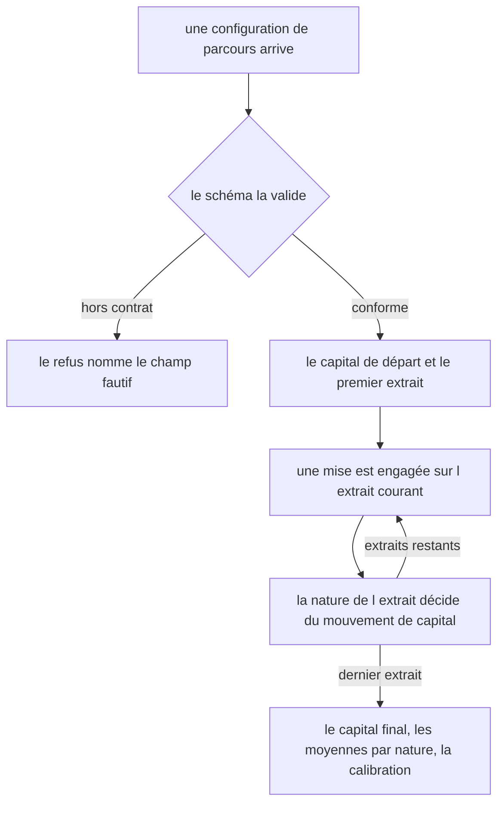
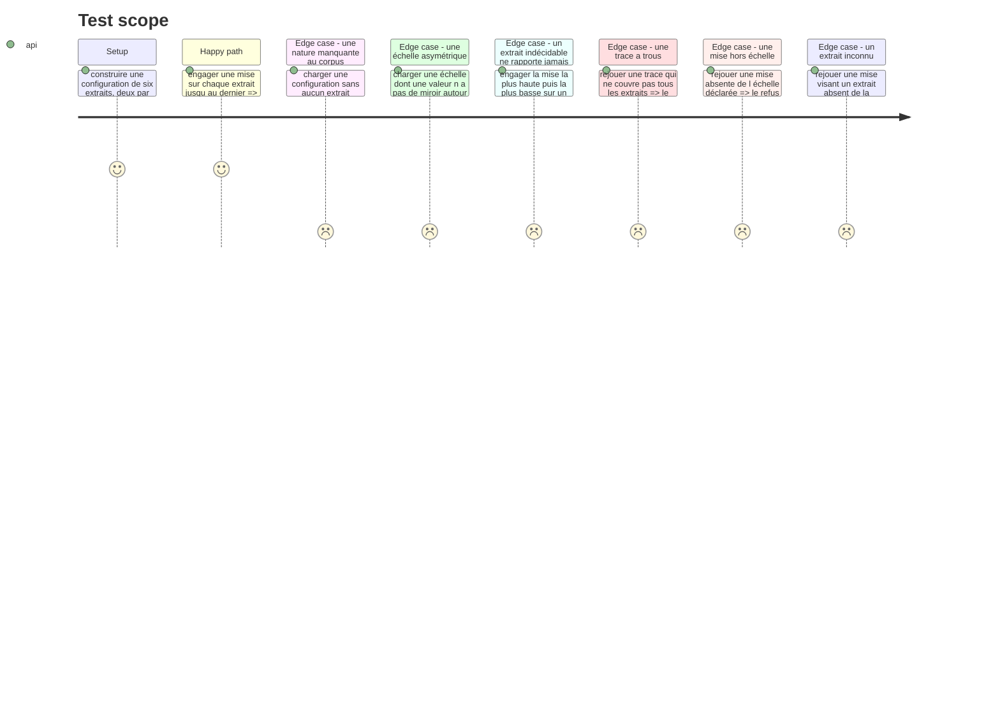

# Instruction: Les contrats et la simulation pure

## Architecture projection

> Tree of the final files. ✅ create · ✏️ modify · ❌ delete

```txt
.
├── src/games/confidence-bet/
│   ├── schema/
│   │   ├── config.schema.ts                  ✅ ce qu un auteur de parcours écrit pour ce jeu
│   │   └── answer.schema.ts                  ✅ la trace des mises, et sa complétude
│   └── helpers/
│       └── run-simulation.helper.ts          ✅ le mouvement de capital, seule implémentation
└── __tests__/unit/games/confidence-bet/
    ├── config.schema.test.ts                 ✅
    ├── answer.schema.test.ts                 ✅
    └── run-simulation.test.ts                ✅
```

## User Journey



## Test Scope



## Tasks to do

### `1)` Le schéma de configuration

> Ce qu'un auteur de parcours écrit, et rien de plus. Le corpus et le barème vivent ici, pas dans le code.

1. Créer `schema/config.schema.ts` : `statement` (même nom que les autres jeux, requis), `stakes` (l'échelle discrète), `neutralStake`, `startingCapital`, et `snippets` (au moins trois).
2. Un extrait porte `id`, `label`, `language`, `code`, `nature` parmi `sound` / `flawed` / `undecidable`, et `reveal`, la phrase montrée après l'engagement.
3. Refuser au chargement, en nommant le champ fautif :
   - deux extraits de même `id` — ils s'écraseraient silencieusement au rejeu ;
   - une échelle de moins de trois valeurs, ou qui ne contient pas `neutralStake` — le joueur ne pourrait pas exprimer le doute ;
   - une échelle qui n'est pas symétrique autour de `neutralStake` : pour toute valeur `s`, `2 × neutralStake − s` doit appartenir à l'échelle ;
   - un corpus qui ne porte pas **au moins un extrait de chacune des trois natures**.
4. Le dernier refus est le plus important : sans lui, un critère porte sur un ensemble vide, ressort satisfait par vacuité, et le jeu note sans mesurer.
5. Documenter en tête du fichier pourquoi le corpus et le barème ne sont pas dans le code : aucun test ne peut dire si un corpus rend la partie triviale.

### `2)` Le schéma de réponse

> La trace des mises est la réponse, comme la trace des tours pour `three-tracks`.

1. Créer `schema/answer.schema.ts` : `bets`, une suite de `{ snippetId, stake }` dans l'ordre des extraits déclarés.
2. Ajouter au niveau de la trace le relevé du journal : le capital final. C'est un journal, jamais une source.
3. Écrire `parseConfidenceBetTrace(answer, config)` : le schéma seul ignore quels extraits la partie comptait. Vérifier la couverture extrait par extrait, dans l'ordre déclaré.
4. Refuser une mise qui vise un extrait inconnu, et une mise absente de l'échelle déclarée. Une erreur nommée par cas, sur le modèle de `IncompleteTraceError` de `three-tracks`.
5. Une trace à trous rendrait des critères manqués par défaut : ce serait noter un bug comme une pratique.

### `3)` La simulation

> Une seule implémentation du mouvement de capital, partagée par l'écran et par le scoring.

1. Créer `helpers/run-simulation.helper.ts` : le résultat d'une mise (`snippetId`, `nature`, `stake`, `delta`) et l'état de la partie (extraits joués, capital, résultats).
2. `initialState(config)` pose le capital de départ et aucun résultat.
3. `applyBet(config, state, bet)` résout une mise : `delta = stake − neutralStake` sur un `sound`, `neutralStake − stake` sur un `flawed`, `−|stake − neutralStake|` sur un `undecidable`.
4. Documenter la troisième branche : sur un extrait que rien ne permet de trancher, aucune direction n'est la bonne, et seul l'éloignement du doute se paie. C'est la seule forme qui s'annonce honnêtement dans la consigne sans dire ce qui est noté — un extrait indécidable qui ne coûterait rien inviterait l'extrémité, et un extrait indécidable qui paierait récompenserait la devinette.
5. Exposer les trois lectures que l'évaluateur consommera, calculées ici et nulle part ailleurs :
   - `meanStakeOn(nature)` — la mise moyenne engagée sur les extraits d'une nature ;
   - `calibration` — la somme des `delta` des extraits **tranchables** divisée par `nombre d'extraits tranchables × (plus haute mise − neutralStake)`, soit une valeur dans `[-1, 1]` que la symétrie de l'échelle garantit. Elle ignore les indécidables : leur `delta` maximal atteignable est nul, les compter la ferait mécaniquement décroître sans rien mesurer. Le capital porte les deux, la calibration ne lit que la discrimination, le garde-fou ne lit que la retenue ;
   - `stakesOn(nature)` — les mises brutes d'une nature, matière du garde-fou.
6. `replayBets(config, bets)` rejoue la partie depuis les seules mises, comme `replayTrace` rejoue depuis les seules allocations. Il accepte un préfixe : l'écran s'en sert pour l'état courant.
7. Aucune horloge, aucun aléa, aucun accès extérieur : la fonction ne dépend que de ses arguments.

### `4)` Les tests

1. Couvrir les quatre refus de configuration, chacun sur le champ qu'il nomme.
2. Couvrir la complétude et les deux refus de mise de la trace.
3. Couvrir le signe du mouvement dans les trois natures, et le fait qu'aucune mise ne rapporte sur un indécidable, quelle que soit sa direction.
4. Couvrir la calibration à `1`, à `0` et à une valeur négative, et vérifier qu'elle ignore les extraits indécidables.
5. Vérifier que deux rejeux des mêmes mises rendent le même état final.

## Test acceptance criteria

| Task | Acceptance criteria |
| --- | --- |
| 1 | Un corpus sans extrait défectueux, sans extrait sain, ou sans extrait indécidable n'ouvre pas de session et nomme le champ |
| 1 | Une échelle sans miroir autour de la mise neutre est refusée au chargement |
| 1 | Une échelle qui ne contient pas la mise neutre est refusée au chargement |
| 1 | Deux extraits de même identifiant sont refusés au chargement |
| 2 | Une trace qui ne couvre pas tous les extraits est refusée, et l'erreur nomme l'extrait manquant |
| 2 | Une mise absente de l'échelle déclarée est refusée, et l'erreur nomme l'extrait fautif |
| 3 | La mise la plus haute sur un extrait sain fait le gain le plus grand, la même mise sur un défectueux fait la perte de même ampleur |
| 3 | Sur un extrait indécidable, la mise neutre ne coûte rien, et les deux mises extrêmes coûtent le même montant |
| 3 | La calibration vaut 1 quand chaque extrait tranchable a reçu la mise extrême du bon côté |
| 3 | La calibration vaut 0 quand toutes les mises sont posées sur la mise neutre |
| 3 | La calibration ne compte aucun extrait indécidable, quelle que soit la mise qui y a été posée |
| 3 | Deux rejeux des mêmes mises rendent le même état final |
