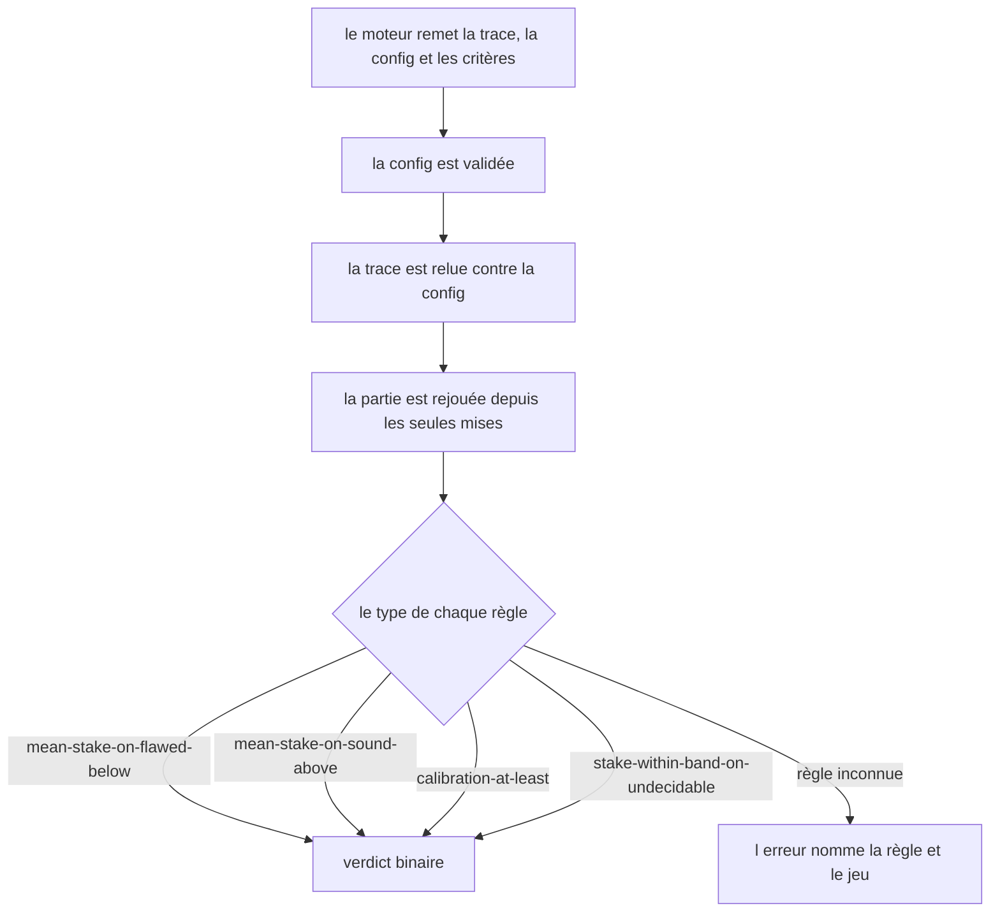
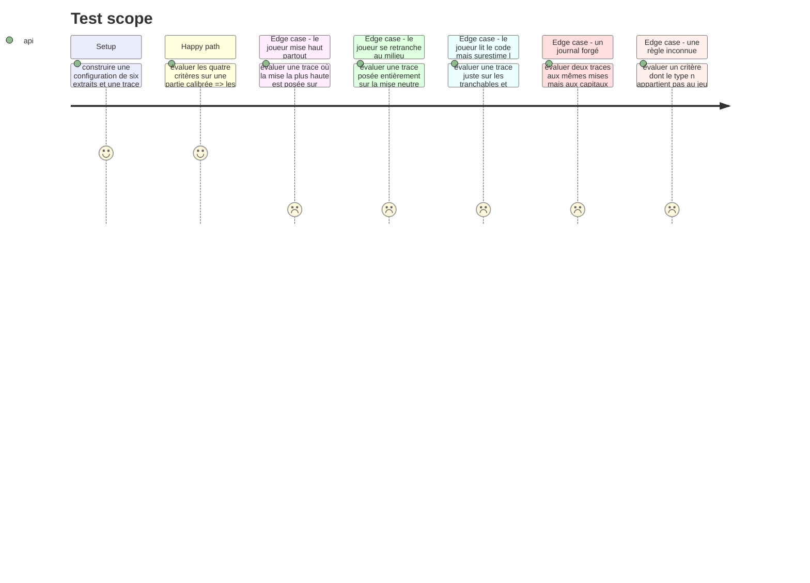

# Instruction: L'évaluateur et ses quatre règles

## Architecture projection

> Tree of the final files. ✅ create · ✏️ modify · ❌ delete

```txt
.
├── src/games/confidence-bet/
│   └── confidence-bet.evaluator.ts           ✅ le point de contact public avec le port GameEvaluator
└── __tests__/unit/games/confidence-bet/
    └── evaluator.test.ts                     ✅
```

## User Journey



## Test Scope



## Tasks to do

### `1)` L'évaluateur

> Il interprète des règles déclaratives. Déplacer un seuil se fait dans le parcours, jamais ici.

1. Créer `confidence-bet.evaluator.ts` à la racine du dossier du jeu, pas sous `actions/` : c'est le point de contact public avec le port.
2. Valider la config, relire la trace contre elle, puis **rejouer** la partie par `replayBets`. Le capital écrit dans la trace n'est jamais lu — une trace dont le journal serait forgé ne change aucun verdict.
3. Implémenter les quatre règles, chacune avec son propre schéma Zod de paramètres, sur le modèle de `three-tracks` :
   - `mean-stake-on-flawed-below` `{ threshold }` — la mise moyenne sur les extraits défectueux est **strictement** sous le seuil ;
   - `mean-stake-on-sound-above` `{ threshold }` — la mise moyenne sur les extraits sains est **strictement** au-dessus du seuil ;
   - `calibration-at-least` `{ threshold }` — la calibration atteint le seuil, borne **incluse**, comme les bornes de la grille ;
   - `stake-within-band-on-undecidable` `{ from, to }` — **chaque** mise posée sur un extrait indécidable tombe dans la bande, bornes incluses.
4. Documenter les deux inégalités strictes : la story dit « sous 50 % » et « au-dessus de 70 % », pas « au plus » ni « au moins ». Se poser exactement sur le seuil, c'est ne pas avoir tranché.
5. Documenter le quantificateur du garde-fou : `chaque`, pas `en moyenne`. Une moyenne laisserait compenser une mise extrême par une mise timorée, alors que ce qui est mesuré est de ne jamais s'engager sur ce qu'on ne peut pas établir.
6. Lever une erreur nommée sur une règle inconnue, sur le modèle de `UnknownRuleError`.

### `2)` Les tests

1. Couvrir les quatre règles, chacune satisfaite et manquée, seuil compris.
2. Couvrir la borne exacte des trois règles à seuil : posée dessus, la stricte est manquée, l'inclusive est satisfaite.
3. Couvrir les trois profils de triche listés dans le Test Scope, et vérifier le compte de critères satisfaits de chacun.
4. Vérifier qu'un capital forgé dans la trace ne change aucun verdict.
5. Couvrir la règle inconnue.

## Test acceptance criteria

| Task | Acceptance criteria |
| --- | --- |
| 1 | Une mise moyenne posée exactement sur le seuil des extraits défectueux fait manquer le critère |
| 1 | Une mise moyenne posée exactement sur le seuil des extraits sains fait manquer le critère |
| 1 | Une calibration posée exactement sur son seuil satisfait le critère |
| 1 | Une seule mise hors bande sur un extrait indécidable fait manquer le garde-fou, même si les autres sont dans la bande |
| 1 | Une trace au capital forgé rend exactement les mêmes verdicts qu'une trace au capital juste |
| 1 | Un type de règle inconnu lève une erreur qui nomme la règle et le jeu |
| 2 | Le joueur qui mise haut partout ne satisfait qu'un critère sur quatre |
| 2 | Le joueur qui reste sur la mise neutre partout ne satisfait qu'un critère sur quatre |
| 2 | Le joueur juste sur les tranchables et extrême sur les indécidables manque le seul garde-fou |
