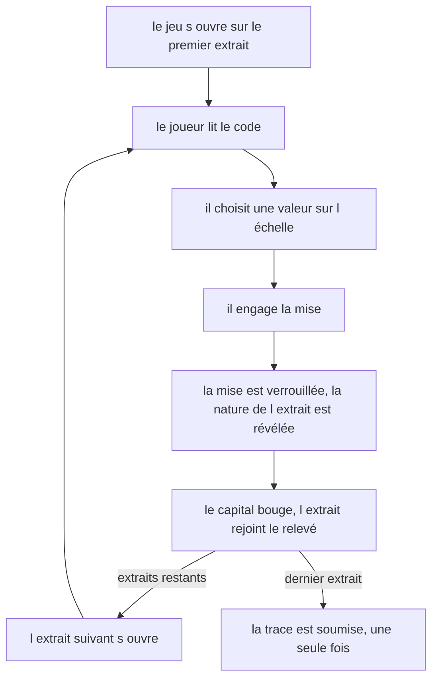
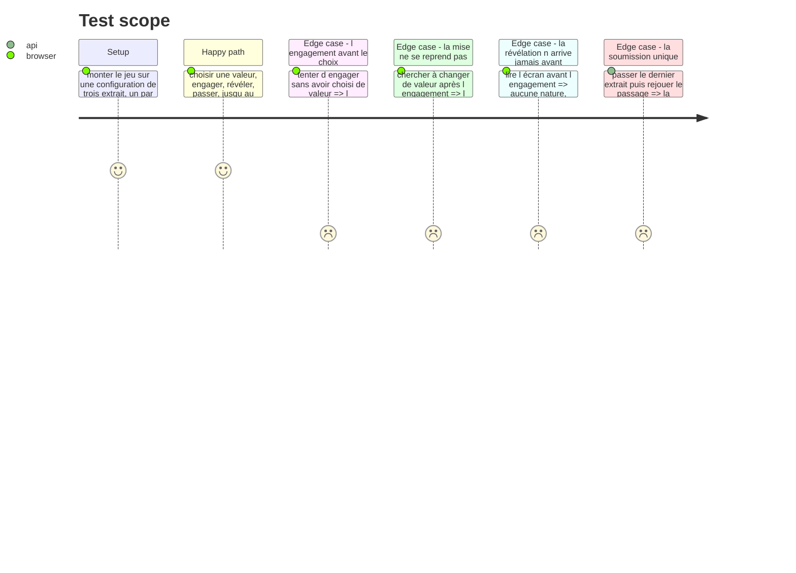

# Instruction: Le jeu à l'écran et son câblage

## Architecture projection

> Tree of the final files. ✅ create · ✏️ modify · ❌ delete

```txt
.
├── src/games/
│   ├── confidence-bet/
│   │   ├── actions/
│   │   │   └── build-confidence-bet-answer.action.ts   ✅ la trace conforme, hors de React
│   │   ├── hooks/
│   │   │   └── use-confidence-bet.hook.ts              ✅ le cycle de vie de la partie, et rien d autre
│   │   └── components/
│   │       ├── elements/
│   │       │   ├── snippet-card.tsx                    ✅ l extrait et son code, muet
│   │       │   ├── stake-scale.tsx                     ✅ l échelle de mises, muette
│   │       │   └── reveal-panel.tsx                    ✅ le verdict de l extrait, muet
│   │       └── composites/
│   │           ├── bet-ledger.tsx                      ✅ le relevé des extraits déjà joués
│   │           └── confidence-bet-game.tsx             ✅ le composite racine du jeu
│   ├── register-games.ts                               ✏️ un bloc de plus, evaluator et schémas
│   └── register-components.ts                          ✏️ un bloc de plus, le composant
└── __tests__/unit/games/confidence-bet/
    ├── build-answer.test.ts                            ✅
    ├── use-confidence-bet.test.ts                      ✅
    └── confidence-bet-game.test.tsx                    ✅
```

## User Journey



## Wireframe

```txt
┌──────────────────────────────────────────────────────────────┐
│ (1) Consigne                                                  │
├──────────────────────────────────────────────────────────────┤
│ (2) Ligne de position : extrait n sur N · capital              │
├──────────────────────────────────────────────────────────────┤
│ (3) Carte de l'extrait                                         │
│  ┌────────────────────────────────────────────────────────┐  │
│  │ intitulé                                                │  │
│  │ ┌────────────────────────────────────────────────────┐ │  │
│  │ │ (4) bloc de code                                    │ │  │
│  │ └────────────────────────────────────────────────────┘ │  │
│  └────────────────────────────────────────────────────────┘  │
├──────────────────────────────────────────────────────────────┤
│ (5) Échelle de mise    [ ] [ ] [ ] [ ] [ ]                     │
│ (6) Bouton d'engagement                                        │
│ ─────────── ou, une fois la mise engagée ───────────           │
│ (7) Panneau de révélation : verdict · explication · mouvement  │
│ (8) Bouton de passage à l'extrait suivant                      │
├──────────────────────────────────────────────────────────────┤
│ (9) Relevé des extraits déjà joués                             │
└──────────────────────────────────────────────────────────────┘
```

1. Consigne : le cadre du jeu, jamais ce qui est noté.
2. Position : l'extrait courant, le total, le capital. Informe, ne conditionne rien.
3. Carte de l'extrait : le moment focal, l'intitulé et le code à juger.
4. Bloc de code : monospace, lecture seule, sans coloration.
5. Échelle : les valeurs déclarées, une seule sélectionnable.
6. Engagement : verrouille la mise. Indisponible tant qu'aucune valeur n'est choisie.
7. Révélation : n'existe qu'après l'engagement, remplace 5 et 6.
8. Passage : ouvre l'extrait suivant, ou soumet au dernier.
9. Relevé : ce qui est derrière, en ajout seul.

## Test Scope



## Tasks to do

### `1)` L'action de construction de la trace

> Testable sans composant, sur le modèle de `buildThreeTracksAnswer`.

1. Créer `actions/build-confidence-bet-answer.action.ts`.
2. Prendre la config et les mises posées par identifiant, rendre la trace dans **l'ordre des extraits déclarés**, jamais celui dans lequel le joueur a joué : deux parties aux mêmes mises produisent la même trace.
3. Le journal — le capital final — vient de `replayBets`, jamais d'un calcul refait ici.
4. Passer la sortie par `parseConfidenceBetTrace` avant de la rendre.

### `2)` Le hook

> Le cycle de vie React de la partie, et rien d'autre.

1. Créer `hooks/use-confidence-bet.hook.ts`. Valider la config une seule fois, par `useMemo` : elle ne change pas d'un extrait à l'autre.
2. Tenir deux états : les mises engagées, en **ajout seul**, et la valeur choisie mais pas encore engagée sur l'extrait courant.
3. Ne jamais exposer de fonction qui retire ou réécrit une mise engagée. C'est l'acceptance première de la story, et elle se tient par l'absence du chemin, pas par une garde.
4. Dériver l'état de la partie par `replayBets` sur le préfixe des mises engagées : capital, mouvement du dernier extrait, natures déjà révélées.
5. Exposer à l'écran ce qu'il a besoin de savoir, déjà assemblé : `statement`, l'extrait courant, son rang et le total, l'échelle, la valeur choisie, si l'engagement est possible, la révélation courante ou `undefined`, le capital, et le relevé.
6. La révélation n'existe que pour un extrait dont la mise est engagée. Un composant qui voudrait l'afficher plus tôt n'aurait rien à afficher.
7. Soumettre par l'action, au dernier extrait, **une seule fois**, gardée par une `ref` — même mécanisme que `three-tracks`.

### `3)` Les composants

> La logique ne vit jamais dans un element ni dans un composite. Ils reçoivent et affichent.

1. `elements/snippet-card.tsx` : l'intitulé et le code, dans un `<pre><code>` en lecture seule. Le langage sert l'étiquette, pas une coloration.
2. `elements/stake-scale.tsx` : un `fieldset` avec une `legend` en `sr-only`, une entrée par valeur de l'échelle. Le sens ne repose jamais sur la seule couleur : la valeur est écrite.
3. `elements/reveal-panel.tsx` : le verdict de l'extrait, sa phrase d'explication, et le mouvement de capital signé. La triade `--nominal` / `--caution` / `--missed` sur le plan neutre, jamais le vermillon d'un groupe.
4. `composites/bet-ledger.tsx` : les extraits déjà joués, chacun avec sa mise et son mouvement.
5. `composites/confidence-bet-game.tsx` : assemble la consigne, la ligne de position, la carte, puis l'échelle **ou** la révélation, et le relevé. Rendre `null` quand la partie est finie, comme `three-tracks`.
6. La ligne de position porte `aria-live="polite"`, seule région annoncée ; le relevé ne réannonce rien.
7. L'écran ne dit jamais ce qu'il note : ni les seuils, ni la bande d'incertitude, ni le fait que la moyenne par nature compte. `DESIGN.md`, « Un jeu ne dit jamais ce qu'il note. »

### `4)` Le câblage

1. Ajouter un bloc `confidence-bet` dans `register-games.ts` : evaluator, schéma de config, schéma de réponse.
2. Ajouter un bloc `confidence-bet` dans `register-components.ts` : le composite racine.
3. Rien d'autre ne bouge. Un jeu, c'est un dossier et deux blocs.

### `5)` Les tests

1. Couvrir l'action : ordre de la trace indépendant de l'ordre de jeu, journal issu du rejeu, trace refusée si incomplète.
2. Couvrir le hook : l'engagement verrouille, la révélation n'arrive qu'après, la soumission est unique.
3. Couvrir le composite : la première mise, l'engagement, la révélation, le passage, jusqu'à la soumission.

## Test acceptance criteria

| Task | Acceptance criteria |
| --- | --- |
| 1 | Jouer les extraits dans le désordre produit exactement la même trace que les jouer dans l'ordre déclaré |
| 1 | La trace construite porte une mise par extrait déclaré |
| 2 | Aucune fonction rendue par le hook ne permet de retirer ou de réécrire une mise engagée |
| 2 | La révélation d'un extrait est absente tant que sa mise n'est pas engagée |
| 2 | Passer le dernier extrait deux fois ne soumet la trace qu'une fois |
| 3 | Avant l'engagement, l'écran ne porte ni nature, ni verdict, ni mouvement de capital |
| 3 | Après l'engagement, l'échelle n'est plus à l'écran |
| 3 | L'engagement est indisponible tant qu'aucune valeur n'est choisie |
| 4 | Le parcours résout le type `confidence-bet` vers son évaluateur et vers son composant |
