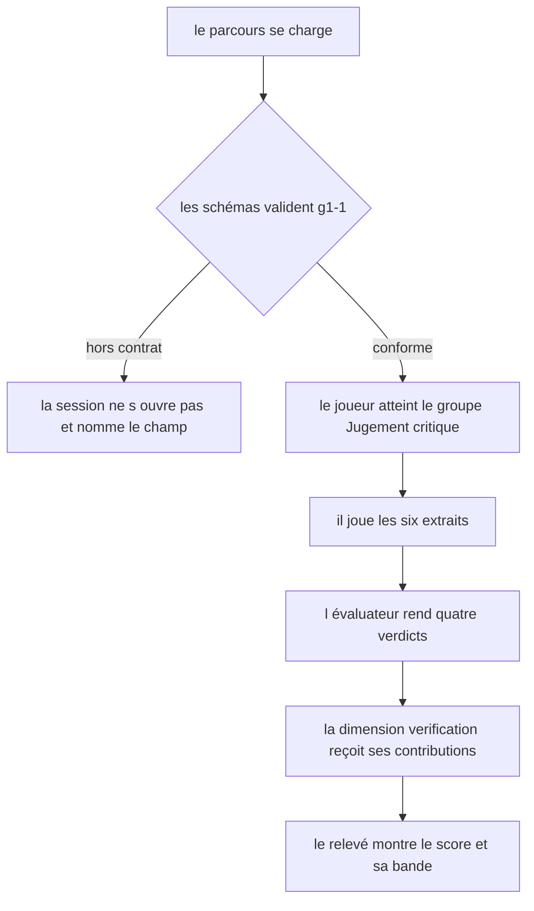
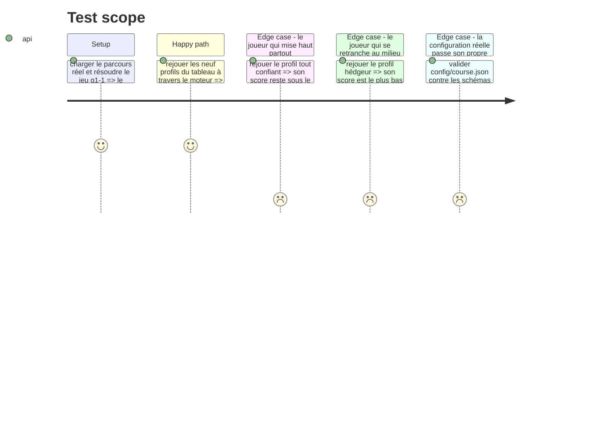

# Instruction: Le jeu dans le parcours

## Architecture projection

> Tree of the final files. ✅ create · ✏️ modify · ❌ delete

```txt
.
├── config/course.json                                      ✏️ g1-1 passe de test-bench à confidence-bet
└── __tests__/integration/course-run/
    └── confidence-bet-run.test.ts                          ✅ le barème contre le moteur, neuf profils
```

## User Journey



## Test Scope



## Tasks to do

### `1)` Le jeu dans `config/course.json`

> `g1-1` cesse d'être un banc d'essai placeholder et devient le jeu de la story. Rien d'autre ne bouge dans le fichier.

1. Remplacer le bloc `g1-1` : `type` passe à `confidence-bet`, `label` à « Quelle confiance accordez-vous à ce code ? ».
2. Écrire la `config` : `statement`, `stakes` `[10, 30, 50, 70, 90]`, `neutralStake` `50`, `startingCapital` `100`, et six extraits — deux `sound`, deux `flawed`, deux `undecidable`.
3. La consigne énonce le cadre, jamais les critères : le nombre d'extraits, le verrouillage de la mise, le sens du gain et de la perte, et le fait que certains extraits ne peuvent pas être tranchés avec ce qui est montré. Elle ne dit ni les seuils, ni la bande, ni que la moyenne par nature compte.
4. **La consigne dit sur quoi porte la mise : l'exactitude de l'extrait, pas ce qu'on en ferait en revue.** Les deux lectures divergent — un développeur aguerri signale un tableau de dépendances par réflexe professionnel alors que l'extrait, lui, est indécidable. Sans cette précision, le jeu punit le réflexe de revue au lieu de mesurer la calibration.
5. **Aucune ligne d'extrait ne dépasse une cinquantaine de caractères.** À 390 px, le bloc de code défile au lieu de se replier, et son ascenseur peut rester invisible au repos : une ligne plus longue serait coupée sans que rien ne le signale. Contrainte pour tout auteur de corpus, vérifiée à la tournée navigateur, pas par un test.
6. Les deux extraits défectueux ne portent pas le même genre de défaut : l'un croise deux bornes, l'autre jette une promesse. Un corpus à défaut unique mesurerait la reconnaissance d'un motif.
7. **Aucun défaut ne se tranche hors de l'extrait.** Une dépendance hallucinée est un défaut réel, mais ce qui permet d'en juger vit dans l'API du paquet, pas dans les lignes montrées — c'est mot pour mot la définition de l'indécidable, et la taxonomie du jeu se contredirait sur son propre corpus. Cette classe de défaut appartient au jeu voisin, `aidd_docs/backlog/stories/trouver-les-erreurs-sans-liste.md`, qui annonce le nombre d'erreurs et joue sur un autre contrat.
8. **Aucun extrait sain n'est contestable.** Un `sound` qu'un lecteur exigeant rejetterait à bon droit punit le meilleur joueur, ce que la story interdit. Une fonction qui interprète une chaîne est disqualifiée d'office : ses cas limites — chaîne vide, notation hexadécimale, espaces — donnent toujours prise à une objection défendable.
9. **Les natures sont entrelacées dans l'ordre déclaré**, et les identifiants ne les encodent pas. Le hook ouvre les extraits dans l'ordre du fichier et chaque révélation nomme la nature en clair : un corpus rangé par nature offrirait sa seconde moitié à qui déduit la maille sur la première. Des identifiants opaques ferment le second canal, celui de l'inspecteur du navigateur, où le `name` du groupe radio expose l'identifiant avant tout engagement.
10. Écrire les quatre critères, tous rattachés à la seule dimension `verification` :

| id | question | règle | poids |
| --- | --- | --- | --- |
| `g1-1-c1` | La confiance engagée sur les extraits défectueux est-elle restée sous 30 % en moyenne ? | `mean-stake-on-flawed-below` `{ threshold: 30 }` | 2 |
| `g1-1-c2` | La confiance engagée sur les extraits sains a-t-elle dépassé 70 % en moyenne ? | `mean-stake-on-sound-above` `{ threshold: 70 }` | 2 |
| `g1-1-c3` | La calibration globale atteint-elle son seuil ? | `calibration-at-least` `{ threshold: 0.5 }` | 2 |
| `g1-1-c4` | La confiance est-elle restée dans la bande d'incertitude sur chaque extrait qu'on ne peut pas trancher ? | `stake-within-band-on-undecidable` `{ from: 40, to: 60 }` | 1 |

11. Le mapping `intervention` du placeholder disparaît. Six groupes portent la signature, le septième porte les axes : un jeu de jugement critique qui monterait un axe du référentiel officiel brouillerait cette frontière.

### `2)` Le barème vérifié contre le moteur

> Aucun test ne dit si un barème rend le jeu trivial. Rejouer des stratégies dans le moteur le dit.

1. Écrire `__tests__/integration/course-run/confidence-bet-run.test.ts`, sur le modèle de `three-tracks-run.test.ts`.
2. Chaque profil se déclare par ses mises, traverse le moteur réel, et son score sur `verification` est comparé au tableau. Le tableau est le contrat, pas une observation : les **quatre verdicts de critère** de chaque ligne s'assertent, pas seulement le score. Avec des poids 2·2·2·1, un score de 5/7 est atteignable par trois combinaisons distinctes et 2/7 par trois autres — n'asserter que le total laisserait la moitié du contrat ouverte.
3. Les huit premiers profils se notent `sains / défectueux / indécidables`, indépendamment de l'ordre du corpus. Le neuvième se note extrait par extrait, dans l'ordre déclaré, parce que c'est précisément l'ordre qu'il exploite. Capital de départ 100, mouvement maximal 40 par extrait tranchable.

| # | Profil | Mises | c1 | c2 | c3 | c4 | Score | Capital |
| --- | --- | --- | --- | --- | --- | --- | --- | --- |
| 1 | Calibré, tranché des deux côtés | 90·90 / 10·10 / 50·50 | ✓ | ✓ | ✓ | ✓ | 7/7 = 1.000 | 260 |
| 2 | Calibré, une hésitation de chaque côté | 90·70 / 10·30 / 50·50 | ✓ | ✓ | ✓ | ✓ | 7/7 = 1.000 | 220 |
| 3 | Lit le code, ne sait pas dire qu'il ne sait pas | 90·90 / 10·10 / 90·90 | ✓ | ✓ | ✓ | ✗ | 6/7 = 0.857 | 180 |
| 4 | Discriminant mais tiède | 70·70 / 30·30 / 50·50 | ✗ | ✗ | ✓ | ✓ | 3/7 = 0.429 | 180 |
| 5 | Tout confiant | 90 partout | ✗ | ✓ | ✗ | ✗ | 2/7 = 0.286 | 20 |
| 6 | Tout méfiant | 10 partout | ✓ | ✗ | ✗ | ✗ | 2/7 = 0.286 | 20 |
| 7 | Hédgeur, la mise neutre partout | 50 partout | ✗ | ✗ | ✗ | ✓ | 1/7 = 0.143 | 100 |
| 8 | Confiant à contresens | 90·10 / 90·10 / 50·50 | ✗ | ✗ | ✗ | ✓ | 1/7 = 0.143 | 100 |
| 9 | Lit les trois premiers, répète la maille sur les trois derniers | `x1` 10 · `x2` 50 · `x3` 90, puis `x4` 10 · `x5` 50 · `x6` 90 | ✓ | ✗ | ✓ | ✗ | 4/7 = 0.571 | 180 |

4. Ce que le tableau établit, et qu'il faut asserter explicitement :
   - le garde-fou est ce qui sépare le profil 1 du profil 3 : sans lui, savoir lire du code suffirait pour un sans-faute ;
   - les profils 5 et 6, les deux formes d'extrémité, retombent à 0.286, **sous le premier palier de `verification`** (0.4) ;
   - le hédgeur, qui ne se trompe jamais parce qu'il ne s'engage jamais, est le plus bas des huit avec le profil à contresens ;
   - le profil 4 est le cas limite des trois seuils à la fois : il pose 30 sur les défectueux et 70 sur les sains, exactement sur des bornes strictes qui le recalent, et il atterrit sur 0.5 de calibration, borne inclusive qui le fait passer. C'est le profil qui a vu la différence sans jamais s'engager, et il manque les deux critères d'engagement pour la même raison, symétriquement ;
   - les profils 5 et 6 sont l'image l'un de l'autre et rendent le même score : c'est la preuve la plus directe que les deux seuils sont désormais symétriques autour de la mise neutre ;
   - le profil 9 est le garde-fou de l'ordre du corpus : celui qui déduit la maille au lieu de lire reste strictement sous le profil 3, qui a lu tout le code sans savoir avouer son ignorance. Sur un corpus rangé par nature, ce même joueur décrochait 7/7 en n'ayant lu que la moitié des extraits.
5. Vérifier aussi que le parcours réel se charge : la config de `g1-1` passe le schéma du jeu, et le registre résout son type.

## Test acceptance criteria

| Task | Acceptance criteria |
| --- | --- |
| 1 | Le parcours réel se charge sans erreur et le groupe « Jugement critique » ouvre sur `confidence-bet` |
| 1 | Aucun critère du jeu ne vise une autre dimension que `verification` |
| 1 | La consigne ne nomme ni seuil, ni bande, ni moyenne par nature |
| 1 | Aucun extrait déclaré `sound` ne porte un défaut qu'un lecteur exigeant rejetterait à bon droit |
| 1 | Aucun extrait déclaré `flawed` ne se tranche sur une information absente de ses lignes |
| 1 | Deux extraits de même nature ne se suivent jamais dans l'ordre déclaré, et aucun identifiant n'encode sa nature — l'un et l'autre verrouillés par un test, pas seulement écrits ici |
| 1 | La consigne dit que la mise porte sur l'exactitude de l'extrait, pas sur ce qu'on en ferait en revue |
| 2 | Les neuf profils rendent exactement les scores du tableau, **et leurs quatre verdicts de critère** |
| 2 | Le profil qui déduit la maille au lieu de lire reste strictement sous celui qui a lu tout le code |
| 2 | Le profil qui mise haut partout obtient un score strictement inférieur à 0.4 |
| 2 | Le profil qui lit le code mais mise haut sur l'indécidable obtient un score strictement inférieur au profil calibré |
| 2 | Le profil tiède atterrit sur le seuil de calibration exact et le franchit |
