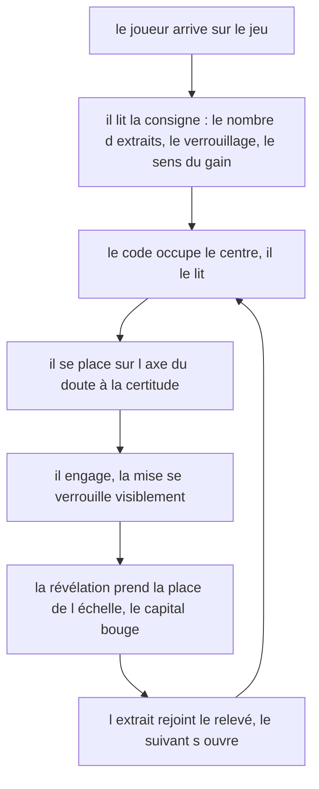
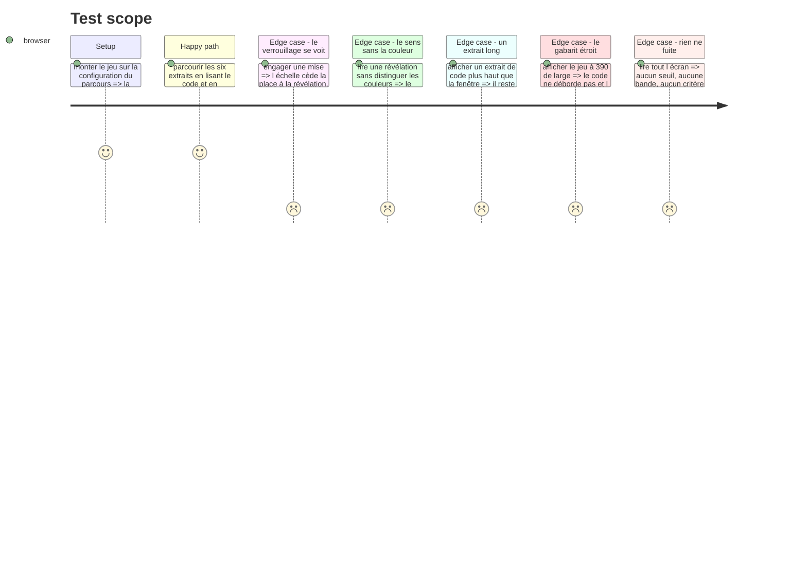

# Instruction: La passe impeccable de la surface

## Architecture projection

> Tree of the final files. ✅ create · ✏️ modify · ❌ delete

```txt
.
├── .impeccable/surfaces/
│   └── ence-bet-components-composites-confidence-bet-game-tsx.md   ✅ la surface du jeu
├── aidd_docs/backlog/defects/
│   └── la-rampe-deborde-sur-mobile.md                              ✅ trouvé en tournée, hors périmètre
├── src/games/confidence-bet/
│   ├── helpers/run-simulation.helper.ts                            ✏️ le repère de vérité, collé au barème
│   ├── hooks/use-confidence-bet.hook.ts                            ✏️ il expose la mise et le repère
│   └── components/
│       ├── elements/
│       │   ├── snippet-card.tsx                                    ✏️
│       │   ├── stake-scale.tsx                                     ❌ remplacée par l instrument
│       │   ├── stake-rule.tsx                                      ✅ la règle graduée qu on engage
│       │   ├── rule-readout.tsx                                    ✅ la même règle figée, deux repères
│       │   └── reveal-panel.tsx                                    ✏️
│       └── composites/
│           ├── bet-ledger.tsx                                      ✏️ les règles en réduction, alignées
│           └── confidence-bet-game.tsx                             ✏️
└── __tests__/unit/games/confidence-bet/
    ├── confidence-bet-game.test.tsx                                ✏️ les tests qui verrouillent
    └── use-confidence-bet.test.ts                                  ✏️
```

## Le cadrage de la passe

La passe se lance par `/impeccable craft` sur `src/games/confidence-bet/components/composites/confidence-bet-game.tsx`. Chaque jeu du parcours a sa propre surface : aucun jeu n'est le gabarit visuel d'un autre, et `three-tracks` ne dicte rien ici qu'une convention de projet ne dicte déjà.

Ce que la passe doit résoudre, et qui est propre à ce jeu :

1. **Le code est le moment focal.** Le joueur passe l'essentiel de son temps à lire un extrait. Tout le reste — position, capital, relevé — est de l'appareillage périphérique qui se lit sans être regardé, comme le journal de `checkpoints`.
2. **L'échelle doit se lire comme un engagement, pas comme un QCM.** Cinq valeurs alignées et neutres feraient une question à choix multiples ; ce qui est demandé est de se placer sur un axe qui va du doute à la certitude.
3. **La bascule échelle → révélation est le battement du jeu.** Elle se répète six fois. Elle doit se sentir comme un verrouillage, jamais comme un rechargement d'écran.
4. **La révélation dit un verdict et un montant.** Deux informations de nature différente dans le même panneau, sans que l'une avale l'autre.

## La ligne à ne pas franchir

`DESIGN.md` : « Un jeu ne dit jamais ce qu'il note. Le contrat annonce le cadre, jamais les critères. »

| S'énonce | Se tait |
| --- | --- |
| Six extraits, un par un | Que la moyenne des mises par nature est lue |
| La mise se verrouille une fois engagée | Les deux seuils de 50 % et de 70 % |
| Un extrait sain rapporte à hauteur de la mise, un défectueux coûte autant | Le seuil de calibration |
| Certains extraits ne peuvent pas être tranchés avec ce qui est montré, et s'en éloigner coûte | Les bornes de la bande d'incertitude |
| Le capital courant, et le mouvement du dernier extrait | Que rester dans la bande est un critère à part entière |

Si un joueur peut déduire de l'écran quelle mise poser **pour bien noter** plutôt que quelle confiance il accorde réellement, la surface est allée trop loin et le jeu ne mesure plus rien.

## User Journey



## Test Scope



## Tasks to do

### `1)` La passe

1. Lancer `/impeccable craft` sur le composite racine du jeu, avec le cadrage et la ligne à ne pas franchir ci-dessus comme contraintes d'entrée.
2. Rester dans le système existant : jetons de `src/index.css`, primitives shadcn, `--nominal` / `--caution` / `--missed` sur le plan neutre. Le vermillon ne devient jamais une teinte de groupe.
3. Un seul thème. Ne pas réintroduire de bloc `.dark`.

### `2)` Ce que la passe doit tenir

1. Le bloc de code est en `<pre><code>`, en monospace, à largeur contenue, sans coloration syntaxique — aucune dépendance nouvelle pour ça.
2. L'échelle porte ses valeurs écrites et un ordre visuel du doute vers la certitude. Le sens ne repose jamais sur la seule couleur.
3. Le mouvement de capital porte son signe et son montant en texte, jamais la seule couleur.
4. La ligne de position reste la seule région `aria-live` ; le relevé ne réannonce rien.
5. Le contour de focus global reste visible sur chaque valeur de l'échelle et sur les deux boutons.
6. Aux deux gabarits, 1440 et 390 : le code ne déborde pas horizontalement, et l'échelle reste atteignable sans faire défiler l'extrait hors de l'écran.

### `3)` Les preuves

1. Produire les captures de la tournée aux deux gabarits, dans `qa/`, sur le modèle de la tournée de `three-tracks`.
2. Verrouiller par des tests ce qui doit le rester : l'absence de révélation avant l'engagement, la disparition de l'échelle après, et l'absence de tout seuil dans le texte affiché.

## Test acceptance criteria

| Task | Acceptance criteria |
| --- | --- |
| 1 | La surface du jeu est décrite dans `.impeccable/surfaces/`, comme celle des jeux précédents |
| 2 | Le code de l'extrait est le contenu le plus lisible de l'écran à chaque extrait |
| 2 | Le verdict et le signe du mouvement se lisent sans distinguer les couleurs |
| 2 | L'échelle se lit comme un axe du doute à la certitude, pas comme une liste de choix indifférents |
| 2 | À 390 de large, le code ne déborde pas et l'échelle reste atteignable |
| 2 | Le contour de focus est visible sur chaque valeur de l'échelle et sur les deux boutons |
| 3 | L'écran ne contient ni seuil, ni bande, ni mention d'un critère de notation |
| 3 | La tournée aux deux gabarits est déposée dans `qa/` |
