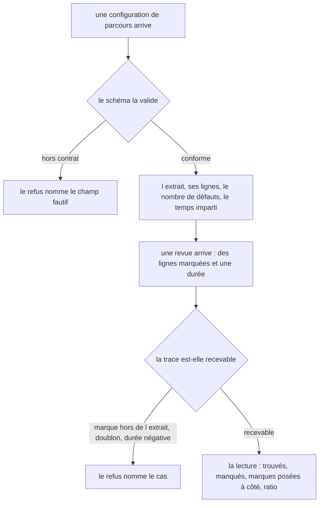
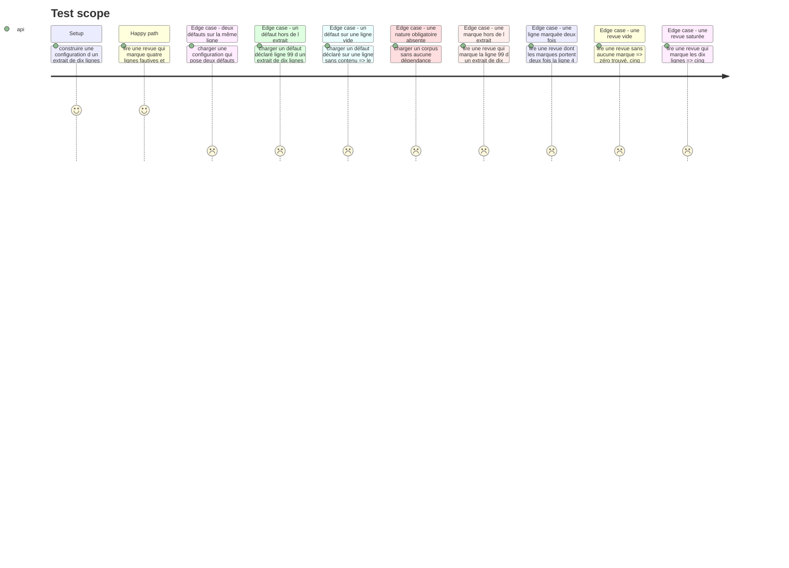

# Instruction: Les contrats et la lecture pure de la revue

## Architecture projection

> Tree of the final files. ✅ create · ✏️ modify · ❌ delete

```txt
.
├── src/games/defect-hunt/
│   ├── schema/
│   │   ├── config.schema.ts                  ✅ ce qu un auteur de parcours écrit pour ce jeu
│   │   └── answer.schema.ts                  ✅ les lignes marquées, la durée, et leur validité
│   └── helpers/
│       ├── snippet-lines.helper.ts           ✅ un découpage en lignes, une seule fois
│       └── read-review.helper.ts             ✅ la lecture de la revue, seule implémentation
└── __tests__/unit/games/defect-hunt/
    ├── config.schema.test.ts                 ✅
    ├── answer.schema.test.ts                 ✅
    └── read-review.test.ts                   ✅
```

## User Journey



## Test Scope



## Tasks to do

### `1)` Le schéma de configuration

> Ce qu'un auteur de parcours écrit, et rien de plus. L'extrait, ses défauts et le temps imparti vivent ici, jamais dans le code.

0. Créer d'abord `helpers/snippet-lines.helper.ts` : `snippetLines(code: string): readonly string[]`, le découpage aux sauts de ligne. Il prend une chaîne, jamais la configuration, pour que le schéma puisse l'appeler sans cycle d'import. Le schéma, l'écran et les tests comptent alors les lignes de la même façon, écrite une seule fois.
1. Créer `schema/config.schema.ts` : `statement` (même nom que les autres jeux), `snippet` (`label`, `language`, `code`), `timeLimitSeconds` (entier strictement positif), et `defects` (au moins trois — les trois natures exigées ne peuvent pas tenir dans moins).
2. Un défaut porte `id`, `line` (entier ≥ 1, 1-indexé sur `snippet.code` découpé aux sauts de ligne), `kind`, et `reveal` — la phrase montrée après le rendu, jamais avant.
3. `kind` est une énumération fermée : `security`, `logic`, `hallucinated-dependency`, `contract`, `resource`. Une chaîne libre laisserait un parcours déclarer une nature qu'aucune règle ne sait lire.
4. Refuser au chargement, en nommant le champ fautif :
   - deux défauts de même `id` — ils s'écraseraient silencieusement à la lecture ;
   - **deux défauts sur la même ligne** — une seule marque vaudrait alors pour deux trouvailles, et le ratio cesserait de décrire ce que le joueur a vu ;
   - une `line` au-delà du nombre de lignes de l'extrait — le défaut serait introuvable ;
   - une `line` qui tombe sur une ligne vide ou blanche — rien n'y est lisible, le défaut serait indevinable ;
   - un corpus qui ne porte pas **au moins un défaut** de chacune des trois natures exigées par la story : `security`, `logic`, `hallucinated-dependency`.
5. Le dernier refus est le plus important, pour la même raison que chez `confidence-bet` : sans lui, le critère de la dépendance hallucinée porte sur un ensemble vide, ressort satisfait par vacuité, et le jeu note sans mesurer.
6. Documenter en tête du fichier que le nombre de défauts annoncé au joueur est **dérivé** de `defects.length`, et n'est jamais un champ à part : un champ séparé pourrait mentir, et le jeu tout entier repose sur ce nombre.
7. Les deux refus de ligne — hors bornes et ligne vide — passent par `snippetLines`, jamais par un `split` refait sur place.

### `2)` Le schéma de réponse

> La revue rendue est la réponse : les lignes marquées, et la durée qu'elle a prise.

1. Créer `schema/answer.schema.ts` : `markedLines`, une suite d'entiers ≥ 1, et `elapsedSeconds`, un nombre fini ≥ 0.
2. **Aucun journal.** Documenter le choix en tête : tout — trouvés, manqués, faux positifs, ratio — se recalcule depuis les seules marques ; la durée est la seule chose qui ne se recalcule pas, et c'est exactement pourquoi elle est portée par la trace. Un champ dérivé de plus ne serait qu'une surface à forger.
3. Écrire `parseDefectHuntTrace(answer, config)`. Le schéma seul ignore quel extrait la partie montrait : les marques se vérifient contre la configuration.
4. Refuser, avec une erreur nommée par cas, sur le modèle de `IncompleteTraceError` :
   - une marque qui vise une ligne au-delà de l'extrait — c'est une trace forgée, **jamais** un faux positif, et confondre les deux ferait noter un bug comme une pratique ;
   - une ligne marquée deux fois — elle compterait double dans un sens ou dans l'autre.
5. Une revue **sans aucune marque** est recevable : ne rien trouver est un résultat, pas une trace malformée. C'est la différence avec `confidence-bet`, où un extrait sans mise était un refus.

### `3)` La lecture de la revue

> Une seule implémentation de ce que vaut une revue, partagée par l'écran et par le scoring.

1. Créer `helpers/read-review.helper.ts` : `readReview(config, trace)` rend `found` (les défauts dont la ligne est marquée), `missed` (les autres), `falsePositiveLines` (les lignes marquées qui ne portent aucun défaut) et `foundRatio`.
2. `foundRatio` vaut `found.length / defects.length`. Le schéma garantit au moins trois défauts, donc le dénominateur n'est jamais nul — le documenter plutôt que de garder une branche morte.
3. `found` et `missed` conservent l'ordre déclaré des défauts, pas l'ordre des marques : deux revues aux mêmes lignes rendent exactement la même lecture.
4. Ajouter `foundKinds(reading)`, l'ensemble des natures trouvées, matière du troisième critère. Elle se calcule ici et nulle part ailleurs.
5. Aucune horloge, aucun aléa, aucun accès extérieur : la fonction ne dépend que de ses arguments. La durée arrive par la trace, elle n'est jamais mesurée ici.

### `4)` Les tests

1. Couvrir les cinq refus de configuration, chacun sur le champ ou la ligne qu'il nomme.
2. Couvrir les deux refus de trace, et vérifier qu'une revue vide passe.
3. Couvrir la lecture sur la revue partielle, la revue vide et la revue saturée.
4. Vérifier qu'une ligne marquée hors de l'extrait est un refus et **non** un faux positif comptabilisé.
5. Vérifier que deux lectures des mêmes marques rendent exactement la même lecture, dans le même ordre.

## Test acceptance criteria

| Task | Acceptance criteria |
| --- | --- |
| 1 | Deux défauts déclarés sur la même ligne n'ouvrent pas de session, et le refus nomme la ligne |
| 1 | Un défaut déclaré au-delà de la dernière ligne de l'extrait est refusé au chargement |
| 1 | Un défaut déclaré sur une ligne vide est refusé au chargement |
| 1 | Un corpus sans défaut de sécurité, sans défaut de logique, ou sans dépendance hallucinée est refusé, et le refus nomme la nature manquante |
| 1 | Le nombre de défauts annoncé se dérive de `defects.length` : aucun champ de la configuration ne le déclare séparément |
| 2 | Une marque qui vise une ligne absente de l'extrait est refusée, et l'erreur nomme la ligne |
| 2 | Une ligne marquée deux fois est refusée, et l'erreur nomme la ligne |
| 2 | Une revue sans aucune marque est acceptée |
| 3 | Une revue qui marque quatre des cinq lignes fautives rend quatre trouvés, un manqué et un ratio de 0,8 |
| 3 | Une marque posée sur une ligne saine ressort en faux positif, et ne change ni les trouvés ni le ratio |
| 3 | Une revue qui marque toutes les lignes rend un ratio plein et autant de faux positifs qu'il y a de lignes saines |
| 3 | Deux lectures des mêmes marques rendent la même lecture, défauts dans l'ordre déclaré |
