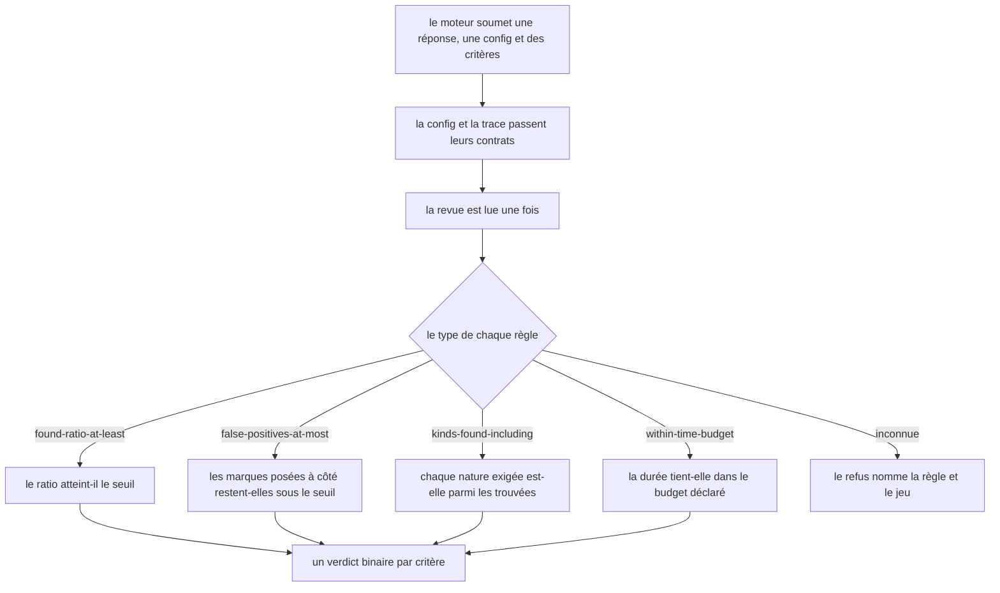
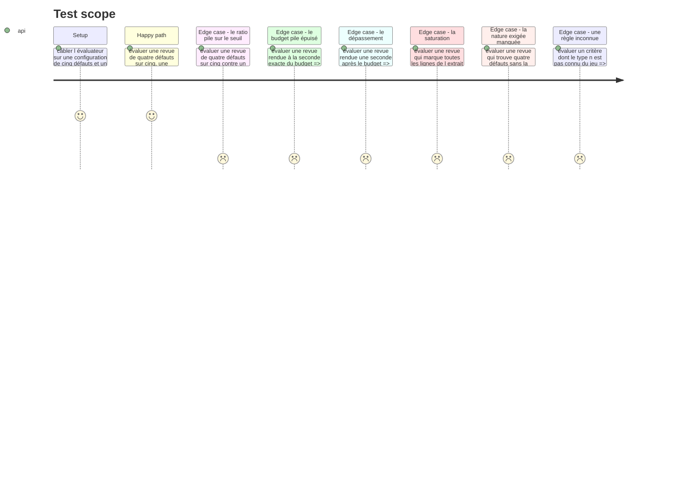

# Instruction: L'évaluateur et ses quatre règles

## Architecture projection

> Tree of the final files. ✅ create · ✏️ modify · ❌ delete

```txt
.
├── src/games/
│   ├── defect-hunt/
│   │   └── defect-hunt.evaluator.ts          ✅ le point de contact public avec le port
│   └── register-games.ts                     ✏️ un bloc de plus, rien d autre ne bouge
└── __tests__/unit/games/defect-hunt/
    └── evaluator.test.ts                     ✅
```

## User Journey



## Test Scope



## Tasks to do

### `1)` Les quatre règles

> Des règles déclaratives : déplacer un seuil se fait dans le parcours, jamais ici.

1. Créer `defect-hunt.evaluator.ts` **à la racine du dossier du jeu**, jamais sous `actions/` : c'est le point de contact public avec le port `GameEvaluator`.
2. Valider la configuration par son schéma, la trace par `parseDefectHuntTrace`, puis lire la revue **une seule fois** par `readReview`. Les quatre règles lisent la même lecture.
3. `found-ratio-at-least` — `{ threshold }`, comparaison **inclusive**. La story dit « au moins 80 % » : atteindre le seuil suffit, comme les bornes de la grille.
4. `false-positives-at-most` — `{ threshold }`, comparaison **inclusive**. « Au plus N marques posées à côté » : en poser exactement N tient encore.
5. `kinds-found-including` — `{ kinds: string[] }`, satisfait quand **chaque** nature listée figure parmi les natures trouvées. Un `every`, jamais un `some` : la règle nomme un ensemble d'exigences, pas un choix.
6. `within-time-budget` — **sans seuil**. Elle lit `timeLimitSeconds` de la configuration et vérifie `elapsedSeconds <= timeLimitSeconds`. Documenter pourquoi : un seuil séparé dans la règle permettrait qu'un écran montre trois minutes pendant qu'un critère en note deux, et le jeu mentirait au joueur.
7. Une règle inconnue lève une erreur nommée qui cite la règle et le jeu, sur le modèle de `UnknownRuleError` de `confidence-bet`.
8. Aucun accès au store, aucun effet de bord, aucune connaissance des autres jeux.

### `2)` Le câblage domaine

1. Ajouter le bloc `registry.register('defect-hunt', …)` dans `src/games/register-games.ts`, avec l'évaluateur et les deux schémas.
2. Rien d'autre ne bouge dans ce fichier : c'est le contrat du système de plugins, et il tient à ce qu'un jeu s'ajoute par un bloc.

### `3)` Les tests

1. Un test par règle, satisfaite puis manquée.
2. Verrouiller les deux bornes incluses : le ratio pile sur le seuil, et la revue rendue à la seconde exacte du budget.
3. Verrouiller l'indépendance des critères : une revue rendue en retard garde ses trois autres verdicts inchangés. C'est la décision « le temps coûte un critère, pas la partie », et elle doit casser un test si elle est reprise par accident.
4. Verrouiller le cas discriminant : quatre défauts trouvés sur cinq **sans** la dépendance hallucinée satisfont le ratio et manquent le critère de nature.
5. Vérifier qu'une règle inconnue lève, et que le message nomme la règle et le jeu.

## Test acceptance criteria

| Task | Acceptance criteria |
| --- | --- |
| 1 | Une revue qui trouve exactement 80 % des défauts satisfait le critère de ratio |
| 1 | Une revue qui pose exactement le seuil de marques à côté satisfait le critère des faux positifs |
| 1 | Une revue qui trouve tous les défauts sauf la dépendance hallucinée manque le critère de nature |
| 1 | Une revue rendue à la seconde exacte du budget satisfait le critère du temps |
| 1 | Une revue rendue une seconde au-delà du budget manque le critère du temps, et lui seul |
| 1 | Le budget noté est celui de la configuration : aucune règle ne porte de seuil de temps |
| 1 | Un type de règle inconnu lève une erreur qui nomme la règle et le jeu |
| 2 | Le registre résout `defect-hunt` vers son évaluateur et ses deux schémas |
| 3 | Une revue qui marque toutes les lignes satisfait le ratio et manque les faux positifs |
