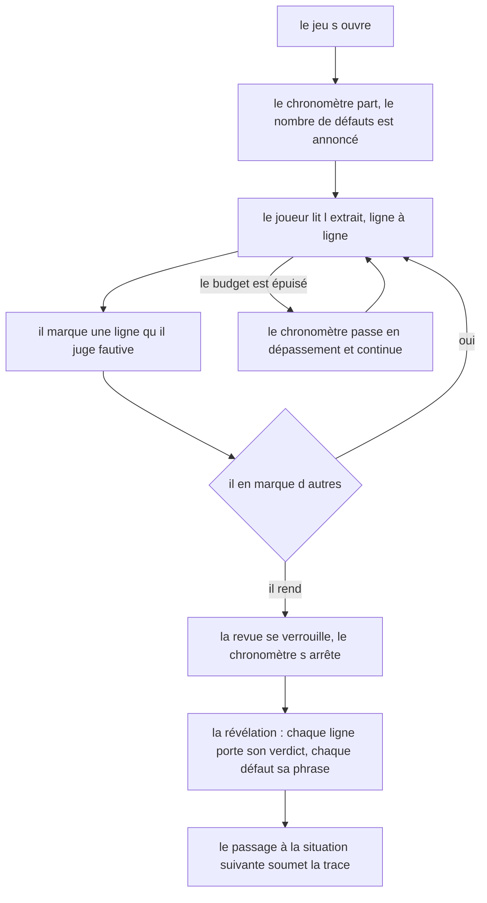
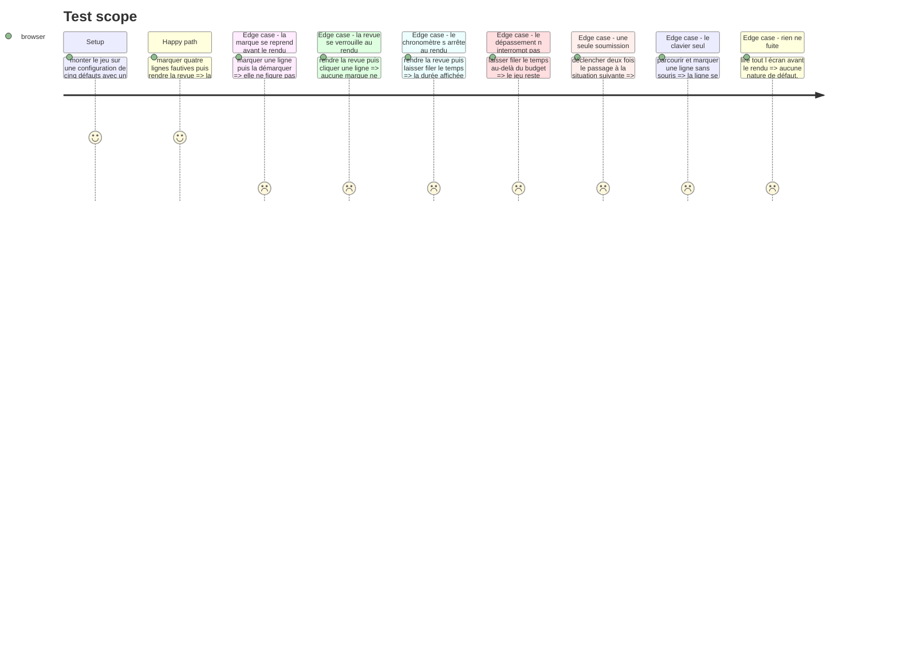

# Instruction: Le jeu à l'écran, ses marques et son chronomètre

## Architecture projection

> Tree of the final files. ✅ create · ✏️ modify · ❌ delete

```txt
.
├── src/games/
│   ├── defect-hunt/
│   │   ├── actions/
│   │   │   └── build-defect-hunt-answer.action.ts   ✅ la trace, construite hors de React
│   │   ├── hooks/
│   │   │   ├── use-defect-hunt.hook.ts              ✅ marques, rendu, révélation
│   │   │   ├── use-elapsed-seconds.hook.ts          ✅ le temps qui court, et rien d autre
│   │   │   └── use-roving-focus.hook.ts             ✅ posé en phase 5 (un seul arrêt de tabulation)
│   │   └── components/
│   │       ├── elements/
│   │       │   ├── code-line.tsx                    ✅ une ligne, sa marque, son verdict
│   │       │   ├── time-dial.tsx                    ✅ posé en phase 5, à la place de hunt-status
│   │       │   └── defect-reveal.tsx                ✅ ce qu un défaut était
│   │       └── composites/
│   │           ├── review-sheet.tsx                 ✅ posé en phase 5, à la place de reviewed-snippet
│   │           └── defect-hunt-game.tsx             ✅ la racine du jeu
│   └── register-components.ts                       ✏️ le jumeau interface du câblage
└── __tests__/unit/games/defect-hunt/
    ├── build-answer.test.ts                         ✅
    ├── use-defect-hunt.test.ts                      ✅
    └── defect-hunt-game.test.tsx                    ✅
```

## User Journey



## Test Scope



## Wireframe

```txt
┌──────────────────────────────────────────────────────────────────┐
│ (1) Consigne                                                      │
├──────────────────────────────────────────────────────────────────┤
│ (2) Bandeau d'état : 0 marquée · 5 à trouver  │  02:41 restant    │
├──────────────────────────────────────────────────────────────────┤
│ (3) L'extrait, ligne à ligne                                      │
│   ┌───┬────┬─────────────────────────────────────────────────┐    │
│   │(4)│ 03 │ import { sanitizeQuery } from 'express-query…'  │    │
│   ├───┼────┼─────────────────────────────────────────────────┤    │
│   │ ✔ │ 16 │   `SELECT * FROM files WHERE owner = '${owner}'`│    │
│   └───┴────┴─────────────────────────────────────────────────┘    │
├──────────────────────────────────────────────────────────────────┤
│ (5) [ Rendre ma revue ]                                           │
└──────────────────────────────────────────────────────────────────┘

Après le rendu, le même écran bascule :

┌──────────────────────────────────────────────────────────────────┐
│ (6) Le relevé : 4 trouvés sur 5 · 1 marque à côté · 02:12         │
├──────────────────────────────────────────────────────────────────┤
│ (7) L'extrait figé, chaque ligne portant son verdict              │
│   ┌───┬────┬─────────────────────────────────────────────────┐    │
│   │ ✔ │ 16 │ …                        trouvé                 │    │
│   │ ✖ │ 21 │ …                        marquée à côté         │    │
│   │ ○ │ 03 │ …                        manqué                 │    │
│   └───┴────┴─────────────────────────────────────────────────┘    │
├──────────────────────────────────────────────────────────────────┤
│ (8) Ce que chaque défaut était, ligne par ligne                   │
├──────────────────────────────────────────────────────────────────┤
│ (9) [ Situation suivante ]                                        │
└──────────────────────────────────────────────────────────────────┘
```

1. Consigne : le cadre du jeu — le nombre annoncé, l'absence de liste, le coût d'une marque posée à côté, le temps qui court sans interrompre.
2. Bandeau d'état : marques posées sur nombre annoncé, et le temps. Seule région annoncée.
3. L'extrait : le moment focal, chaque ligne est une cible.
4. Gouttière de marque : l'état marqué d'une ligne, porté par un signe, jamais par la seule couleur.
5. L'action qui verrouille la revue et arrête le chronomètre.
6. Le relevé : des faits, aucun seuil.
7. L'extrait re-rendu, chaque ligne portant l'un des trois verdicts en texte.
8. La révélation défaut par défaut. C'est ce que le joueur emporte.
9. Le passage à la situation suivante, qui soumet la trace déjà verrouillée.

## Tasks to do

### `1)` L'action de construction de trace

> Testable sans composant, sur le modèle de `buildConfidenceBetAnswer`.

1. Créer `actions/build-defect-hunt-answer.action.ts` : `buildDefectHuntAnswer(config, markedLines, elapsedSeconds)`.
2. Les lignes sortent **triées croissant**, jamais dans l'ordre où le joueur les a cliquées : deux revues aux mêmes lignes produisent alors exactement la même trace.
3. Ne dédoublonne pas. L'écran tient un ensemble, un doublon serait un bug, et le refus de `parseDefectHuntTrace` doit pouvoir le dire.
4. La trace sort par `parseDefectHuntTrace` : l'action ne construit jamais un objet qui n'aurait pas passé son propre contrat.

### `2)` Le chronomètre

> Un hook qui ne fait que ça, pour que le hook du jeu reste lisible et que le temps se teste seul.

1. Créer `hooks/use-elapsed-seconds.hook.ts` : il prend un booléen `running` et rend les secondes écoulées depuis le premier rendu, plus `readElapsedSeconds()`, qui lit la durée **à l'instant de l'appel**.
2. L'instant de départ vit dans une `ref`, posé au premier rendu. Le `setInterval` tourne au quart de seconde et se nettoie au démontage comme à l'arrêt.
3. `readElapsedSeconds()` recalcule depuis la `ref`, il ne lit **jamais** l'état affiché : l'état peut avoir jusqu'à un quart de seconde de retard, et la durée notée doit être celle du geste, pas celle du dernier battement.
4. `Date.now()` est appelé ici, dans la couche interface. L'interdiction d'appeler `Date` porte sur `core/` : le domaine reste sans horloge parce que la durée lui arrive par la trace. Le documenter en tête du fichier, en renvoyant à la décision du plan.
5. Aucune interruption : le hook laisse la valeur croître au-delà de n'importe quel budget. C'est l'écran qui nomme le dépassement, pas le compteur qui s'arrête.

### `3)` Le hook du jeu

1. Créer `hooks/use-defect-hunt.hook.ts` : la configuration validée une fois par `useMemo`, l'ensemble des lignes marquées, l'état `submitted`, et la lecture de la revue une fois rendue.
2. Avant le rendu : `toggleLine(line)` pose ou retire une marque. Après le rendu : il ne fait rien. Le verrou tient par l'absence de chemin, pas par une garde décorative.
3. `submitReview()` fige la durée par `readElapsedSeconds()`, construit la trace par l'action, la garde en mémoire, arrête le chronomètre, et bascule sur la révélation. Il ne soumet pas encore.
4. `advance()` appelle `onSubmit` avec la trace figée, **une seule fois**, protégé par une `ref` comme dans `useConfidenceBet`.
5. Exposer pour l'écran : la consigne, l'extrait découpé en lignes, le nombre annoncé (`defects.length`), le nombre de marques posées, le budget, le temps écoulé, le dépassement, l'état de rendu, et une fois rendu, la lecture de la revue et les révélations dans l'ordre déclaré.
6. Le hook n'expose **jamais** la nature d'un défaut ni sa ligne avant le rendu. Ce qui n'est pas exposé ne peut pas fuiter à l'écran.

### `4)` Les composants

1. `elements/code-line.tsx` — une ligne : son numéro, son code en monospace, et son état. Avant le rendu c'est un contrôle bascule ; après, une ligne figée qui porte son verdict en texte — trouvé, manqué, marquée à côté — et jamais par la seule couleur.
2. `elements/hunt-status.tsx` — marques posées, nombre annoncé, et le temps. Le dépassement s'écrit en toutes lettres. Seule région `aria-live="polite"` de l'écran, et elle n'annonce que le compte, pas chaque battement de seconde.
3. `elements/defect-reveal.tsx` — un défaut : sa ligne, sa nature, sa phrase. N'existe qu'après le rendu.
4. `composites/reviewed-snippet.tsx` — l'extrait ligne à ligne, sans coloration syntaxique. Aucune dépendance nouvelle : une coloration jugerait à la place du joueur, exactement comme chez `confidence-bet`.
5. `composites/defect-hunt-game.tsx` — la racine, purement d'assemblage. Elle bascule d'un bloc à l'autre au rendu.
6. Les composants sont muets : ils affichent ce qu'on leur donne, ils ne connaissent ni les seuils ni les critères.

> **Ce que la phase 5 a repris de ce découpage.** La passe de surface a le droit de le refaire, et elle l'a fait sur trois points, tous consignés dans la fiche `.impeccable/surfaces/` du jeu :
>
> - `hunt-status.tsx` s'est scindé — le cadran du temps est parti dans `elements/time-dial.tsx` et il porte trois libellés, `RESTANT` / `DÉPASSÉ DE` / `RENDUE EN` ; le compte de marques est descendu dans le pied de la feuille, à côté de l'action, parce que c'est ce que le joueur **produit** et non ce que le jeu lui **donne**. La région `aria-live` l'a suivi.
> - `reviewed-snippet.tsx` est devenu `composites/review-sheet.tsx` : la feuille porte désormais son bandeau de tête et son pied, elle n'est plus un bloc de code nu suivi d'un bouton détaché.
> - **Le bloc n'est plus un `<pre>`.** Le motif `listbox`/`option` demande un conteneur et des descendants sémantiques, ce qu'un `<pre>` de contrôles ne donne pas. `whitespace-pre-wrap` sur chaque ligne préserve l'indentation, et le repli remplace le défilement horizontal — un jeu de lecture se perd si un caractère de l'extrait est hors de vue.

### `5)` Le câblage interface

1. Ajouter `'defect-hunt': DefectHuntGame` dans `src/games/register-components.ts`. Un bloc, rien d'autre.

### `6)` Les tests

1. Tester l'action : tri croissant, trace refusée sur un doublon, revue vide acceptée.
2. Tester le chronomètre sur horloge simulée (`vi.useFakeTimers`) : il avance, il s'arrête, il dépasse sans se bloquer, et `readElapsedSeconds()` rend la durée du geste et non celle du dernier battement.
3. Tester le hook : bascule d'une marque, verrou au rendu, soumission unique, et le fait que la nature d'un défaut n'est pas exposée avant le rendu.
4. Tester l'écran : le nombre annoncé est à l'écran, aucune nature de défaut n'y figure avant le rendu, et une ligne se marque au clavier seul.

## Test acceptance criteria

| Task | Acceptance criteria |
| --- | --- |
| 1 | Deux revues qui marquent les mêmes lignes dans des ordres différents produisent la même trace |
| 1 | Une revue sans aucune marque produit une trace acceptée |
| 2 | Le temps affiché avance seconde après seconde tant que la revue n'est pas rendue |
| 2 | Le temps affiché ne bouge plus après le rendu |
| 2 | Le temps continue de courir au-delà du budget et le jeu reste jouable |
| 2 | La durée retenue dans la trace est celle de l'instant du rendu, pas celle du dernier battement affiché |
| 3 | Une ligne marquée puis démarquée avant le rendu ne figure pas dans la trace |
| 3 | Cliquer une ligne après le rendu ne change aucune marque |
| 3 | Déclencher deux fois le passage à la situation suivante ne soumet la trace qu'une fois |
| 4 | Le nombre de défauts annoncé est à l'écran avant le rendu |
| 4 | Aucune nature de défaut, aucune ligne fautive, aucun seuil ne figure à l'écran avant le rendu |
| 4 | Une ligne se parcourt et se marque au clavier seul, et son état marqué est annoncé |
| 4 | Après le rendu, chaque ligne porte son verdict en texte, sans dépendre de la couleur |
| 5 | Le parcours résout `defect-hunt` vers son composant, sans passer par l'écran de type non résolu |
