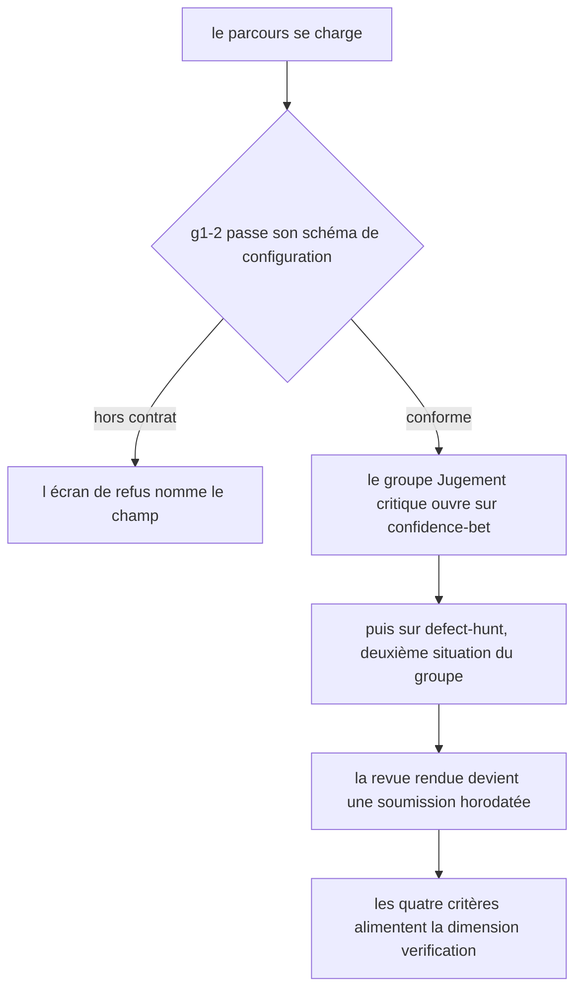
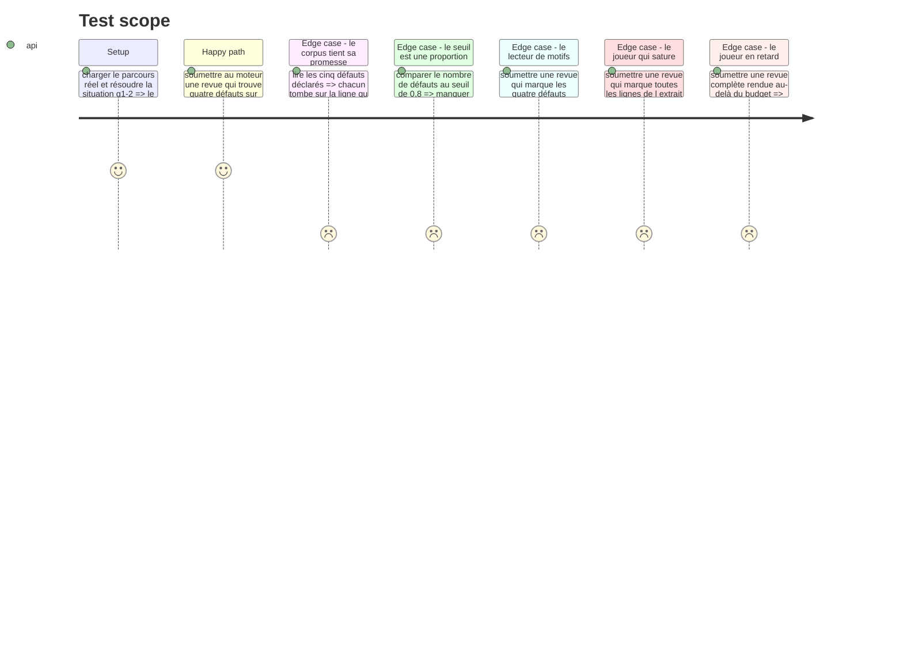

# Instruction: Le jeu dans le parcours

## Architecture projection

> Tree of the final files. ✅ create · ✏️ modify · ❌ delete

```txt
.
├── config/
│   └── course.json                                        ✏️ g1-2 passe de test-bench à defect-hunt
├── src/features/onboarding/helpers/
│   └── estimate-course-minutes.helper.ts                  ✏️ son commentaire devient faux
├── aidd_docs/backlog/stories/
│   └── trouver-les-erreurs-sans-liste.md                  ✏️ les seuils retenus y reviennent
└── __tests__/integration/course-run/
    └── defect-hunt-run.test.ts                            ✅ le jeu joué de bout en bout par le moteur
```

## User Journey



## Test Scope



## Tasks to do

### `1)` Le corpus

> L'extrait, ses cinq défauts et le temps imparti vivent en données. Aucun test ne peut dire si un corpus rend la partie triviale — seul jouer, en éditant le JSON, le dit.

1. Remplacer le bloc `g1-2` de `config/course.json` : `type` passe à `"defect-hunt"`, le `label` « Combien d'erreurs voyez-vous ? » reste — il dit exactement le contrat du jeu.
2. La `statement` annonce le **cadre** et le **barème**, jamais ce qui est noté : que l'extrait contient des défauts sans dire combien ni de quelle nature, qu'aucune liste n'est proposée, que le joueur rend sa revue quand il l'estime finie, que marquer une ligne fautive vaut un point et une ligne saine en coûte un tandis qu'une ligne laissée de côté ne vaut rien, et que le temps court à l'écran sans interrompre la partie. Le barème s'annonce parce que `DESIGN.md` veut le coût d'un geste connu avant qu'on le pose ; les seuils, eux, restent tus.
3. Poser `timeLimitSeconds` à `180`. Trois minutes sur une trentaine de lignes denses : c'est court, et c'est le sujet du jeu.
4. L'extrait est un routeur Express en TypeScript, du code plausible tel qu'un assistant en produit. Les cinq défauts tombent sur cinq lignes distinctes et non vides, et couvrent les trois natures exigées plus deux :

| Nature | Ce que le défaut est |
| --- | --- |
| `hallucinated-dependency` | L'import d'un paquet qui n'existe pas sur npm, et dont le symbole importé n'est jamais appelé. **Le seul défaut de nature IA du corpus** — le symbole jamais appelé se voit dans l'extrait, mais l'inexistence du paquet demande de sortir du fichier |
| `security` | Un paramètre d'URL interpolé brut dans une requête SQL |
| `resource` | Dans un bloc `finally` correct, un `client?.release` lu sans être appelé — les parenthèses manquent, et c'est le seul endroit où l'on corrige |
| `logic` | Une pagination décalée : la page 1 saute la première page, les premiers éléments sont inatteignables |
| `contract` | Une valeur de `req.query` convertie sans validation, qui rend `NaN` sans que rien ne le signale |

5. Chaque défaut porte un `reveal` qui explique **pourquoi** c'en est un, en une ou deux phrases. C'est ce que le joueur emporte du jeu, et la seule contrepartie honnête au fait qu'on ne lui ait rien dit avant.
6. Vérifier les numéros de ligne **contre la chaîne réelle** après écriture : `snippet.code` découpé aux sauts de ligne, 1-indexé. Une ligne fausse rendrait un défaut introuvable, et le schéma ne le dirait pas — il ne sait refuser qu'une ligne hors bornes ou vide.

### `2)` Les quatre critères

> **Repris le 30/08, après la décision produit.** Le nombre de défauts n'est plus annoncé et le barème le remplace : +1 par ligne fautive marquée, −1 par ligne saine marquée, 0 pour une ligne laissée de côté. Le critère qui comptait séparément les faux positifs disparaît — le barème les fait déjà payer un par un, et le garder les punirait deux fois pour la même marque. Le garde-fou contre la saturation est désormais le barème lui-même : marquer les vingt-sept lignes rend cinq bonnes réponses et vingt-deux mauvaises.

1. `g1-2-c1` — « Le score net de la revue atteint-il son seuil ? » · `net-score-at-least` à `3` · `verification`, poids **2**. Trois sur cinq et non quatre : à quatre, un relecteur qui trouve tout n'a droit qu'à une seule marque discutable, et la rédaction du corpus en tolère deux.
2. `g1-2-c2` — « Au moins 80 % des défauts de l'extrait ont-ils été trouvés ? » · `found-ratio-at-least` à `0.8` · `verification`, poids **2**. Il tient l'autre bout du barème : on n'atteint pas le score net en marquant trois lignes au hasard.
3. `g1-2-c3` — « Le défaut qui ne se lit pas dans l'extrait a-t-il été trouvé ? » · `kinds-found-including` sur `["hallucinated-dependency"]` · `verification`, poids **2**. Il sépare le joueur qui lit le code de celui qui vérifie aussi ce que le code invoque.
4. `g1-2-c4` — « La revue a-t-elle été rendue dans le temps imparti ? » · `within-time-budget`, sans seuil · `verification`, poids **1**. Le budget noté est celui affiché.
5. Le mapping `intervention` du placeholder disparaît : ce groupe porte la signature, pas les axes officiels.
6. Vérifier après écriture que 80 % de cinq défauts vaut quatre : le seuil doit rester une proportion, pas une exigence de perfection déguisée.

### `3)` Le commentaire devenu faux

1. `src/features/onboarding/helpers/estimate-course-minutes.helper.ts` affirme « aucun verdict ne dépend du temps passé ». Ce jeu le rend faux.
2. Le reformuler sans changer le code : aucun verdict ne dépend de la **durée du parcours**, et c'est bien pourquoi cette estimation vit dans `onboarding` ; le temps imparti d'une situation est l'affaire du jeu qui le porte, et il vit dans sa configuration.

### `4)` La story

1. Reprendre `aidd_docs/backlog/stories/trouver-les-erreurs-sans-liste.md` pour y inscrire ce qui est réellement câblé : le nombre de défauts n'est plus annoncé, le barème vaut +1 / −1 / 0, le score net doit atteindre 3 sur 5, la couverture 80 %, le temps trois minutes, et le dépassement ne coûte que son critère.
2. Un contrat qui contredirait le code ne vaudrait rien : c'est la règle déjà appliquée à la story de `confidence-bet`.

### `5)` Le test d'intégration

1. Créer `__tests__/integration/course-run/defect-hunt-run.test.ts`, sur le modèle de `confidence-bet-run.test.ts` : charger le parcours réel, résoudre `g1-2`, jouer des revues par le moteur.
2. Verrouiller le corpus : chaque défaut déclaré tombe sur une ligne dont le contenu porte bien ce que son `reveal` décrit — une sous-chaîne attendue par défaut suffit. C'est le seul garde-fou contre un corpus qui dérive quand l'extrait est réécrit.
3. Verrouiller que les trois natures exigées par la story sont dans le corpus, et que `defects.length` vaut **exactement** cinq : les trois premiers profils se posent sur `4 / 5 = 0,80`, la borne exacte du critère de ratio, et à six défauts le tableau cesserait de dire ce qu'il prétend.
4. Ajouter un garde-fou d'équité, sans lequel le corpus punit la lecture correcte : chaque ligne fautive porte une instruction complète (équilibre des parenthèses et des accolades), et le marqueur de chaque défaut n'apparaît **qu'une fois** dans tout l'extrait. Sinon un défaut a deux domiciles plausibles, et le joueur qui le diagnostique juste mais clique l'autre paie deux fois.
5. Jouer les profils qui décident le barème :

| Profil | Trouvés | Marques à côté | Durée | Attendu |
| --- | --- | --- | --- | --- |
| Le relecteur | 4/5 dont la dépendance | 1 | 100 s | les quatre critères satisfaits |
| Le lecteur de motifs | 4/5 sans la dépendance | 1 | 100 s | seul `c3` manqué |
| Le saturateur | 5/5 | toutes les lignes saines | 100 s | seul `c1` manqué |
| Le lent | 4/5 dont la dépendance | 1 | 200 s | seul `c4` manqué |
| **Le relecteur exhaustif** | 5/5 | 2 | 100 s | les quatre critères satisfaits |

6. Le profil du relecteur exhaustif est le plus important, et il est arrivé après la revue indépendante : celui qui lit bien signale aussi les lignes que le corpus reconnaît comme discutables, et il doit sortir au score plein. S'il n'y arrive pas, le jeu récompense celui qui s'arrête plutôt que celui qui lit — l'inverse de ce que la story mesure.
7. Ces profils sont le barème : s'ils ne se séparent pas comme le tableau le dit, ce sont les seuils du parcours qu'il faut reprendre, pas le test.

## Test acceptance criteria

| Task | Acceptance criteria |
| --- | --- |
| 1 | La situation `g1-2` du parcours réel est de type `defect-hunt` et sa configuration passe son schéma |
| 1 | Chaque défaut déclaré tombe sur une ligne dont le contenu porte ce que son `reveal` décrit |
| 1 | Le corpus porte au moins un défaut de sécurité, un de logique et une dépendance hallucinée |
| 1 | Ni la consigne ni l'écran n'annoncent le nombre de défauts avant le rendu de la revue |
| 1 | Chaque ligne fautive porte une instruction complète, et le marqueur de chaque défaut n'apparaît qu'une fois dans l'extrait |
| 2 | Manquer un défaut sur cinq satisfait encore le critère de ratio |
| 2 | Cinq bonnes réponses et deux mauvaises satisfont encore le critère de score net |
| 2 | Les quatre critères de `g1-2` visent tous `verification` et aucun ne vise `intervention` |
| 2 | Le critère du temps ne porte aucun seuil : il lit le budget de la configuration |
| 3 | `estimate-course-minutes.helper.ts` n'affirme plus qu'aucun verdict ne dépend du temps |
| 4 | La story porte les seuils réellement câblés dans le parcours |
| 5 | Le relecteur satisfait les quatre critères |
| 5 | Le lecteur de motifs ne manque que le critère de la dépendance hallucinée |
| 5 | Le saturateur ne manque que le critère de score net |
| 5 | Le lent ne manque que le critère du temps |
| 5 | Le relecteur exhaustif — cinq défauts trouvés et deux marques discutables — satisfait les quatre critères |
