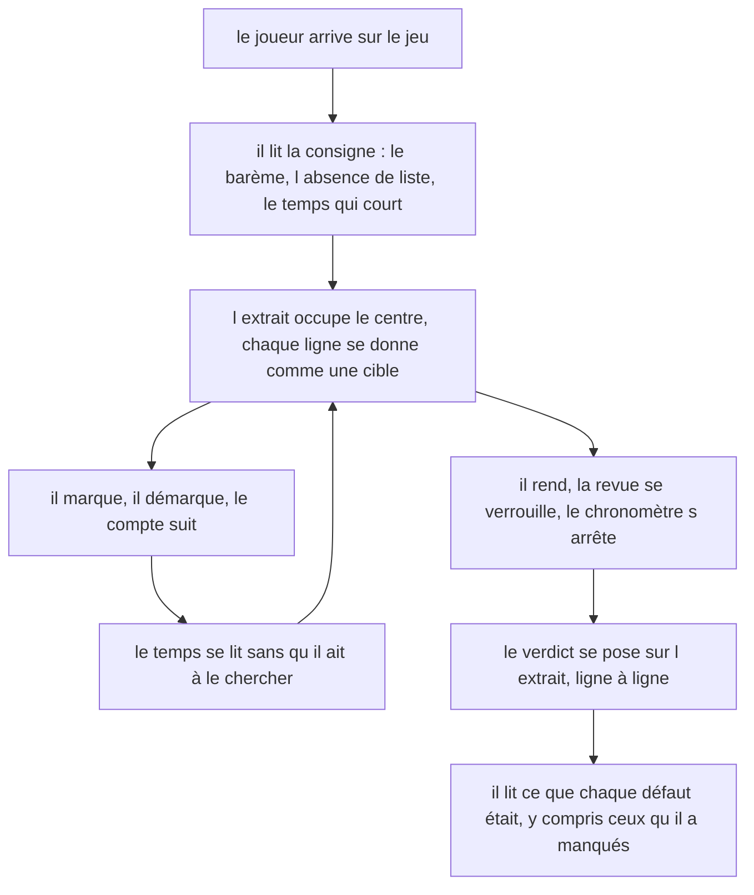
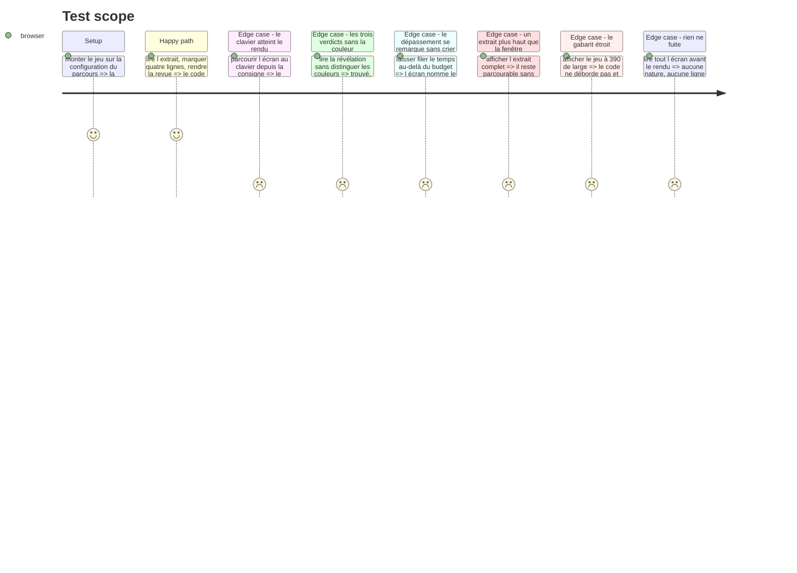

# Instruction: La passe impeccable de la surface

## Architecture projection

> Tree of the final files. ✅ create · ✏️ modify · ❌ delete

```txt
.
├── .impeccable/surfaces/
│   └── ...defect-hunt-components-composites-defect-hunt-game-tsx.md   ✅ la surface du jeu
├── src/games/defect-hunt/
│   ├── hooks/use-defect-hunt.hook.ts                                  ✏️ si la passe a besoin d une lecture de plus
│   └── components/
│       ├── elements/                                                  ✏️ ligne, bandeau, révélation
│       └── composites/                                                ✏️ extrait et racine
├── aidd_docs/tasks/2026_08/2026_08_30_jeu-defect-hunt/qa/             ✅ la tournée aux deux gabarits
└── __tests__/unit/games/defect-hunt/
    ├── defect-hunt-game.test.tsx                                      ✏️ les tests qui verrouillent
    └── use-defect-hunt.test.ts                                        ✏️
```

## Le cadrage de la passe

La passe se lance par `/impeccable craft` sur `src/games/defect-hunt/components/composites/defect-hunt-game.tsx`. Chaque jeu du parcours a sa propre surface : aucun jeu n'est le gabarit visuel d'un autre, et `confidence-bet` ne dicte rien ici qu'une convention de projet ne dicte déjà — même s'ils partagent le groupe et un bloc de code à l'écran.

Ce que la passe doit résoudre, et qui est propre à ce jeu :

1. **L'extrait n'est plus un objet à lire, c'est une surface à travailler.** Chez `confidence-bet` le code est un bloc que le joueur regarde ; ici chaque ligne est une cible, et la différence doit se voir sans qu'on l'explique. Le code reste malgré tout le contenu le plus lisible de l'écran : la cible ne doit pas manger le texte.
2. **Trente lignes cliquables, c'est trente arrêts de tabulation.** C'est le risque d'accessibilité réel de cet écran. Une navigation au clavier qui oblige à traverser tout l'extrait pour atteindre le bouton de rendu est un échec, même si chaque ligne est individuellement conforme.
3. **Le temps doit se voir sans presser.** Un chronomètre trop présent transforme un jeu de lecture en jeu de réflexe, et mesure autre chose que ce qu'on veut. Il doit rester lisible d'un coup d'œil, et le passage en dépassement doit se remarquer sans crier — il ne coûte qu'un critère.
4. **La bascule rendu → révélation est le seul battement du jeu.** Elle n'arrive qu'une fois, et c'est le moment où le joueur apprend quelque chose. Elle doit se sentir comme un verdict qui se pose, jamais comme un rechargement d'écran.
5. **Trois verdicts sur les lignes, pas deux.** Trouvé, manqué, marqué à côté : trois états à distinguer sur la même surface, sans que la triade `--nominal` / `--caution` / `--missed` soit le seul canal.

## La ligne à ne pas franchir

`DESIGN.md` : « Un jeu ne dit jamais ce qu'il note. Le contrat annonce le cadre, jamais les critères. »

> **Repris le 30/08, après la décision produit.** Le nombre de défauts n'est plus annoncé du tout : il passe de la colonne « s'énonce » à la colonne « se tait ». Ce qui s'énonce à sa place est le barème, +1 / −1 / 0, parce que `DESIGN.md` veut le coût d'un geste annoncé avant qu'on le pose.

| S'énonce | Se tait |
| --- | --- |
| Que l'extrait contient des défauts | **Combien il en contient** |
| Que leur nature n'est dite nulle part, et qu'aucune liste n'est proposée | Que la dépendance hallucinée a son propre critère |
| Le barème : un point par ligne fautive, un de moins par ligne saine, rien pour une ligne laissée de côté | Le seuil de score net, et celui de 80 % |
| Que le joueur rend sa revue quand il l'estime finie | Qu'aucun signal ne lui dira qu'elle est complète, parce qu'il n'y en a pas |
| Le temps imparti, et qu'il n'interrompt pas la partie | Que le dépassement ne coûte qu'un critère sur quatre |
| Le nombre de marques déjà posées | Où elles tombent, et lesquelles sont justes |

Avant le rendu, l'écran ne doit porter **aucune** trace de la nature d'un défaut ni de sa ligne. La phase 3 le tient déjà par construction — le hook ne les expose pas — et la passe ne doit pas rouvrir ce chemin pour un effet visuel.

Si un joueur peut déduire de l'écran **où** chercher plutôt que **lire pour trouver**, la surface est allée trop loin et le jeu ne mesure plus rien.

## User Journey



## Test Scope



## Wireframe

```txt
┌──────────────────────────────────────────────────────────────────┐
│ (1) Consigne                                                      │
├──────────────────────────────────────────────────────────────────┤
│ (2) Bandeau de tête : l'extrait, sa langue    │  02:41 restant    │
├──────────────────────────────────────────────────────────────────┤
│ (3) L'extrait, ligne à ligne                                      │
│   ┌───┬────┬─────────────────────────────────────────────────┐    │
│   │(4)│ 03 │ import { sanitizeQuery } from 'express-query…'  │    │
│   ├───┼────┼─────────────────────────────────────────────────┤    │
│   │ ✔ │ 16 │   `SELECT * FROM files WHERE owner = '${owner}'`│    │
│   └───┴────┴─────────────────────────────────────────────────┘    │
├──────────────────────────────────────────────────────────────────┤
│ (5) [ Rendre ma revue ]                                           │
└──────────────────────────────────────────────────────────────────┘

Après le rendu, le même écran bascule :

┌──────────────────────────────────────────────────────────────────┐
│ (6) Le relevé : 4 trouvés sur 5 · 1 marque à côté · 02:12         │
├──────────────────────────────────────────────────────────────────┤
│ (7) L'extrait figé, chaque ligne portant son verdict              │
├──────────────────────────────────────────────────────────────────┤
│ (8) Ce que chaque défaut était, ligne par ligne                   │
├──────────────────────────────────────────────────────────────────┤
│ (9) [ Situation suivante ]                                        │
└──────────────────────────────────────────────────────────────────┘
```

## Tasks to do

### `1)` La passe

1. Lancer `/impeccable craft` sur le composite racine du jeu, avec le cadrage et la ligne à ne pas franchir ci-dessus comme contraintes d'entrée.
2. Rester dans le système existant : jetons de `src/index.css`, primitives shadcn, `--nominal` / `--caution` / `--missed` sur le plan neutre. Le vermillon ne devient jamais une teinte de groupe.
3. Un seul thème. Ne pas réintroduire de bloc `.dark`.
4. Aucune dépendance nouvelle. En particulier, pas de coloration syntaxique : elle jugerait à la place du joueur, et elle attirerait l'œil là où la teinte tombe plutôt que là où le défaut est.

### `2)` Ce que la passe doit tenir

1. Le bloc de code est en `<pre>`, monospace, à largeur contenue, avec des numéros de ligne qui ne se sélectionnent pas à la copie.
2. Une ligne marquée se distingue par un signe **et** par sa forme, jamais par la seule couleur. Idem pour les trois verdicts de la révélation.
3. La navigation au clavier atteint le bouton de rendu sans traverser toutes les lignes une à une : l'extrait est un seul arrêt de tabulation, et les flèches y parcourent les lignes. Le libellé accessible de chaque ligne nomme son numéro.
4. Le contour de focus global reste visible sur la ligne courante et sur les deux boutons.
5. Le bandeau d'état est la seule région `aria-live`, et il n'annonce que le compte de marques — pas chaque seconde qui passe.
6. Le temps se lit d'un coup d'œil sans dominer l'écran. Le passage en dépassement change le libellé, pas seulement la teinte.
7. Aux deux gabarits, 1440 et 390 : le code ne déborde pas horizontalement, les lignes restent marquables au doigt, et ni le temps ni le bouton de rendu ne sortent de l'écran quand l'extrait défile.

### `3)` Les preuves

1. Produire les captures de la tournée aux deux gabarits, dans `qa/`, sur le modèle des tournées précédentes : avant marque, en cours de marquage, en dépassement, après le rendu.
2. Verrouiller par des tests ce qui doit le rester : l'absence de toute nature de défaut avant le rendu, l'impossibilité de marquer après le rendu, et le fait que les trois verdicts se lisent au texte.

## Test acceptance criteria

| Task | Acceptance criteria |
| --- | --- |
| 1 | La surface du jeu est décrite dans `.impeccable/surfaces/`, comme celle des jeux précédents |
| 2 | Chaque ligne de l'extrait se donne comme une cible sans que le code cesse d'être le contenu le plus lisible de l'écran |
| 2 | Trouvé, manqué et marqué à côté se distinguent sans percevoir les couleurs |
| 2 | Le bouton de rendu s'atteint au clavier sans traverser les lignes une à une |
| 2 | Le contour de focus est visible sur la ligne courante et sur les deux boutons |
| 2 | Le dépassement du temps change le libellé affiché, pas seulement la teinte |
| 2 | À 390 de large, le code ne déborde pas et les lignes restent marquables |
| 3 | L'écran ne contient, avant le rendu, ni nature de défaut, ni ligne fautive, ni seuil |
| 3 | La tournée aux deux gabarits est déposée dans `qa/` |
