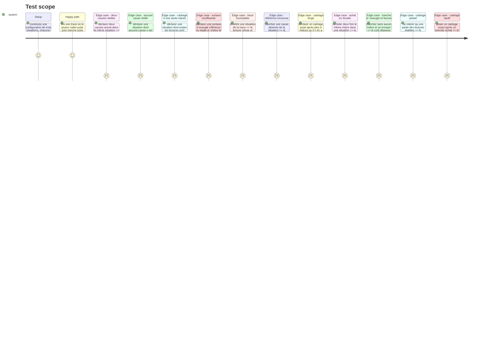

# Instruction: Les contrats et la lecture pure des situations

**Note d'historique.** Cette page garde son contenu d'origine, comme `phase-2.md:7` le pose pour la sienne. `SituationReading` portait `framedAndGrounded` à la livraison de cette phase ; la scission du 30/08 (`c2`/`c3`, cf. `plan.md`) l'a retiré au profit de `framedFirst` et `framingGrounded` lus séparément. Les mentions de `framedAndGrounded` ci-dessous décrivent donc ce qui a été construit alors, pas le contrat courant — `read-situations.helper.ts` et ses tests portent la version vivante.

## Architecture projection

> Tree of the final files. ✅ create · ✏️ modify · ❌ delete

```txt
.
├── src/games/hint-budget/
│   ├── schema/
│   │   ├── config.schema.ts                    ✅ ce qu un auteur de parcours écrit, et ses dix-neuf refus (après le tour 5)
│   │   └── answer.schema.ts                    ✅ la trace du cadrage, des achats et de la tranche
│   └── helpers/
│       └── read-situations.helper.ts           ✅ la lecture pure, partagée par l écran et l évaluateur
└── __tests__/unit/games/hint-budget/
    ├── config.schema.test.ts                   ✅
    ├── answer.schema.test.ts                   ✅
    └── read-situations.test.ts                 ✅
```

## Test Scope



## Tasks to do

### `1)` Le schéma de configuration

> Ce qu'un auteur de parcours écrit pour ce jeu, et rien de plus.

1. Créer `src/games/hint-budget/schema/config.schema.ts`.
2. Poser `framingSchema` : `id` non vide, `text` non vide, `established` booléen. Documenter le sens des deux valeurs — `established` marque une lecture que le rapport d'incident soutient, l'autre marque une supposition que rien à l'écran n'établit. Les deux se présentent **exactement pareil** au joueur.
3. Poser `hintSchema` : `id` non vide, `label` non vide (ce sur quoi l'indice porte, jamais son contenu), `cost` entier strictement positif, `text` non vide (révélé à l'achat seulement).
4. Poser `causeSchema` : `id` non vide, `text` non vide, `actual` booléen, `verification` non vide — pourquoi cette cause est la bonne, ou pourquoi celle-ci ne l'est pas. Montrée à la révélation uniquement.
5. Poser `situationSchema` : `id` non vide, `symptom` non vide, `report` (au moins 2 lignes non vides — les faits déjà en main, gratuits), `framings` (au moins 3), `hints` (au moins 3), `causes` (au moins 3).
6. Poser le schéma de base : `statement` non vide — même nom que les six autres jeux —, `wrongCutPenalty` entier strictement positif, `blindCutSurcharge` entier strictement positif, `situations` (au moins 2).
7. Ajouter les neuf refus au chargement, en `superRefine`, chacun avec son `path` et sa phrase en français :
   - deux situations de même `id` ;
   - deux indices de même `id` dans une situation ;
   - deux causes de même `id` dans une situation ;
   - deux lectures de cadrage de même `id` dans une situation ;
   - une situation sans aucune cause `actual` — il n'y a rien à résoudre ;
   - une situation à plusieurs causes `actual` — la tranche devient ambiguë ;
   - une situation sans aucune lecture `established` ;
   - une situation sans aucune lecture non `established` ;
   - `blindCutSurcharge` inférieure ou égale au coût de l'indice le plus cher du corpus.
8. Documenter les deux avant-derniers refus comme le **garde-fou anti-triche du cadrage** : sans lecture non établie, « tout cocher » est un cadrage fondé sans avoir rien lu ; sans lecture établie, « ne rien cocher » l'est aussi. C'est le mélange des deux natures qui force à lire le rapport.
9. Documenter le dernier refus comme la **mise en mécanique du quatrième critère d'acceptation** de la story : « trancher sans aucun indice et se tromper coûte plus cher que d'en avoir acheté un » n'est vrai pour n'importe quel indice que si la surtaxe excède strictement le plus cher d'entre eux. Le message nomme les deux montants.
10. Exporter les types `Framing`, `Hint`, `Cause`, `Situation`, `HintBudgetConfig`.

### `2)` Le schéma de trace

> Ce que le joueur a posé, acheté et tranché, dans cet ordre.

1. Créer `src/games/hint-budget/schema/answer.schema.ts`.
2. Poser `framingEntrySchema` : `retainedIds` (tableau de chaînes non vides, possiblement vide — un cadrage qui ne retient rien reste un cadrage posé), `afterHints` entier positif ou nul.
3. Poser `attemptSchema` : `situationId` non vide, `framing` (`framingEntrySchema` ou `null` — `null` veut dire jamais posé), `boughtHintIds` (tableau, possiblement vide, dans **l'ordre d'achat**), `cutCauseId` non vide.
4. Poser `hintBudgetAnswerSchema` : `attempts`, au moins une entrée, plus trois refus de schéma — une situation présente deux fois dans la trace, un indice acheté deux fois dans la même situation, une lecture retenue deux fois dans le même cadrage. Ce sont des défauts de la trace elle-même, indépendants de toute configuration : ils se refusent au niveau du schéma, sur le modèle des doublons de `lie-detector`.
5. Documenter qu'aucun champ dérivé n'entre dans la trace : résolu, frugal, cadrage fondé, cadrage premier et coût se recalculent depuis ces champs et la configuration. `afterHints` est une **position dans le déroulé**, pas un verdict.
6. Poser six erreurs nommées : `IncompleteTraceError` (une situation de la configuration n'est pas couverte), `UnknownSituationError`, `UnknownCauseError` (porte l'identifiant fautif **et** la situation), `UnknownHintError` (idem), `UnknownFramingError` (idem), et `ForgedFramingError` — `afterHints` dépasse le nombre d'indices réellement achetés, ce qu'aucun déroulé ne peut produire.
7. Poser `parseHintBudgetTrace(answer, config)` : parse le schéma, puis vérifie la trace contre la configuration — une entrée par situation exactement, chaque identifiant connu de sa situation, `afterHints` cohérent avec les achats.
8. Documenter pourquoi une situation sans tranche n'est pas recevable : trancher est le geste qui clôt une situation, l'écran ne laisse jamais passer une situation sans tranche, donc une trace qui en porte une est forgée.

### `3)` La lecture pure des situations

> Une seule lecture, que l'écran et l'évaluateur partagent.

1. Créer `src/games/hint-budget/helpers/read-situations.helper.ts`.
2. Exporter `SituationReading` : `situationId`, `actualCauseId`, `cutCauseId`, `solved`, `hintsBought`, `hintsTotal`, `blindCut`, `framedFirst`, `framingGrounded`, `framedAndGrounded`, `hintCost`, `cost`.
3. Définir chaque lecture en une ligne de code et une ligne de commentaire :
   - `solved` : la cause tranchée est la cause `actual` ;
   - `blindCut` : aucun indice acheté dans cette situation ;
   - `framedFirst` : un cadrage a été posé, et `afterHints` vaut zéro ;
   - `framingGrounded` : le cadrage retient **exactement** l'ensemble des lectures `established` — toutes, et aucune autre ;
   - `framedAndGrounded` : les deux à la fois, le seul cas qui vaut quelque chose au scoring ;
   - `hintCost` : la somme des `cost` des indices achetés ;
   - `cost` : `hintCost`, plus `wrongCutPenalty` si la tranche est fausse, plus `blindCutSurcharge` si elle est fausse **et** aveugle.
4. Documenter pourquoi `framingGrounded` exige l'ensemble exact et non « au moins une établie, aucune supposée » : la version faible laissait passer la sélection d'une seule ligne au hasard, trop peu cher pour un critère qui pèse la moitié du jeu ; et un brief partiel est du contexte manquant, ce que le produit mesure au même titre que du contexte faux.
5. Documenter pourquoi la surtaxe d'aveugle ne s'applique **que** sur une tranche fausse : la story la conditionne à l'erreur (« trancher sans aucun indice **et se tromper** »). Trancher juste sans indice est une lecture réussie, pas une imprudence.
6. Exporter `Reading` : `situations`, `groundedFramingCount` (le compte de `framedAndGrounded`), `totalCost`.
7. Documenter que le compte de résolutions frugales n'est **pas** ici : sa borne est déclarée dans la règle du parcours, et ce helper est aussi lu par l'écran, qui ne doit rien savoir des seuils.
8. Exporter `readSituations(config, trace): Reading`.

### `4)` Les tests

1. `config.schema.test.ts` : une configuration valide passe ; chacun des neuf refus est vérifié séparément, sur son message et son `path`.
2. `answer.schema.test.ts` : une trace complète passe ; les six erreurs nommées sont levées sur leur cas ; les trois refus de schéma sont vérifiés.
3. `read-situations.test.ts` : cadrage exact posé en premier, cadrage exact posé tard, cadrage partiel, cadrage avec une supposition, cadrage jamais posé, tranche juste, tranche fausse, tranche fausse et aveugle — plus les agrégats. Un test compare explicitement le coût d'une tranche fausse à l'aveugle à celui de la même erreur après l'indice le plus cher.

## Test acceptance criteria

| Task | Acceptance criteria |
| --- | --- |
| 1 | Une situation dont toutes les lectures de cadrage sont établies est refusée au chargement, en nommant la situation |
| 1 | Une situation à zéro ou deux causes `actual` est refusée, en nommant la situation |
| 1 | Une configuration dont la surtaxe d'aveugle n'excède pas l'indice le plus cher est refusée, en nommant les deux montants |
| 2 | Une trace qui omet une situation, qui tranche une cause inconnue, ou dont `afterHints` dépasse les achats, lève l'erreur nommée qui porte l'identifiant fautif |
| 2 | Une trace qui achète deux fois le même indice dans une situation est refusée par le schéma |
| 3 | Un cadrage qui retient toutes les lectures établies et aucune supposition rend `framingGrounded: true` ; en retirer une seule établie, ou en ajouter une supposée, le rend `false` |
| 3 | Un cadrage exact posé après un achat rend `framingGrounded: true` et `framedFirst: false` — donc `c2` (l'ordre) manqué et `c3` (le fondement) tenu, depuis la scission du 30/08 |
| 3 | Une tranche fausse sans aucun indice coûte strictement plus qu'une tranche fausse après l'achat de l'indice le plus cher de la situation |
| 4 | `npm run lint`, `npm run typecheck` et `npm run test` passent |

## Correction du 30/08, tour 2 de revue — le graphe d'élimination des causes

Deux tours de revue ont montré le même motif sur `c1` : une consigne d'écriture du corpus ferme un canal de fuite (l'indice le plus cher paraphrase la cause réelle, tour 1) et en découvre aussitôt un autre (le même indice l'écarte plutôt que de la nommer, mais élimine quatre causes sur cinq — la délégation totale reste possible, tour 2). Une note dans un fichier de phase ne borne rien : c'est le contrat qui doit rendre la fuite inexprimable, pas une relecture du corpus au prochain tour.

`config.schema.ts` gagne deux champs :

- `causeSchema.ruledOutByReport: boolean` — le rapport gratuit écarte-t-il déjà cette cause ;
- `hintSchema.eliminates` — **l'unique** identifiant de cause que le texte de cet indice écarte par son nom. La cardinalité exacte vient du tour 3 : voir ci-dessous.

Et sept refus au chargement, en plus des neuf déjà posés :

1. un `eliminates` qui référence une cause absente de la situation est une référence pendante ;
2. la cause `actual` n'est jamais `ruledOutByReport`, et n'apparaît dans le `eliminates` d'aucun indice — le rapport et les indices écartent des alternatives, jamais ne confirment ou ne nomment la bonne réponse ;
3. après le rapport seul, il doit rester au moins trois causes en lice ;
4. **le plancher de deux causes** : même en achetant *tous* les indices, au moins deux causes restent debout, dont la réelle ;
5. **un chemin frugal doit exister** : au moins une combinaison d'au plus `floor(hints.length / 2)` indices doit ramener le champ **à ce plancher de deux** — sans ce refus, le plancher pourrait rendre une situation impossible à resserrer sous le seuil de frugalité ;
6. **deux indices n'écartent jamais la même cause encore en lice** — la règle porte sur les causes qui décident quelque chose, donc sans exception. Le doublon reste permis sur une cause que le rapport a déjà écartée : il ne fuite rien et paie deux fois la même information, ce qui *est* le mécanisme de l'achat gaspillé ;
7. **au moins un indice vise une cause déjà écartée par le rapport** — sans lui, lire le rapport n'a aucune conséquence économique, tous les achats se valent, et l'inattention ne coûte rien.

### La cardinalité exacte, ajoutée au tour 3

`eliminates` était de taille libre, et un tableau vide y était **déclaré légitime** au motif que « la plupart des indices apportent une mesure, pas une élimination nommée ». C'est par là que la fuite est revenue : le contrat ne bornait qu'un côté — ce qu'un indice **écarte**, jamais ce qu'il **confirme**. Les six indices à `eliminates: []` n'étaient contraints par rien, et trois d'entre eux énonçaient la cause réelle, `s1-h3` sur quatre-vingts caractères consécutifs.

Avec exactement une élimination par indice, aucun indice n'est plus *à propos* de la bonne réponse : la confirmation devient inexprimable plutôt qu'interdite par un commentaire. Le refus 4 en devient d'ailleurs inatteignable en pratique — une élimination unique sur au moins trois causes en lice laisse toujours deux debout — mais il reste posé comme énoncé explicite de l'invariant.

Testé dans `config.schema.test.ts`, sous `describe('the cause-elimination graph', …)` : chacun des refus sur son propre cas, cardinalité comprise dans les deux sens (zéro élimination, et plus d'une). Testé aussi au niveau du corpus réel dans `hint-budget-run.test.ts` : aucun indice réel ne partage plus de vingt caractères consécutifs avec la cause réelle de sa situation — mesure étendue du seul indice le plus cher à **tous** les indices, parce qu'un garde-fou posé sur la seule position que le défaut venait de quitter ne garde rien. La mesure porte sur la cause réelle seule, jamais sur toutes les causes : un indice qui écarte une cause doit en parler, et partage donc légitimement des phrases entières avec elle.

### Le plancher de deux causes, posé au tour 4

Les refus 1 à 5 de la version précédente formaient un théorème que personne n'avait vu : cardinalité exacte, cause réelle jamais éliminée, pas deux indices sur la même cause en lice, et un chemin frugal ramenant le champ à **exactement une** cause. Ensemble, ils forçaient les indices à couvrir toutes les causes en lice sauf la réelle. Or les `label` sont publics avant l'achat, par conception — c'est ce qui permet de savoir quel achat sera gaspillé.

Conséquence : lire les cinq intitulés, barrer les causes qu'ils nomment, et la survivante **était** la réponse. Vérifié sur les trois situations du corpus : `s1-c-clock`, `s2-c-rounding`, `s3-c-parallel`, chaque fois l'unique cause jamais visée, chaque fois la réelle. Coût zéro, aucune lecture, aucun cadrage, `c1` tenu 3/3 — un critère qui pèse 2 des 4 points du jeu.

Le correctif du tour 3, celui qui a rendu les indices purement éliminatifs, est précisément ce qui a rendu ce complément lisible : la confirmation fermée, la soustraction ouverte.

Le refus 4 change donc de nature. Il ne dit plus « aucun indice **pris seul** ne descend sous deux causes » — énoncé qui, depuis la cardinalité exacte, ne pouvait plus rejeter aucune configuration que les autres refus acceptaient, et que le tour 4 a relevé comme sans pouvoir de porte. Il dit désormais : **même en achetant tous les indices, deux causes restent debout.** Le complément cesse d'être un singleton, le balayage des intitulés ne rend jamais mieux qu'un pile ou face, et la discrimination finale revient au symptôme et au rapport — c'est-à-dire à une lecture, ce que le jeu prétend mesurer.

Le refus 5 suit : le chemin frugal vise le plancher de deux, plus l'unicité.

### Le plancher élargi à tout ce que l'écran nomme, posé au tour 5

Le plancher du tour 4 ne portait que sur les cibles d'indices (`hint.eliminates`). Le panneau de cadrage nomme des causes aussi : une lecture `established` reformule ce que le rapport écarte, et une supposition non surveillée pouvait déguiser une hypothèse de diagnostic. Sur `s2`, les cinq lectures et les cinq intitulés du marché nommaient ensemble quatre causes sur cinq — la survivante était la réponse, sans rien acheter ni rien lire du rapport ; le complément était redevenu un singleton, exactement le canal que le tour 4 venait de fermer côté indices.

Une garde lexicale (plus longue sous-chaîne commune) ne pouvait pas fermer ce canal : elle compte aussi les locutions partagées entre lecture et cause (« de l'agent CI »), donc rejetterait un corpus sain tout en laissant passer une paraphrase habile. `framingSchema` porte donc désormais `refersTo: string | null` — la cause candidate qu'une lecture désigne nommément, sur le modèle exact de `hint.eliminates` — et deux refus au chargement s'ajoutent aux dix-sept du tableau ci-dessus (dix-neuf au total, tour 5 compris) :

- une lecture dont le `refersTo` référence une cause absente de sa situation est une référence pendante ;
- une lecture dont le `refersTo` désigne la cause `actual` de sa situation : aucune lecture de cadrage ne peut nommer la bonne réponse, au même titre qu'aucun indice ne le peut.

Le plancher de deux causes (refus 4 du tour 2, reformulé au tour 4) se recalcule sur **l'union** de tout ce que l'écran nomme — exclusions du rapport, éliminations d'indice, références de cadrage — plutôt que sur les seules éliminations d'indice. Six suppositions du corpus ont été réécrites en conséquence pour qu'aucune ne désigne plus une cause candidate par accident : `s1-f3`, `s1-f4`, `s2-f3`, `s2-f5`, `s3-f1`, `s3-f4`. Détail du corpus : `phase-4.md`, section « Le plancher élargi au tour 5 ».

### Le plancher testé, et `ruledOutByReport` écrit noir sur blanc, au tour 6

**Trois refus posés aux tours 4 et 5 n'avaient aucun test qui les isole.** Le plancher de deux causes (refus 4, tour 2, reformulé au tour 4) et les deux refus `refersTo` (tour 5) n'étaient exercés par aucun cas dédié : `refersTo` n'apparaissait dans les fixtures que comme paramètre par défaut à `null`, et supprimer le bloc `standingCauses.length < 2` laissait la suite entière verte — le test d'intégration recalculait l'union lui-même sur le corpus réel, sans jamais passer par le schéma. C'est le même trou que le tour 5 avait refermé sur le seuil de `c1` (« ramener `threshold` à `2` laisse les tests verts »), rouvert au tour 6 sur le garde-fou qui compte le plus. La doctrine de la branche est « on passe le garde-fou en contrat, pas en consigne » (`plan.md`) : un contrat sans test qui l'isole n'est qu'une consigne de plus. Fermé par un `describe('the two-cause floor', …)` dédié dans `config.schema.test.ts` (`:408-461`), à côté de `describe('the cause-elimination graph', …)` (`:232-406`) : chaque refus a désormais son cas, son message et son `path` vérifiés séparément.

**`ruledOutByReport` marque une exclusion *énoncée* par le rapport, jamais une exclusion *inférable*.** Le champ (`causeSchema.ruledOutByReport`, ci-dessus) restait `false` sur les trois causes que le plancher du tour 4 laisse debout aux côtés de la réelle — le cache CDN de `s1`, le double calcul de `s2`, le cache de dépendances de `s3` — alors que le rapport de chacune, lu avec un pas de raisonnement, les écarte. Ce n'est pas une déclaration complaisante pour faire passer le plancher : `true` voudrait dire que le rapport pose l'exclusion telle quelle, sans qu'il reste rien à en tirer (« aucune remise n'est configurée pour ce type de facture » écarte la remise, point, rien à inférer). Les trois causes du plancher demandent le pas de plus que le jeu mesure : le rapport donne un fait, il faut en tirer la conséquence (« l'échec ne porte jamais sur les mêmes tests d'une exécution à l'autre » n'écarte un cache corrompu que pour qui sait qu'un cache corrompu échoue de façon déterministe). Les déclarer `true` ferait rejeter au schéma son propre corpus — correctement, puisqu'il ne resterait plus rien à trancher. C'est cette distinction, énoncé contre inférable, qui laisse au joueur le pas de raisonnement entre les deux causes que le plancher laisse debout ; sans elle, le plancher recalculerait `standingCauses` à zéro et se fermerait lui-même. Docblock du champ : `config.schema.ts:73-96`.
