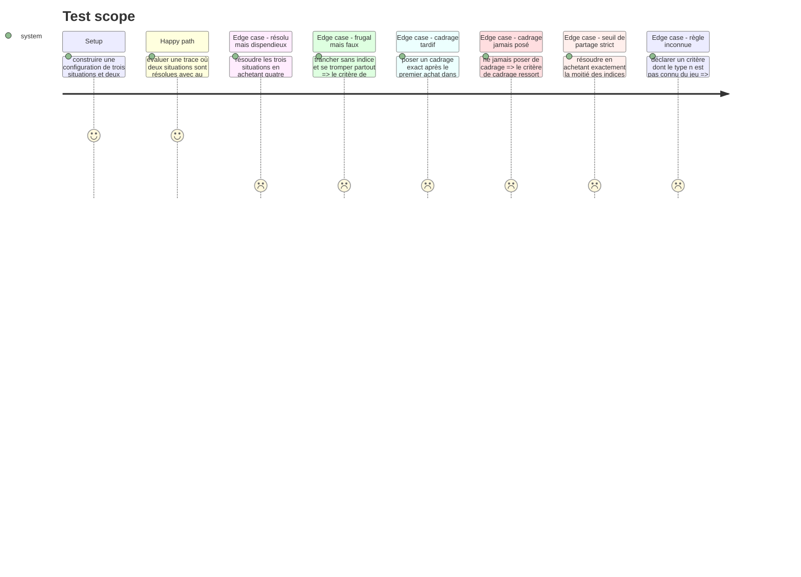

# Instruction: L'évaluateur et ses deux règles

**Correction du 30/08, après revue.** Cette phase a livré deux règles (`frugal-solves-at-least`, `grounded-framings-at-least`). La revue a montré que `grounded-framings-at-least` en portait en réalité deux à la fois — l'ordre (`framedFirst`) et le fondement (`framingGrounded`) — sous une seule question affichée qui ne parlait que d'ordre. Décision produit : une troisième règle déclarative, `framed-first-at-least`, lit l'ordre seul ; `grounded-framings-at-least` est conservée mais recentrée sur le seul fondement, sans plus jamais lire `framedFirst`. Le jeu porte donc trois règles, pas deux — cette page garde son contenu d'origine pour l'historique, `hint-budget.evaluator.ts` et ses tests portent la version courante.

## Architecture projection

> Tree of the final files. ✅ create · ✏️ modify · ❌ delete

```txt
.
├── src/games/hint-budget/
│   └── hint-budget.evaluator.ts                ✅ le point de contact public avec le port
└── __tests__/unit/games/hint-budget/
    └── evaluator.test.ts                       ✅
```

## Test Scope



## Tasks to do

### `1)` L'évaluateur

> Il interprète des règles déclaratives : déplacer un seuil se fait dans le parcours, jamais ici.

1. Créer `src/games/hint-budget/hint-budget.evaluator.ts`, à la **racine** du dossier du jeu et non sous `actions/` : c'est le point de contact public avec le port `GameEvaluator`.
2. Implémenter `HintBudgetEvaluator implements GameEvaluator`. `evaluate(answer, config, criteria)` parse la configuration, parse la trace contre elle (`parseHintBudgetTrace`), lit les situations **une seule fois** avec `readSituations`, puis applique chaque règle sur cette lecture.
3. Poser `frugalSolvesAtLeast(situations, rule)` : la règle lit `share` et `threshold`. Une situation compte quand elle est **résolue** et que `hintsBought < hintsTotal * share`. L'inégalité est **stricte** : la story dit « moins de la moitié », pas « au plus la moitié ». Documenter que les deux membres sont exigés — un joueur qui n'achète rien et se trompe partout serait autrement le plus frugal du parcours.
4. Poser `groundedFramingsAtLeast(groundedFramingCount, rule)` : la règle lit `threshold`, le compte vient de `Reading.groundedFramingCount`, qui n'agrège que les situations à la fois cadrées d'entrée et fondées.
5. Documenter pourquoi le compte frugal se calcule ici et pas dans le helper : sa borne (`share`) est déclarée dans le parcours, et le helper est aussi lu par l'écran, qui ne doit rien savoir des seuils. C'est le seul agrégat paramétré du jeu.
6. Valider chaque `rule` par un schéma Zod local, sur le modèle de `lie-detector` : `z.object({ share: z.number().positive(), threshold: z.number() })` et `z.object({ threshold: z.number() })`.
7. Lever `UnknownRuleError` sur un type de règle inconnu, avec le nom du jeu dans le message.
8. Déclarer le type local `VerdictInputs` : tout ce qu'une règle peut lire, et rien de plus.

### `2)` Les tests

1. `evaluator.test.ts` : les deux règles sur leur cas satisfait et leur cas manqué, la borne stricte du partage vérifiée à la valeur exacte, la règle inconnue, et une trace incohérente qui remonte l'erreur du parse plutôt qu'un verdict.
2. Un test doit casser si `frugal-solves-at-least` cesse d'exiger la résolution : une trace à zéro indice et zéro bonne réponse ne doit jamais satisfaire le critère.

## Test acceptance criteria

| Task | Acceptance criteria |
| --- | --- |
| 1 | Une trace qui achète exactement la moitié des indices d'une situation ne fait pas compter cette situation comme frugale |
| 1 | Une trace sans aucun achat et sans aucune bonne cause ne satisfait pas le critère de frugalité |
| 1 | Un cadrage exact mais posé après un achat ne fait pas compter la situation pour le critère de cadrage |
| 1 | Un critère dont le `rule.type` est inconnu lève une erreur nommée qui cite le type et le jeu |
| 2 | `npm run lint`, `npm run typecheck` et `npm run test` passent |

## Correction du 30/08, tour 2 de revue — `c2` n'avait pas de plancher de contenu

La scission de `c2` en deux règles (documentée dans `plan.md`) a isolé l'ordre du fondement, mais a laissé `framedFirst` se définir uniquement par `attempt.framing !== null && attempt.framing.afterHints === 0`, sans jamais vérifier que le cadrage retient quoi que ce soit. `framingEntrySchema` autorise explicitement `retainedIds: []` (« un cadrage qui ne retient rien reste un cadrage posé »), ce qui était juste pour le schéma de trace — un joueur peut légitimement transmettre un cadre vide — mais faux pour ce que `framed-first-at-least` en tirait : trois clics sur « Transmettre ce cadre », zéro lecture, zéro seconde de réflexion, tenaient `c2` 3/3.

Erreur assumée, pas une rustine à contourner en silence : ne rien transmettre n'est pas contextualiser, quel que soit le moment où ce rien est déposé. Le correctif porte dans `read-situations.helper.ts`, pas dans l'écran — `framedFirst` exige désormais un cadrage déposé, avant tout achat, **et non vide** (`attempt.framing.retainedIds.length > 0`). Un joueur qui coche au hasard puis dépose tiendra tout de même `c2` (il a cadré en premier) mais manquera `c3` (rien n'appuie sa sélection au hasard sur le rapport) — c'est exactement ce que la scission de `c2` cherchait à rendre lisible : il a bien cadré en premier, mal.

Testé : le profil « cadrage vide posé en premier » est ajouté aux profils de `hint-budget-run.test.ts` (W9 de la revue 2), avec l'assertion qu'il ne tient aucun des trois critères.
