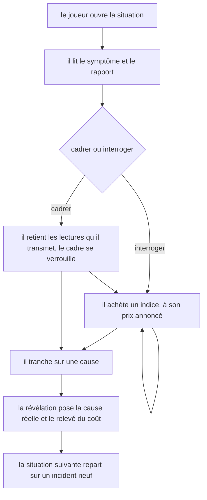
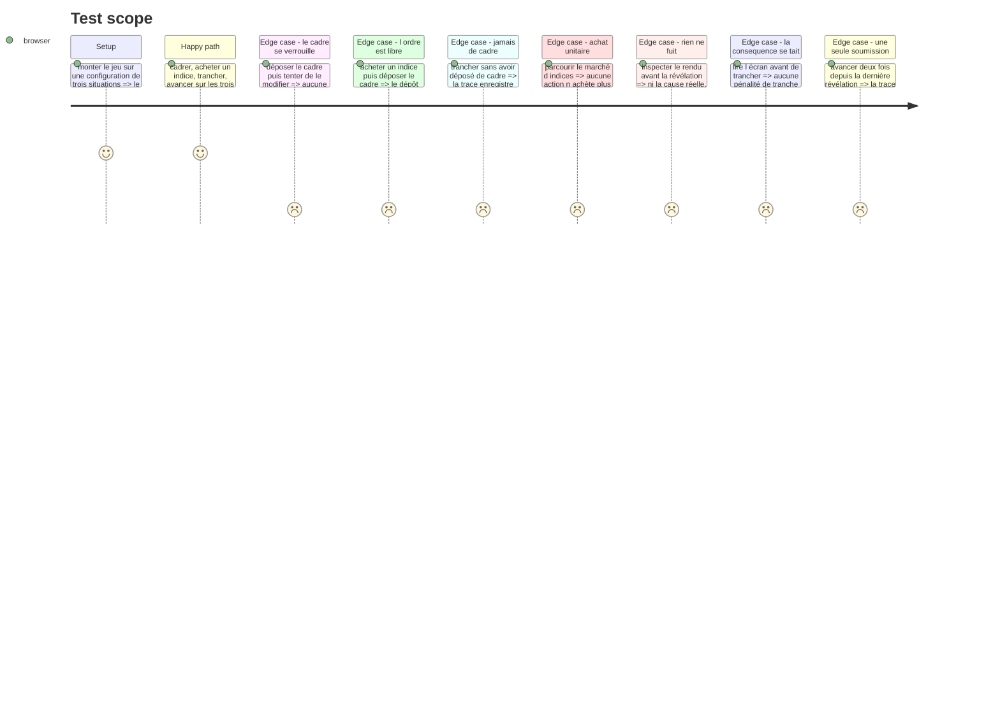

# Instruction: Le jeu à l'écran : cadrer, acheter, trancher

## Architecture projection

> Tree of the final files. ✅ create · ✏️ modify · ❌ delete

```txt
.
├── src/games/hint-budget/
│   ├── actions/
│   │   └── build-hint-budget-answer.action.ts  ✅ la trace produite hors de React
│   ├── hooks/
│   │   └── use-hint-budget.hook.ts             ✅ le cycle de vie d une situation, et rien d autre
│   └── components/
│       ├── elements/
│       │   ├── hint-card.tsx                   ✅ un indice, son prix annoncé, son texte une fois acheté
│       │   ├── framing-line.tsx                ✅ une lecture proposée du rapport, à retenir ou non
│       │   └── cause-option.tsx                ✅ une cause candidate
│       └── composites/
│           ├── hint-budget-game.tsx            ✅ le composant enregistré du jeu
│           ├── incident-brief.tsx              ✅ le symptôme et le rapport, gratuits
│           └── cut-panel.tsx                   ✅ la tranche, puis la révélation
└── __tests__/unit/games/hint-budget/
    ├── build-answer.test.ts                    ✅
    ├── use-hint-budget.test.ts                 ✅
    └── hint-budget-game.test.tsx               ✅
```

## Wireframe

```txt
┌───────────────────────────────────────────────────────────────┐
│ (1) Consigne                                                  │
│ (2) Situation 2 sur 3                    (3) Coût engagé : 45 │
├───────────────────────────────────────────────────────────────┤
│ (4) Le symptôme                                               │
│ (5) Le rapport : les faits déjà en main                       │
├───────────────────────────────┬───────────────────────────────┤
│ (6) Le cadrage                │ (7) L'assistant               │
│  [ ] lecture du rapport       │  ┌─────────────────────────┐  │
│  [ ] lecture du rapport       │  │ (8) indice · son prix   │  │
│  [ ] lecture du rapport       │  └─────────────────────────┘  │
│  [ Transmettre ce cadre ]     │  (9) ce qui a été acheté      │
├───────────────────────────────┴───────────────────────────────┤
│ (10) Les causes candidates                    [ Trancher ]    │
├───────────────────────────────────────────────────────────────┤
│ (11) Révélation : la cause réelle, sa vérification, le relevé │
└───────────────────────────────────────────────────────────────┘
```

1. La consigne du jeu : le cadre, jamais les critères. Elle dit que le cadre se transmet une seule fois, que chaque indice a un prix, et qu'on peut faire les deux dans l'ordre qu'on veut.
2. La situation courante sur le total. Jamais le compte des situations déjà résolues.
3. Le coût engagé depuis le début de la partie. Il monte à chaque achat, et au relevé de chaque révélation.
4. Le symptôme : ce qui est observé, la mise en situation.
5. Le rapport : deux à quatre faits déjà en main, gratuits, toujours visibles. C'est la matière du cadrage.
6. Le cadrage : les lectures proposées du rapport, à retenir ou non, puis un dépôt qui verrouille.
7. L'assistant : le marché d'indices, au même niveau que le cadrage, jamais en dessous ni en second.
8. Un indice : ce sur quoi il porte, et son prix. Son contenu n'apparaît qu'après l'achat.
9. Les indices déjà achetés, avec leur texte. La liste se plafonne et se replie plutôt que de pousser la tranche hors de l'écran.
10. Les causes candidates et l'action de trancher, l'unique action primaire de l'écran.
11. La révélation : la cause réelle, sa vérification, celles qui ne l'étaient pas et pourquoi, puis le relevé du coût de la situation.

## User Journey



## Test Scope



## Tasks to do

### `1)` La construction de la trace, hors de React

> Testable sans composant, sur le modèle de `buildLieDetectorAnswer`.

1. Créer `src/games/hint-budget/actions/build-hint-budget-answer.action.ts`.
2. `buildHintBudgetAnswer(config, playedAttempts)` range les tentatives dans **l'ordre des situations déclarées** dans la configuration, jamais celui du jeu : deux parties aux mêmes gestes produisent exactement la même trace.
3. Une situation omise lève `IncompleteTraceError`. La trace produite repasse par `parseHintBudgetTrace` : ce que l'écran produit se vérifie contre le même contrat que ce que l'évaluateur consomme.

### `2)` Le hook

> Le cycle de vie React d'une situation, et rien d'autre. La lecture d'une situation vit dans `readSituations`, jamais recalculée ici.

1. Créer `src/games/hint-budget/hooks/use-hint-budget.hook.ts`.
2. Valider la configuration une seule fois, en `useMemo` : elle ne change pas en cours de partie.
3. Tenir l'état d'une situation : index courant, phase (`playing` · `revealed`), lectures retenues, cadrage déposé (`null` tant qu'il ne l'est pas), indices achetés dans l'ordre, cause tranchée, tentatives closes.
4. `toggleFraming(id)` ne fait rien une fois le cadre déposé, et rien après la tranche. Le verrou tient par **l'absence de chemin**, pas par une garde décorative.
5. `postFraming()` fige `retainedIds` et enregistre `afterHints` = le nombre d'indices déjà achetés dans la situation. C'est la seule écriture de cette position, et elle est brute.
6. `buyHint(id)` ajoute **un** indice, une fois, et ne fait rien sur un indice déjà acheté. Aucune action d'achat groupé n'existe dans l'API du hook — c'est ce qui rend « jamais en bloc » vrai par construction plutôt que par discipline.
7. `cut(causeId)` clôt la situation et bascule sur `revealed`.
8. `advance()` passe à la situation suivante, ou soumet la trace **une seule fois** à la dernière, via un `useRef` d'appel unique, sur le modèle de `useLieDetector`.
9. Exposer, et jamais plus : `statement`, `situationNumber`, `situationsTotal`, `symptom`, `report`, `framings` (`id` et `text` seulement — **jamais** `established`), `retainedIds`, `framingPosted`, `hints` (`id`, `label`, `cost`, `bought`, et `text` **seulement une fois acheté**), `causes` (`id` et `text` seulement — **jamais** `actual`), `spent`, `phase`, `revelation` (indéfini hors phase `revealed`), et les cinq gestes.
10. Documenter la règle de fuite : ce qui n'est pas exposé ne peut pas fuiter à l'écran. `established`, `actual`, `verification` et le `text` d'un indice non acheté ne sortent jamais du hook avant leur heure.
11. `spent` est le coût **engagé** : la somme des relevés des situations déjà révélées, plus les seuls achats de la situation courante. Les pénalités de la situation en cours n'y entrent qu'à sa révélation — le coût d'un geste est annoncé, sa conséquence ne l'est jamais.
12. `revelation` porte les causes avec leur `actual` et leur `verification`, la cause tranchée, et le relevé de la situation (coût des indices, pénalité de tranche fausse le cas échéant, surtaxe d'aveugle le cas échéant, total). Elle ne porte **rien** sur la qualité du cadrage.

### `3)` Les composants

> Trois éléments muets, trois compositions muettes. Aucune logique.

1. `elements/framing-line.tsx` : une lecture proposée, son état retenu ou non, désactivée une fois le cadre déposé. Les deux natures de lecture se rendent **exactement pareil**.
2. `elements/hint-card.tsx` : le `label` de l'indice, son prix annoncé, l'action d'achat, puis son texte une fois acheté. Le prix reste lisible après l'achat.
3. `elements/cause-option.tsx` : une cause candidate, sélectionnable ; à la révélation, elle porte en plus sa vérification et son statut.
4. `composites/incident-brief.tsx` : le symptôme et le rapport.
5. `composites/cut-panel.tsx` : les causes, l'action de trancher, puis la révélation et le relevé.
6. `composites/hint-budget-game.tsx` : le composant enregistré. Il consomme le hook, compose les quatre régions, et n'ajoute aucune règle.
7. La consigne s'affiche en entier à la première situation et se replie derrière un `<details>` natif ensuite, comme chez `lie-detector` : elle ne change pas d'une situation à l'autre, et la relire en entier repousse la décision courante vers le bas.
8. Le cadrage et le marché d'indices sont **deux pairs**. Aucun des deux n'est présenté comme l'étape d'avant ou d'après l'autre. Le rendu final de cette parité est le travail de la phase 5 ; ici, la structure ne doit pas la rendre impossible.

### `4)` Les tests

1. `build-answer.test.ts` : l'ordre canonique des situations, la situation omise, le passage par le contrat.
2. `use-hint-budget.test.ts` : le verrou du cadre, l'ordre libre des deux gestes, l'achat unitaire et non répétable, la soumission unique, et le fait qu'aucune valeur cachée ne sorte du hook avant sa phase.
3. `hint-budget-game.test.tsx` : le premier rendu porte les quatre régions ; la révélation n'apparaît qu'après la tranche ; un test échoue si le rendu avant révélation contient le texte d'une vérification, celui d'un indice non acheté, ou une marque distinguant les deux natures de lecture de cadrage.

## Test acceptance criteria

| Task | Acceptance criteria |
| --- | --- |
| 1 | Deux parties aux mêmes gestes, joués dans des ordres différents, produisent une trace identique |
| 2 | Une fois le cadre déposé, aucune lecture ne change plus d'état |
| 2 | Acheter un indice puis déposer le cadre est accepté, et la trace porte `afterHints` à 1 |
| 2 | Il n'existe aucune manière, dans l'API du hook, d'acheter plus d'un indice par appel |
| 2 | `advance()` appelé deux fois à la dernière situation ne soumet qu'une trace |
| 3 | Le rendu avant révélation ne contient ni `verification`, ni le texte d'un indice non acheté, ni rien qui distingue une lecture établie d'une supposition |
| 4 | `npm run lint`, `npm run typecheck` et `npm run test` passent |
