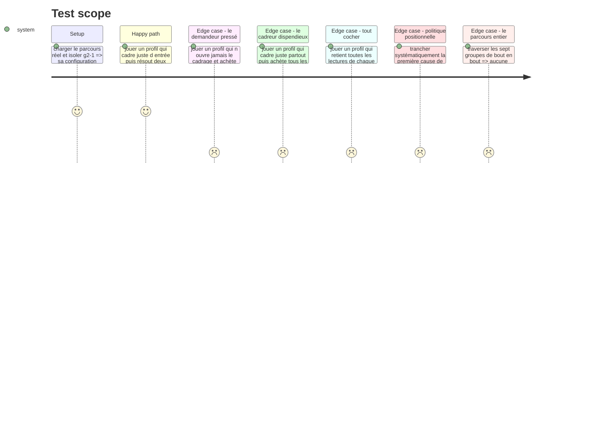

# Instruction: Le jeu dans le parcours, et son corpus

## Architecture projection

> Tree of the final files. ✅ create · ✏️ modify · ❌ delete

```txt
.
├── config/
│   └── course.json                                     ✏️ g2-1 passe de test-bench à hint-budget, corpus et critères
├── src/games/
│   ├── register-games.ts                               ✏️ un bloc : évaluateur, schéma de config, schéma de trace
│   └── register-components.ts                          ✏️ un bloc : le composant du jeu
└── __tests__/
    ├── fixtures/
    │   └── hint-budget-answer.ts                       ✅ la trace conforme minimale, pour les parcours qui traversent tout
    └── integration/course-run/
        ├── hint-budget-run.test.ts                     ✅ le jeu à travers le moteur réel, sur le corpus réel
        ├── checkpoints-run.test.ts                     ✏️ g2-1 n est plus un test-bench : il lui faut sa trace
        └── three-tracks-run.test.ts                    ✏️ idem
```

## Test Scope



## Le corpus de `g2-1`

Trois situations, chacune un incident sur du code que l'assistant vient de livrer. Le format est fixe : un symptôme, un rapport de deux à quatre faits déjà en main, cinq lectures de cadrage, cinq indices, cinq causes.

Les trois situations à écrire, énoncées par leur incident :

| # | L'incident |
| --- | --- |
| `s1` | Une requête authentifiée renvoie `401` depuis la mise en production de la veille, alors qu'elle passe en local |
| `s2` | Un total de facture est faux d'un centime, sur certaines lignes seulement |
| `s3` | Une suite de tests passe en local et échoue en intégration continue, sans message utile |

Les règles d'écriture, qu'aucun test ne peut rattraper :

1. **Le rapport doit suffire à écarter deux causes sur cinq**, jamais plus. En dessous, le cadrage n'a pas de matière ; au-dessus, le jeu se résout sans acheter et la frugalité cesse d'être un arbitrage.
2. **Le prix d'un indice suit ce qu'il tranche.** Le plus cher désigne la cause ; les moins chers écartent une piste chacun. Sans cet écart, acheter est une décision sans arbitrage. Prix retenus : `5 · 10 · 15 · 20 · 25`.
3. **Une lecture de cadrage établie est une reformulation de ce que le rapport dit**, jamais une déduction. Une supposition est une phrase qui *sonne* juste et que rien à l'écran n'appuie — c'est là que se joue la lecture.
4. **Aucun indice ne nomme une cause candidate**, sinon l'achat remplace le raisonnement au lieu de le nourrir.
5. La cause réelle **ne tombe pas au même rang** dans les trois situations, et l'ensemble des rangs des lectures établies **diffère** d'une situation à l'autre. Les deux se vérifient par test.
6. Ni le symptôme, ni le rapport, ni une lecture de cadrage ne dit ce qui est noté.

Les deux montants de l'économie : `wrongCutPenalty` à `40`, `blindCutSurcharge` à `30`. La surtaxe excède strictement l'indice le plus cher (`25`), ce que le schéma vérifie au chargement — c'est le quatrième critère d'acceptation de la story.

## Les deux critères de `g2-1`

| Critère | Question | Règle | Mapping |
| --- | --- | --- | --- |
| `g2-1-c1` | L'incident a-t-il été résolu en achetant moins de la moitié des indices ? | `frugal-solves-at-least` · `share: 0.5` · `threshold: 2` | `pilotage-contexte` · poids `2` |
| `g2-1-c2` | Le contexte a-t-il été posé avant le premier indice ? | `grounded-framings-at-least` · `threshold: 2` | `pilotage-contexte` · poids `2` |

Le mapping `harness` du placeholder disparaît : les six premiers groupes portent la signature, seul le septième porte les axes du référentiel officiel. C'est la même coupe que celle faite chez `g1-2` et `g1-3`.

Le seuil de `c1` à deux situations sur trois : cinq causes portent la chance d'une tranche aveugle à `1/5`, donc à `10,4 %` pour deux situations sur trois — l'ordre de grandeur retenu chez `lie-detector` (`15,6 %`). La marge d'une situation laisse un lecteur qui se trompe une fois satisfaire le critère.

## Tasks to do

### `1)` Le câblage

1. `src/games/register-games.ts` : un bloc `registry.register('hint-budget', { evaluator, configSchema, answerSchema })`, à la suite des six autres.
2. `src/games/register-components.ts` : une entrée `'hint-budget': HintBudgetGame`.
3. Rien d'autre ne bouge. Si un troisième fichier doit changer, le contrat de plugin a une fuite — la signaler plutôt que la contourner.

### `2)` Le corpus

1. Remplacer, dans `config/course.json`, le `type`, la `config` et les `criteria` de `g2-1`. Le `label` (« Combien d'indices vous faut-il ? ») ne change pas : il décrit déjà ce jeu.
2. Écrire les trois situations selon les six règles ci-dessus.
3. Écrire le `statement` : il annonce que le cadre se transmet une seule fois, que chaque indice a un prix affiché, et que l'ordre des deux gestes est libre. Il ne dit **ni** que l'ordre est noté, **ni** qu'il existe une pénalité de tranche fausse.

### `3)` Les parcours qui traversent tout

1. Créer `__tests__/fixtures/hint-budget-answer.ts` : `defaultHintBudgetAnswer(config)`, une trace conforme minimale — aucun cadrage, aucun achat, la première cause tranchée. Les parcours qui mesurent `intervention` ou `parallele` n'ont besoin que d'une trace **valide**, jamais d'une bonne réponse.
2. Brancher la fixture dans `checkpoints-run.test.ts` et `three-tracks-run.test.ts`, à côté de `defaultLieDetectorAnswer` : `g2-1` n'est plus un `test-bench`, et sans elle ces deux parcours refusent la soumission.

### `4)` Le test d'intégration du jeu

1. Créer `__tests__/integration/course-run/hint-budget-run.test.ts`, sur le gabarit de `lie-detector-run.test.ts` : vrai registre, vraie façade, vraie stratégie de pondération, corpus réel de `g2-1` lu depuis `config/course.json`.
2. Les profils se construisent **depuis le corpus lu**, jamais depuis des identifiants écrits en dur : une réécriture du corpus ne doit pas casser ce test pour la mauvaise raison.
3. Quatre profils : le cadreur frugal, le demandeur pressé, le cadreur dispendieux, et celui qui coche tout.
4. Trois garde-fous de corpus, vérifiés sur le corpus réel :
   - la cause `actual` n'occupe pas le même rang dans les trois situations ;
   - l'ensemble des rangs des lectures `established` diffère d'une situation à l'autre ;
   - pour chaque situation et chaque indice, une tranche fausse à l'aveugle coûte strictement plus qu'une tranche fausse après l'achat de cet indice.
5. `verification` vit dans la signature, `pilotage-contexte` aussi : lire `getVerdict().signature`, jamais `.result`.

## Test acceptance criteria

| Task | Acceptance criteria |
| --- | --- |
| 1 | Ajouter le jeu n'a demandé que les deux blocs de câblage |
| 2 | Le parcours réel se charge sans refus, et `g2-1` passe `hintBudgetConfigSchema` |
| 3 | `checkpoints-run` et `three-tracks-run` traversent les sept groupes sans refus de soumission |
| 4 | Un profil qui cadre juste d'entrée et résout deux situations sur trois avec au plus deux indices satisfait les deux critères |
| 4 | Un profil qui ne cadre jamais et achète tous les indices manque les deux |
| 4 | Trancher systématiquement la première cause de chaque situation résout au plus une situation |
| 4 | Retenir toutes les lectures de chaque situation ne satisfait le critère de cadrage dans aucune |
| 4 | `npm run lint`, `npm run typecheck` et `npm run test` passent |
