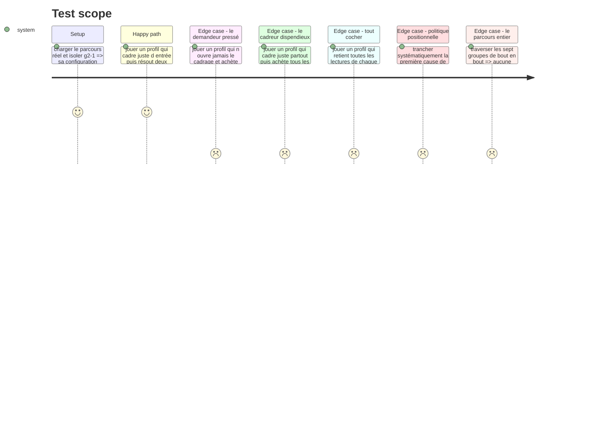

# Instruction: Le jeu dans le parcours, et son corpus

## Architecture projection

> Tree of the final files. ✅ create · ✏️ modify · ❌ delete

```txt
.
├── config/
│   └── course.json                                     ✏️ g2-1 passe de test-bench à hint-budget, corpus et critères
├── src/games/
│   ├── register-games.ts                               ✏️ un bloc : évaluateur, schéma de config, schéma de trace
│   └── register-components.ts                          ✏️ un bloc : le composant du jeu
└── __tests__/
    ├── fixtures/
    │   └── hint-budget-answer.ts                       ✅ la trace conforme minimale, pour les parcours qui traversent tout
    └── integration/course-run/
        ├── hint-budget-run.test.ts                     ✅ le jeu à travers le moteur réel, sur le corpus réel
        ├── checkpoints-run.test.ts                     ✏️ g2-1 n est plus un test-bench : il lui faut sa trace
        └── three-tracks-run.test.ts                    ✏️ idem
```

## Test Scope



## Le corpus de `g2-1`

Trois situations, chacune un incident sur du code que l'assistant vient de livrer. Le format est fixe : un symptôme, un rapport de deux à quatre faits déjà en main, cinq lectures de cadrage, cinq indices, cinq causes.

Les trois situations à écrire, énoncées par leur incident :

| # | L'incident |
| --- | --- |
| `s1` | Une requête authentifiée renvoie `401` depuis la mise en production de la veille, alors qu'elle passe en local |
| `s2` | Un total de facture est faux d'un centime, sur certaines lignes seulement |
| `s3` | Une suite de tests passe en local et échoue en intégration continue, sans message utile |

Les règles d'écriture, qu'aucun test ne peut rattraper :

1. **Le rapport doit suffire à écarter deux causes sur cinq**, jamais plus. En dessous, le cadrage n'a pas de matière ; au-dessus, le jeu se résout sans acheter et la frugalité cesse d'être un arbitrage.
2. ~~Le prix d'un indice suit ce qu'il tranche. Le plus cher désigne la cause ; les moins chers écartent une piste chacun.~~ **Corrigé le 30/08, après revue : cette règle contredisait la règle 4 et a produit la faille qu'elle décrit.** Le corpus initial suivait cette version : `h5` de chaque situation paraphrasait la cause réelle mot pour mot (`s1-h5` ≈ `s1-c-clock`), rendant « acheter le seul indice le plus cher puis trancher » une stratégie qui tenait `c1` 3/3 à l'aveugle — exactement la délégation totale que l'épique nomme comme triche à bloquer. La règle qui tient est la 4 : **l'indice le plus cher est celui qui écarte le plus d'alternatives, jamais celui qui livre la réponse.** Prix retenus, inchangés : `5 · 10 · 15 · 20 · 25`.
3. **Une lecture de cadrage établie est une reformulation de ce que le rapport dit**, jamais une déduction. Une supposition est une phrase qui *sonne* juste et que rien à l'écran n'appuie — c'est là que se joue la lecture.
4. **Aucun indice ne nomme une cause candidate**, sinon l'achat remplace le raisonnement au lieu de le nourrir. C'est la règle qui prime sur la 2 : un indice peut écarter des causes par leur nom (« le diagnostic élimine le certificat, la clé de signature… »), jamais confirmer ou paraphraser celle qui reste.
5. La cause réelle **ne tombe pas au même rang** dans les trois situations, et l'ensemble des rangs des lectures établies **diffère** d'une situation à l'autre. Les deux se vérifient par test.
6. Ni le symptôme, ni le rapport, ni une lecture de cadrage ne dit ce qui est noté.
7. **Corrigé le 30/08, après revue — règle ajoutée : le texte d'une cause ne trahit jamais laquelle est réelle par sa forme.** Le corpus initial faisait de la cause `actual` le texte le plus long des cinq, dans les trois situations, avec une marge considérable (135 vs 62/52/52/44 caractères sur `s1`, par exemple) : « trancher la cause la plus longue, n'acheter aucun indice, ne rien cadrer » tenait `c1` 3/3 sans lire une ligne. Les cinq `causes[].text` d'une situation restent désormais à moins d'un quart d'écart entre le plus long et le plus court (`longest - shortest <= longest / 4`, le même seuil que `lie-detector` applique à ses affirmations), et la cause réelle n'est jamais ni la plus longue ni la plus courte. L'explication causale complète — qui, elle, peut varier en longueur sans trahir rien — vit dans `verification`, montrée seulement à la révélation, jamais dans `text`.

Les deux montants de l'économie : `wrongCutPenalty` à `40`, `blindCutSurcharge` à `30`. La surtaxe excède strictement l'indice le plus cher (`25`), ce que le schéma vérifie au chargement — c'est le quatrième critère d'acceptation de la story.

**Correction du 30/08, après revue — `s1` était techniquement faux.** `s1-h3` disait l'horloge du serveur « en avance » de quatre minutes, `s1-h5` disait qu'elle « retardait » — deux indices de la même situation affirmant deux dérives opposées, `s1-h5` se contredisant même dans sa propre phrase. `s1-h4` (rejet pour date d'émission future) exigeait une horloge en retard ; `s1-c-clock` (jetons invalides avant leur expiration réelle) exigeait une horloge en avance : les deux causes du même bug ne pouvaient pas être vraies ensemble. Et quatre minutes de dérive dans une fenêtre de validité de quinze minutes ne produit aucun `401` dans un sens comme dans l'autre. Tranché en faveur d'une horloge **en retard**, à hauteur de **vingt minutes** — largement au-delà de la fenêtre de quinze minutes et de l'écart réel entre émission et appel (quatre minutes), donc suffisant pour faire systématiquement échouer la vérification d'émission plutôt qu'un cas limite improbable. `s1-h3`, `s1-h4`, `s1-h5`, `s1-c-clock` et sa `verification` portent désormais tous la même direction et la même mesure.

## Les trois critères de `g2-1`

**Correction du 30/08, après revue.** `g2-1-c2` portait initialement l'ordre et le fondement à la fois (poids `2`), sous une question qui ne parlait que d'ordre — un joueur cadrant juste en premier, mais de façon incomplète, lisait « manqué » sur un critère que sa question ne laissait pas deviner. Décision produit : `c2` scindé en deux.

| Critère | Question | Règle | Mapping |
| --- | --- | --- | --- |
| `g2-1-c1` | L'incident a-t-il été résolu en achetant moins de la moitié des indices ? | `frugal-solves-at-least` · `share: 0.5` · `threshold: 2` | `pilotage-contexte` · poids `2` |
| `g2-1-c2` | Le contexte a-t-il été posé avant le premier indice ? | `framed-first-at-least` · `threshold: 2` | `pilotage-contexte` · poids `1` |
| `g2-1-c3` | Ce contexte était-il fondé sur le rapport ? | `grounded-framings-at-least` · `threshold: 2` | `pilotage-contexte` · poids `1` |

Le mapping `harness` du placeholder disparaît : les six premiers groupes portent la signature, seul le septième porte les axes du référentiel officiel. C'est la même coupe que celle faite chez `g1-2` et `g1-3`. Le poids `2 · 1 · 1` garde l'équilibre initial entre trancher frugalement (`2`) et cadrer (`1 + 1`).

Le seuil de `c1` à deux situations sur trois : cinq causes portent la chance d'une tranche aveugle à `1/5`, donc à `10,4 %` pour deux situations sur trois — l'ordre de grandeur retenu chez `lie-detector` (`15,6 %`). La marge d'une situation laisse un lecteur qui se trompe une fois satisfaire le critère.

## Les politiques aveugles, recalculées sur le corpus réécrit (30/08)

Neuf politiques, simulées sur le corpus final de `config/course.json` (situations, causes et indices tels que livrés après correction). Aucune ne tient un critère à l'aveugle ; la seule qui approche est explicitement une politique **informée**, pas aveugle — voir la note sous le tableau.

| Politique | `c1` frugalité (2/3 requis) | `c2` ordre (2/3 requis) | `c3` fondement (2/3 requis) |
| --- | --- | --- | --- |
| Trancher la cause la plus longue | manqué (0/3) | manqué (0/3) | manqué (0/3) |
| Trancher la cause la plus courte | manqué (0/3) | manqué (0/3) | manqué (0/3) |
| Rang fixe (toujours la première cause déclarée) | manqué (1/3) | manqué (0/3) | manqué (0/3) |
| Cadrage vide (jamais de cadrage, jamais d'indice, rang fixe) | manqué (1/3) | manqué (0/3) | manqué (0/3) |
| Premier indice seul (`h1`), rang fixe | manqué (1/3) | manqué (0/3) | manqué (0/3) |
| Tout acheter (les cinq indices, tranche juste) | manqué (0/3) | manqué (0/3) | manqué (0/3) |
| Tout cocher (toutes les lectures, aucun indice, tranche juste) | **tenu (3/3)** | **tenu (3/3)** | manqué (0/3) |
| Ne rien cocher (cadrage vide posé en premier, rang fixe) | manqué (1/3) | **tenu (3/3)** | manqué (0/3) |
| Indice le plus cher (`h5`) seul, **élimination informée** | **tenu (3/3)** | manqué (0/3) | manqué (0/3) |

Deux lignes méritent d'être lues avec leur condition :

- **« Tout cocher »** ne tient `c1` que parce que la simulation lui fait *aussi* trancher juste par construction (elle isole la question « ce profil de cadrage peut-il tenir un critère sans lire ? », pas « ce profil peut-il deviner la cause »). Ce qu'elle prouve réellement : cocher toutes les lectures pose le cadre en premier (`c2` tenu, l'ordre seul ne s'y oppose pas) mais ne le fonde jamais (`c3` manqué à 0/3) — c'est le garde-fou attendu, et exactement le cas que la scission de `c2` corrige : avant elle, ce même profil lisait « manqué » sur un critère combiné dont la question n'annonçait que l'ordre.
- **« Indice le plus cher seul »** n'est **pas** une politique aveugle : elle exige de lire le texte de `h5` (qui élimine quatre des cinq causes par leur nom, jamais celle qui reste) et de le recouper avec les cinq causes affichées pour identifier par élimination celle qu'il ne nomme pas. C'est un vrai travail de lecture, la stratégie la moins chère qui reste légitime — et c'est précisément ce que la règle 4 corrigée autorise : un indice qui écarte des alternatives, jamais un indice qui répond à la place du joueur. Elle tient `c1` (un seul indice acheté, la situation résolue), jamais `c2` ni `c3` puisqu'aucun cadrage n'est posé dans cette simulation.

Aucune politique véritablement aveugle — qui ne lit ni le rapport, ni les indices, ni les causes — ne tient plus aucun critère 3/3 ni même 2/3 sur ce corpus.

## Tasks to do

### `1)` Le câblage

1. `src/games/register-games.ts` : un bloc `registry.register('hint-budget', { evaluator, configSchema, answerSchema })`, à la suite des six autres.
2. `src/games/register-components.ts` : une entrée `'hint-budget': HintBudgetGame`.
3. Rien d'autre ne bouge. Si un troisième fichier doit changer, le contrat de plugin a une fuite — la signaler plutôt que la contourner.

### `2)` Le corpus

1. Remplacer, dans `config/course.json`, le `type`, la `config` et les `criteria` de `g2-1`. Le `label` (« Combien d'indices vous faut-il ? ») ne change pas : il décrit déjà ce jeu.
2. Écrire les trois situations selon les six règles ci-dessus.
3. Écrire le `statement` : il annonce que le cadre se transmet une seule fois, que chaque indice a un prix affiché, et que l'ordre des deux gestes est libre. Il ne dit **ni** que l'ordre est noté, **ni** qu'il existe une pénalité de tranche fausse.

### `3)` Les parcours qui traversent tout

1. Créer `__tests__/fixtures/hint-budget-answer.ts` : `defaultHintBudgetAnswer(config)`, une trace conforme minimale — aucun cadrage, aucun achat, la première cause tranchée. Les parcours qui mesurent `intervention` ou `parallele` n'ont besoin que d'une trace **valide**, jamais d'une bonne réponse.
2. Brancher la fixture dans `checkpoints-run.test.ts` et `three-tracks-run.test.ts`, à côté de `defaultLieDetectorAnswer` : `g2-1` n'est plus un `test-bench`, et sans elle ces deux parcours refusent la soumission.

### `4)` Le test d'intégration du jeu

1. Créer `__tests__/integration/course-run/hint-budget-run.test.ts`, sur le gabarit de `lie-detector-run.test.ts` : vrai registre, vraie façade, vraie stratégie de pondération, corpus réel de `g2-1` lu depuis `config/course.json`.
2. Les profils se construisent **depuis le corpus lu**, jamais depuis des identifiants écrits en dur : une réécriture du corpus ne doit pas casser ce test pour la mauvaise raison.
3. Quatre profils : le cadreur frugal, le demandeur pressé, le cadreur dispendieux, et celui qui coche tout.
4. Trois garde-fous de corpus, vérifiés sur le corpus réel :
   - la cause `actual` n'occupe pas le même rang dans les trois situations ;
   - l'ensemble des rangs des lectures `established` diffère d'une situation à l'autre ;
   - pour chaque situation et chaque indice, une tranche fausse à l'aveugle coûte strictement plus qu'une tranche fausse après l'achat de cet indice.
5. `verification` vit dans la signature, `pilotage-contexte` aussi : lire `getVerdict().signature`, jamais `.result`.

## Test acceptance criteria

| Task | Acceptance criteria |
| --- | --- |
| 1 | Ajouter le jeu n'a demandé que les deux blocs de câblage |
| 2 | Le parcours réel se charge sans refus, et `g2-1` passe `hintBudgetConfigSchema` |
| 3 | `checkpoints-run` et `three-tracks-run` traversent les sept groupes sans refus de soumission |
| 4 | Un profil qui cadre juste d'entrée et résout deux situations sur trois avec au plus deux indices satisfait les deux critères |
| 4 | Un profil qui ne cadre jamais et achète tous les indices manque les deux |
| 4 | Trancher systématiquement la première cause de chaque situation résout au plus une situation |
| 4 | Retenir toutes les lectures de chaque situation ne satisfait le critère de cadrage dans aucune |
| 4 | `npm run lint`, `npm run typecheck` et `npm run test` passent |

### Amendements du 30/08, après revue

- Le `statement` a perdu sa phrase « Les deux gestes se jouent dans l'ordre qui vous convient » : elle rassurait sur la dimension exacte que `c2` note, à contresens de `DESIGN.md` (« se taire sur ce qui est noté », pas orienter à contresens). Il dit désormais ce que le joueur peut faire — transmettre le cadre, interroger l'assistant — et quand trancher, sans plus rien dire de l'ordre.
- Retenir toutes les lectures de chaque situation ne satisfait plus « aucun » critère de cadrage — c'était vrai du critère combiné d'origine. Depuis la scission, ce profil satisfait `c2` (l'ordre : il cadre en premier) et manque `c3` (le fondement : il retient plus que ce que le rapport établit). C'est exactement le décalage que la scission corrige — voir le tableau de politiques aveugles ci-dessus et `hint-budget-run.test.ts`, « satisfies the order criterion but sinks the grounding criterion ».
- Deux garde-fous de longueur ajoutés à `hint-budget-run.test.ts`, sur le modèle de `lie-detector-run.test.ts:398,417` : la cause réelle n'est jamais le texte le plus long ni le plus court de sa situation, et l'écart entre le plus long et le plus court reste sous un quart du plus long.
- Un garde-fou de recouvrement ajouté : la plus longue sous-chaîne commune entre l'indice le plus cher et (le texte de la cause réelle + sa vérification) reste sous 20 caractères, dans les trois situations — casse si un futur indice paraphrase la réponse plutôt que de l'entourer.
